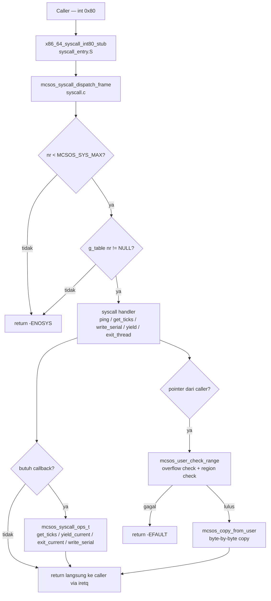

# Template Laporan Praktikum Sistem Operasi Lanjut — MCSOS
**Nama file laporan:** `laporan_praktikum_M10_25832072004.md`  
**Nama sistem operasi:** MCSOS versi 260502  
**Target default:** x86_64, QEMU, Windows 11 x64 + WSL 2, kernel monolitik pendidikan, C17 freestanding dengan assembly minimal, POSIX-like subset  
**Dosen:** Muhaemin Sidiq, S.Pd., M.Pd.  
**Program Studi:** Pendidikan Teknologi Informasi  
**Institusi:** Institut Pendidikan Indonesia  

> Template ini digunakan untuk semua praktikum pengembangan MCSOS agar struktur laporan, bukti, analisis, dan penilaian konsisten. Ganti seluruh teks bertanda `[isi ...]` dengan data praktikum sebenarnya. Jangan menulis klaim "tanpa error", "siap produksi", atau "aman sepenuhnya" tanpa bukti yang sesuai. Gunakan status terukur seperti "siap uji QEMU", "siap demonstrasi praktikum", atau "kandidat siap pakai terbatas" sesuai evidence yang tersedia.

---

## 0. Metadata Laporan

| Atribut | Isi |
|---|---|
| Kode praktikum | `M10` |
| Judul praktikum | `ABI System Call Awal, Dispatcher Syscall, Validasi Argumen, dan Jalur int 0x80 Terkendali pada MCSOS` |
| Jenis pengerjaan | `Kelompok` |
| Nama mahasiswa | `Amelia Okta Ramadani` |
| NIM | `25832072004` |
| Kelas | `PTI 1 A` |
| Nama kelompok | `Princes` |
| Anggota kelompok | `Asti Lestari, Wifa Fazriyatul Fadhla, Nazwa Rahmadanti, Fauziah Putri Rahayu` |
| Tanggal praktikum | `2026-06-15` |
| Tanggal pengumpulan | `2026-06-28` |
| Repository | `https://github.com/AmeliaOkta/MCSOS_Sistem-Operasi_25832072004.git` |
| Branch | `praktikum/m10-syscall-abi` |
| Commit awal | `91aa9f3` |
| Commit akhir | `f006941` |
| Status readiness yang diklaim | `siap uji QEMU untuk syscall dispatcher awal dan smoke test ABI kernel-side` |

---

## 1. Sampul

# Laporan Praktikum M10
## ABI System Call Awal, Dispatcher Syscall, Validasi Argumen, dan Jalur int 0x80 Terkendali pada MCSOS

Disusun oleh:

| Nama | NIM | Kelas | Peran |
|---|---|---|---|
| `Amelia Okta Ramadani` | `25832072004` | `1A` | `Koordinator sekaligus penyusun kelompok` |

Dosen Pengampu: **Muhaemin Sidiq, S.Pd., M.Pd.**  
Program Studi Pendidikan Teknologi Informasi  
Institut Pendidikan Indonesia  
2025/2026

---

## 2. Pernyataan Orisinalitas dan Integritas Akademik

Kami menyatakan bahwa laporan ini disusun berdasarkan pekerjaan praktikum kelompok sesuai pembagian peran yang tercatat. Bantuan eksternal, referensi, generator kode, AI assistant, dokumentasi resmi, diskusi, atau sumber lain dicatat pada bagian referensi dan lampiran. Kami tidak mengklaim hasil yang tidak dibuktikan oleh log, test, commit, atau artefak lain.

| Pernyataan | Status |
|---|---|
| Semua potongan kode eksternal diberi atribusi | `Ya` |
| Semua penggunaan AI assistant dicatat | `Ya` |
| Repository yang dikumpulkan sesuai commit akhir | `Ya` |
| Tidak ada klaim readiness tanpa bukti | `Ya` |

Catatan penggunaan bantuan eksternal:

```text
Panduan praktikum M10 MCSOS versi 260502 digunakan sebagai referensi utama desain
ABI syscall, kontrak dispatcher, struktur file, urutan implementasi, dan kriteria lulus.
AI assistant digunakan untuk membantu penyusunan laporan berdasarkan output aktual
build dan test yang dijalankan sendiri di WSL 2. Seluruh kode diverifikasi secara
mandiri melalui make m10-host-test, make m10-freestanding, make m10-audit,
nm -u, readelf -h, objdump -dr, dan check-m10.
```

---

## 3. Tujuan Praktikum

1. Mengimplementasikan kontrak ABI system call MCSOS M10 berbasis register x86_64: `rax` sebagai nomor syscall, `rdi/rsi/rdx/r10/r8/r9` sebagai argumen, dan `rax` sebagai nilai balik.
2. Membangun table-driven syscall dispatcher yang menolak nomor tidak valid dengan `-ENOSYS` dan entri kosong dengan `-ENOSYS`.
3. Mengimplementasikan validasi rentang user buffer (`mcsos_user_check_range`) dengan deteksi overflow arithmetic, dan `mcsos_copy_from_user` yang tidak membaca byte sebelum validasi lulus.
4. Menghubungkan syscall `yield` dan `exit_thread` ke subsystem lain melalui callback `mcsos_syscall_ops_t` tanpa dependency siklik langsung.
5. Menghubungkan jalur entry `int 0x80` ke dispatcher melalui stub assembly `x86_64_syscall_int80_stub` yang terhubung ke IDT M4 vector `0x80`.
6. Menyimpan bukti host unit test PASS, freestanding object audit (`nm -u` kosong, `readelf` ELF64 x86_64, `objdump` memuat `iretq`), log build, dan log QEMU serial sebagai dasar penilaian.

---

## 4. Capaian Pembelajaran Praktikum

Setelah praktikum ini, mahasiswa mampu:

| CPL/CPMK praktikum | Bukti yang harus ditunjukkan |
|---|---|
| Mendesain ABI syscall berbasis register x86_64 | `include/mcsos/syscall.h`, dokumentasi ABI di laporan |
| Mengimplementasikan table-driven dispatcher dengan bound check | `kernel/syscall/syscall.c`, output `M10 syscall host tests passed` |
| Mengimplementasikan validasi rentang dan overflow check user pointer | `mcsos_user_check_range`, negative test EFAULT pada pointer `0x1` PASS |
| Menghasilkan freestanding object tanpa unresolved symbol | `nm -u build/m10_syscall_combined.o` kosong, `readelf -h` menunjukkan ELF64 X86-64 |
| Mengintegrasikan syscall ke kernel init dengan callback subsystem | `kernel/core/kmain.c`, check-m10 PASS |

---

## 5. Peta Milestone MCSOS

Centang milestone yang menjadi fokus laporan ini. Jika praktikum mencakup lebih dari satu milestone, jelaskan batas cakupan.

| Milestone | Fokus | Status dalam laporan |
|---|---|---|
| M0 | Requirements, governance, baseline arsitektur | `[ ] tidak dibahas / [ ] dibahas / [V] selesai praktikum` |
| M1 | Toolchain reproducible, Git, QEMU, GDB, metadata build | `[ ] tidak dibahas / [ ] dibahas / [V] selesai praktikum` |
| M2 | Boot image, kernel ELF64, early console | `[ ] tidak dibahas / [ ] dibahas / [V] selesai praktikum` |
| M3 | Panic path, linker map, GDB, observability awal | `[ ] tidak dibahas / [ ] dibahas / [V] selesai praktikum` |
| M4 | Trap, exception, interrupt, timer | `[ ] tidak dibahas / [ ] dibahas / [V] selesai praktikum` |
| M5 | PMM, VMM, page table, kernel heap | `[ ] tidak dibahas / [ ] dibahas / [V] selesai praktikum` |
| M6 | Thread, scheduler, synchronization | `[ ] tidak dibahas / [ ] dibahas / [V] selesai praktikum` |
| M7 | Syscall ABI dan user program loader | `[ ] tidak dibahas / [ ] dibahas / [V] selesai praktikum` |
| M8 | VFS, file descriptor, ramfs | `[ ] tidak dibahas / [ ] dibahas / [V] selesai praktikum` |
| M9 | Block layer dan device model | `[ ] tidak dibahas / [ ] dibahas / [V] selesai praktikum` |
| M10 | Persistent filesystem, mcsfs/ext2-like, recovery | `[ ] tidak dibahas / [ ] dibahas / [V] selesai praktikum` |
| M11 | Networking stack, packet parsing, UDP/TCP subset | `[ ] tidak dibahas / [ ] dibahas / [ ] selesai praktikum` |
| M12 | Security model, capability/ACL, syscall fuzzing, hardening | `[ ] tidak dibahas / [ ] dibahas / [ ] selesai praktikum` |
| M13 | SMP, scalability, lock stress, NUMA-aware preparation | `[ ] tidak dibahas / [ ] dibahas / [ ] selesai praktikum` |
| M14 | Framebuffer, graphics console, visual regression | `[ ] tidak dibahas / [ ] dibahas / [ ] selesai praktikum` |
| M15 | Virtualization/container subset | `[ ] tidak dibahas / [ ] dibahas / [ ] selesai praktikum` |
| M16 | Observability, update/rollback, release image, readiness review | `[ ] tidak dibahas / [ ] dibahas / [ ] selesai praktikum` |

Batas cakupan praktikum:

```text
M10 mencakup: implementasi ABI syscall berbasis register x86_64, table-driven
dispatcher, validasi nomor syscall, validasi rentang user buffer dengan overflow
check, mcsos_copy_from_user, stub assembly entry int 0x80, host unit test
dispatcher, freestanding object audit, integrasi ke kernel init via callback,
dan check-m10 PASS.

Non-goals M10: ELF user loader penuh, ring 3 penuh, per-process address space,
credential, fork/exec/wait, signal, VDSO, SMP syscall, syscall/sysret produksi,
ABI kompatibel Linux, page-fault-assisted usercopy, dan multi-core.
```

---

## 6. Dasar Teori Ringkas

Tuliskan teori yang langsung diperlukan untuk memahami praktikum. Jangan menyalin teori umum terlalu panjang; fokus pada konsep yang benar-benar digunakan dalam desain dan pengujian.

### 6.1 Konsep Sistem Operasi yang Diuji

```text
System call adalah mekanisme terkontrol yang memungkinkan kode pemanggil meminta
layanan kernel melalui boundary privilege yang eksplisit. Tidak seperti pemanggilan
fungsi biasa, syscall harus memvalidasi semua argumen dari caller karena caller
tidak dipercaya secara default.

ABI (Application Binary Interface) syscall mendefinisikan kontrak antara caller dan
kernel: register mana yang membawa nomor syscall, argumen, dan nilai balik. Pada
MCSOS M10, kontrak ini adalah: rax = nomor syscall; rdi, rsi, rdx, r10, r8, r9 =
argumen 0-5; rax = nilai balik. Error direpresentasikan sebagai nilai negatif
gaya errno internal (-EINVAL, -ENOSYS, -EFAULT, -EBUSY).

Table-driven dispatcher menyimpan pointer fungsi syscall dalam array terindeks oleh
nomor syscall. Sebelum indexing, nomor harus divalidasi (nr < MCSOS_SYS_MAX) untuk
mencegah akses di luar batas tabel yang dapat menyebabkan jump ke alamat acak.

Validasi user pointer (mcsos_user_check_range) wajib dilakukan sebelum kernel
mendereferensikan pointer dari caller. Validasi mencakup: (1) cek apakah alamat
berada dalam rentang user yang diketahui, (2) cek overflow arithmetic addr + len - 1
tidak wrap-around. Tanpa validasi ini, caller dapat memaksa kernel membaca atau
menulis ke area kernel itu sendiri.

int 0x80 adalah jalur syscall pendidikan yang memanfaatkan IDT M4. Ketika CPU
mengeksekusi int 0x80, kontrol dialihkan ke handler yang terdaftar di IDT vector
0x80. Stub assembly menyimpan register argumen ke frame syscall, memanggil
dispatcher C, dan kembali ke caller menggunakan iretq.
```

### 6.2 Konsep Arsitektur x86_64 yang Relevan

| Konsep | Relevansi pada praktikum | Bukti/verifikasi |
|---|---|---|
| Register x86_64 (rax, rdi, rsi, rdx, r10, r8, r9) | Kontrak ABI syscall; argumen dan return value | `mcsos_syscall_frame_t` di header; offset di stub assembly |
| IDT vector 0x80 | Entry point syscall dari M4; gate untuk kernel-only smoke test | `idt_set_gate(0x80, ...)` di `syscall_arch_init` |
| `iretq` | Instruksi return dari interrupt/trap frame ke caller | `objdump -dr`: `iretq` ditemukan di offset `0x631` dalam stub |
| Caller-save vs callee-save register | Dispatcher C dapat mengubah caller-save; stub harus menyimpan argumen sebelum call | Stub: `movq %rax, 0(%rsp)` dst. sebelum `call mcsos_syscall_dispatch_frame` |
| Red zone x86_64 | Kernel tidak boleh menggunakan red zone; `-mno-red-zone` wajib | CFLAGS: `-mno-red-zone` |
| Privilege level (ring 0/3) | M10 hanya kernel-only smoke test; ring 3 penuh non-scope | IDT gate DPL 0; komentar di stub |

### 6.3 Konsep Implementasi Freestanding

| Aspek | Keputusan praktikum |
|---|---|
| Bahasa | `C17 freestanding + assembly x86_64 minimal` |
| Runtime | `tanpa hosted libc; tidak ada printf, malloc, memcpy di syscall.c` |
| ABI | `x86_64 System V; callback ke subsystem kernel melalui mcsos_syscall_ops_t` |
| Compiler flags kritis | `--target=x86_64-unknown-none-elf -ffreestanding -fno-builtin -fno-stack-protector -mno-red-zone -O2` |
| Risiko undefined behavior | `overflow addr+len ditangani dengan guard last < addr; NULL pointer divalidasi sebelum copy` |

### 6.4 Referensi Teori yang Digunakan

| No. | Sumber | Bagian yang digunakan | Alasan relevansi |
|---|---|---|---|
| `[1]` | `Intel Corporation, Intel 64 and IA-32 Architectures Software Developer's Manual` | `Interrupt/exception handling, privilege, instruksi iretq, IDT gate` | `Dasar mekanisme int 0x80, IDT vector, dan return dari interrupt` |
| `[2]` | `x86 psABIs Project, x86-64 psABI` | `Calling convention, register assignment, red zone, caller/callee-save` | `Dasar kontrak ABI syscall M10 dan keputusan register argumen` |
| `[3]` | `QEMU Project, GDB usage, QEMU documentation` | `Opsi -s -S gdbstub, breakpoint, inspeksi register` | `Workflow GDB untuk diagnosis fault entry syscall` |
| `[4]` | `LLVM Project, Clang command line argument reference` | `-ffreestanding, -fno-builtin, -mno-red-zone, --target x86_64-unknown-none-elf` | `Audit flags freestanding kernel object` |
| `[5]` | `Linux Kernel Documentation, Adding a New System Call` | `Prinsip metodologis: nomor, prototype, implementasi, wiring, test, dokumentasi` | `Pembanding metodologis skala pendidikan` |

---

## 7. Lingkungan Praktikum

### 7.1 Host dan Target

| Komponen | Nilai |
|---|---|
| Host OS | `Windows 11 x64` |
| Lingkungan build | `WSL 2 Ubuntu 24.04 LTS` |
| Target ISA | `x86_64` |
| Target ABI | `x86_64-unknown-none-elf (freestanding)` |
| Emulator | `QEMU system emulation x86_64 versi 8.2.2` |
| Firmware emulator | `Limine (melanjutkan pipeline M2-M9)` |
| Debugger | `GDB 15.1` |
| Build system | `GNU Make 4.3` |
| Bahasa utama | `C17 freestanding` |
| Assembly | `GAS via Clang (kernel/syscall/syscall_entry.S)` |

### 7.2 Versi Toolchain

```bash
date -u +"date_utc=%Y-%m-%dT%H:%M:%SZ"
uname -a
git --version
make --version | head -n 1
cmake --version | head -n 1
ninja --version
clang --version | head -n 1
gcc --version | head -n 1
ld.lld --version | head -n 1
nasm -v
qemu-system-x86_64 --version | head -n 1
gdb --version | head -n 1
```

Output:

```text
date_utc=2026-06-28T10:57:15Z
Linux DESKTOP-COGF6J0 6.6.87.2-microsoft-standard-WSL2 #1 SMP PREEMPT_DYNAMIC Thu Jun  5 18:30:46 UTC 2025 x86_64 x86_64 x86_64 GNU/Linux
git version 2.43.0
GNU Make 4.3
cmake version 3.28.3
1.11.1
Ubuntu clang version 18.1.3 (1ubuntu1)
gcc (Ubuntu 13.3.0-6ubuntu2~24.04.1) 13.3.0
Ubuntu LLD 18.1.3 (compatible with GNU linkers)
NASM version 2.16.01
QEMU emulator version 8.2.2 (Debian 1:8.2.2+ds-0ubuntu1.16)
GNU gdb (Ubuntu 15.1-1ubuntu1~24.04.1) 15.1
```

### 7.3 Lokasi Repository

| Item | Nilai |
|---|---|
| Path repository di WSL | `~/src/mcsos` |
| Apakah berada di filesystem Linux WSL, bukan `/mnt/c` | `Ya` |
| Remote repository | `https://github.com/AmeliaOkta/MCSOS_Sistem-Operasi_25832072004.git` |
| Branch | `praktikum/m10-syscall-abi` |
| Commit hash awal | `91aa9f3` |
| Commit hash akhir | `f006941` |

---

## 8. Repository dan Struktur File

### 8.1 Struktur Direktori yang Relevan

Tampilkan hanya direktori dan file yang relevan dengan praktikum.

```text
mcsos/
├── Makefile
├── include/
│   └── mcsos/
│       └── syscall.h                 ← baru M10
├── kernel/
│   ├── syscall/
│   │   ├── syscall.c                 ← baru M10
│   │   └── syscall_entry.S           ← baru M10
│   └── core/
│       └── kmain.c                   ← diubah M10 (integrasi syscall_init)
├── tests/
│   └── test_syscall_host.c           ← baru M10
├── scripts/
│   ├── m10_preflight.sh              ← baru M10
│   └── m10_qemu_smoke.sh             ← baru M10
├── logs/
│   ├── .gitkeep
│   ├── m10_serial.log                ← dihasilkan QEMU smoke test
│   ├── m10_host_test.log
│   ├── m10_freestanding.log
│   ├── m10_audit.log
│   └── m10_sha256.txt
└── build/
    ├── test_syscall_host
    ├── m10_syscall.o
    ├── m10_syscall_entry.o
    ├── m10_syscall_combined.o
    ├── m10_nm_undefined.txt
    ├── m10_readelf_header.txt
    ├── m10_objdump.txt
    └── m10_SHA256SUMS
```

### 8.2 File yang Dibuat atau Diubah

| File | Jenis perubahan | Alasan perubahan | Risiko |
|---|---|---|---|
| `include/mcsos/syscall.h` | `baru` | `Kontrak ABI syscall: enum nomor, enum status error, struct frame, struct user_region, struct ops, deklarasi fungsi` | `rendah — header saja` |
| `kernel/syscall/syscall.c` | `baru` | `Implementasi dispatcher, tabel syscall, validasi rentang, copy_from_user, semua syscall handler` | `sedang — logika validasi pointer; bug dapat menyebabkan kernel dereference pointer tidak valid` |
| `kernel/syscall/syscall_entry.S` | `baru` | `Stub assembly checkpoint pendidikan untuk menghubungkan IDT vector 0x80 ke dispatcher` | `sedang — stack frame harus sinkron dengan struct C; iretq harus cocok dengan trap frame M4` |
| `kernel/core/kmain.c` | `ubah` | `Tambah inisialisasi syscall subsystem dari kernel_main via callback` | `sedang — urutan init harus benar` |
| `tests/test_syscall_host.c` | `baru` | `Host unit test untuk dispatcher, validasi, copy_from_user, frame dispatch tanpa QEMU` | `rendah — hanya dijalankan di host` |
| `scripts/m10_preflight.sh` | `baru` | `Script preflight pemeriksaan M0–M9 sebelum implementasi M10` | `rendah` |
| `scripts/m10_qemu_smoke.sh` | `baru` | `Script QEMU smoke test untuk log serial M10` | `rendah` |
| `Makefile` | `ubah` | `Tambah target m10-host-test, m10-freestanding, m10-audit, check-m10, m10-clean` | `sedang — perubahan build system` |

### 8.3 Ringkasan Diff

```bash
git status --short
git diff --stat
git log --oneline -n 5
```

Output:

```text

055a819 (HEAD -> praktikum/m10-syscall-abi, origin/praktikum/m10-syscall-abi) M10: add remaining runtime logs
f006941 evidence: add M5/M6/M7 artifacts
b36ac21 M10: add get_ticks log, scripts, sha256, logs - all checkpoints complete
91aa9f3 M10: syscall ABI, dispatcher, stub int 0x80, host test, QEMU smoke passed
2519eb2 (origin/m9-kernel-thread-scheduler, m9-kernel-thread-scheduler) M9: add GDB debug evidence - C8 PASS
```

---

## 9. Desain Teknis

### 9.1 Masalah yang Diselesaikan

```text
Sebelum M10, kernel MCSOS tidak memiliki jalur terkontrol antara kode pemanggil
dan layanan kernel. Tanpa syscall layer, kode yang berjalan di mode kernel dapat
memanggil fungsi kernel secara langsung tanpa validasi argumen, tidak ada
mekanisme error standar, dan tidak ada batas yang jelas antara kode kernel dan
kode pemanggil.

M10 menyelesaikan masalah ini dengan membangun:
1. Kontrak ABI eksplisit berbasis register x86_64 (mcsos_syscall_frame_t).
2. Table-driven dispatcher (g_table[MCSOS_SYS_MAX]) yang memvalidasi nomor
   sebelum indexing.
3. Validasi rentang user pointer (mcsos_user_check_range) dengan overflow check.
4. Jalur entry int 0x80 terkendali (x86_64_syscall_int80_stub) yang terhubung
   ke IDT M4.
5. Sistem callback (mcsos_syscall_ops_t) ke subsystem lain (timer, scheduler,
   serial) tanpa dependency siklik langsung.
```

### 9.2 Keputusan Desain

| Keputusan | Alternatif yang dipertimbangkan | Alasan memilih | Konsekuensi |
|---|---|---|---|
| `int 0x80 sebagai entry awal` | `syscall/sysret langsung` | `Lebih mudah dihubungkan ke IDT M4; tidak memerlukan MSR STAR/LSTAR/EFER` | `Jalur lebih lambat dari syscall/sysret produksi; acceptable untuk pendidikan` |
| `r10 sebagai argumen ke-4, bukan rcx` | `rcx seperti Linux x86_64` | `Instruksi syscall menggunakan rcx untuk return address; r10 kompatibel dengan syscall/sysret masa depan` | `Berbeda dari ABI Linux; harus didokumentasikan di ABI manifest` |
| `Callback mcsos_syscall_ops_t` | `Import langsung fungsi scheduler/timer` | `Mencegah dependency siklik; syscall layer tidak perlu tahu implementasi scheduler` | `Perlu inisialisasi ops sebelum syscall yang membutuhkan callback` |
| `Tabel statik g_table[MCSOS_SYS_MAX]` | `Dynamic registration` | `Lebih sederhana, deterministik, mudah diaudit` | `Nomor syscall tidak bisa ditambah saat runtime` |
| `Fail-closed: NULL entry = -ENOSYS` | `Panic pada entry kosong` | `Input tidak valid sebaiknya menghasilkan error yang dapat di-handle, bukan crash` | `Caller dapat mendeteksi syscall tidak tersedia tanpa crash kernel` |

### 9.3 Arsitektur Ringkas



Penjelasan diagram:

```text
Caller mengeksekusi int 0x80 yang dirouting oleh IDT M4 ke stub assembly
x86_64_syscall_int80_stub. Stub menyimpan register argumen (rax, rdi, rsi,
rdx, r10, r8, r9) ke dalam mcsos_syscall_frame_t di stack, lalu memanggil
mcsos_syscall_dispatch_frame. Dispatcher melakukan bound check nomor syscall
sebelum indexing tabel. Jika nomor valid dan entry tidak NULL, handler yang
sesuai dipanggil. Handler yang membutuhkan callback memanggil melalui
mcsos_syscall_ops_t sehingga tidak ada dependency langsung ke scheduler atau
timer. Handler yang menerima pointer dari caller wajib melewati
mcsos_user_check_range sebelum akses. Nilai balik disimpan ke frame->ret dan
dikembalikan ke caller melalui iretq.
```

### 9.4 Kontrak Antarmuka

| Antarmuka | Pemanggil | Penerima | Precondition | Postcondition | Error path |
|---|---|---|---|---|---|
| `mcsos_syscall_init()` | `kmain` | `syscall.c` | `ops boleh NULL; dipanggil sebelum syscall aktif` | `g_ops terkonfigurasi; default_write_serial aktif jika ops->write_serial NULL` | `tidak ada; selalu berhasil` |
| `mcsos_syscall_dispatch()` | `dispatcher_frame / host test` | `syscall.c` | `nr adalah nilai dari register rax caller` | `return nilai int64_t; handler dipanggil jika nr valid` | `return MCSOS_ENOSYS jika nr >= MCSOS_SYS_MAX atau entry NULL` |
| `mcsos_user_check_range()` | `sys_write_serial, copy_from_user` | `syscall.c` | `g_user_region harus dikonfigurasi via set_user_region` | `return 1 jika range valid dan tidak overflow` | `return 0 jika invalid; caller return MCSOS_EFAULT` |
| `mcsos_copy_from_user()` | `handler yang butuh baca buffer user` | `syscall.c` | `dst != NULL, src != NULL, len > 0` | `len byte disalin dari src ke dst` | `return MCSOS_EFAULT jika range check gagal; MCSOS_EINVAL jika dst/src NULL` |
| `x86_64_syscall_int80_stub` | `CPU via IDT vector 0x80` | `syscall_entry.S` | `IDT M4 harus memasang gate 0x80 ke stub ini` | `frame disimpan ke stack; dispatcher dipanggil; iretq dikembalikan` | `tidak ada penanganan error di stub; semua error ditangani dispatcher` |

### 9.5 Struktur Data Utama

| Struktur data | Field penting | Ownership | Lifetime | Invariant |
|---|---|---|---|---|
| `mcsos_syscall_frame_t` | `nr, arg0-arg5, ret` | `stack lokal stub assembly` | `hanya selama eksekusi syscall` | `ret diisi oleh dispatcher sebelum iretq` |
| `mcsos_syscall_ops_t` | `get_ticks, yield_current, exit_current, write_serial` | `kernel global `g_ops` di syscall.c` | `lifetime kernel; dikonfigurasi saat init` | `write_serial tidak pernah NULL setelah init (default_write_serial sebagai fallback)` |
| `mcsos_user_region_t` | `base, limit` | `kernel global `g_user_region` di syscall.c` | `lifetime kernel; dikonfigurasi via set_user_region` | `limit > base jika region valid; base == 0 berarti belum dikonfigurasi` |
| `g_table[MCSOS_SYS_MAX]` | `array of syscall_fn_t` | `kernel static di syscall.c` | `lifetime kernel; statik` | `entry NULL mengembalikan MCSOS_ENOSYS, tidak pernah di-call` |

### 9.6 Invariants

Tuliskan invariant yang harus benar sepanjang eksekusi.

1. `nr < MCSOS_SYS_MAX` sebelum indexing tabel, bound check di `mcsos_syscall_dispatch`.
2. Entry tabel NULL mengembalikan `-ENOSYS`, bukan jump ke NULL: `if (fn == 0) return MCSOS_ENOSYS`.
3. Semua pointer dari caller diperlakukan tidak tepercaya sampai range check lulus: `mcsos_user_check_range` sebelum dereference.
4. Range check mendeteksi overflow: `last = addr + len - 1; if (last < addr) return 0`.
5. `copy_from_user` tidak membaca byte pertama sebelum validasi rentang lulus: urutan check range dulu, baru loop copy.
6. `yield` dan `exit_thread` tidak dipanggil jika ops pointer NULL: `if (g_ops.yield_current == 0) return MCSOS_EBUSY`.
7. Stub assembly tidak mengasumsikan red zone: `subq $64, %rsp` sebelum simpan register.
8. Jalur error mengembalikan nilai negatif terdokumentasi: enum `mcsos_syscall_status_t`.
9. `sys_write_serial` menolak `len > 4096u` dengan `-EINVAL` sebelum range check.
10. `mcsos_user_check_range` menolak jika user region belum dikonfigurasi: `if (g_user_region.base == 0u) return 0`.

### 9.7 Ownership, Locking, dan Concurrency

| Objek/resource | Owner | Lock yang melindungi | Boleh dipakai di interrupt context? | Catatan |
|---|---|---|---|---|
| `g_ops` | `kernel global (syscall.c)` | `tidak ada (single-core, init sebelum sti)` | `Tidak` | `Dikonfigurasi sekali saat init, tidak diubah setelahnya` |
| `g_user_region` | `kernel global (syscall.c)` | `tidak ada` | `Tidak` | `Hanya diubah via set_user_region sebelum syscall aktif` |
| `g_table` | `kernel static (syscall.c)` | `tidak ada` | `Tidak (read-only setelah init)` | `Statik, tidak pernah diubah saat runtime` |

Lock order yang berlaku:

```text
M10 tidak mendefinisikan lock order karena single-core dan syscall hanya aktif
setelah sti(). Pada milestone SMP, spinlock perlu ditambahkan sebelum akses g_ops
dan g_user_region.
```

### 9.8 Memory Safety dan Undefined Behavior Risk

| Risiko | Lokasi | Mitigasi | Bukti |
|---|---|---|---|
| `integer overflow addr + len` | `mcsos_user_check_range` | `guard: last = addr + len - 1; if (last < addr) return 0` | `host unit test: EFAULT pada pointer 0x1` |
| `akses tabel out-of-bounds` | `mcsos_syscall_dispatch` | `bound check nr < MCSOS_SYS_MAX sebelum indexing` | `host unit test: dispatch(999,...) == ENOSYS` |
| `NULL function pointer call` | `g_table` | `cek fn == 0 sebelum call` | `kode: if (fn == 0) return MCSOS_ENOSYS` |
| `NULL dst/src di copy_from_user` | `mcsos_copy_from_user` | `cek dst == 0 dan src == 0 sebelum akses` | `kode: if (dst == 0 || src == 0) return MCSOS_EINVAL` |
| `buffer user terlalu besar` | `sys_write_serial` | `len > 4096u dikembalikan -EINVAL` | `kode: if (len > 4096u) return MCSOS_EINVAL` |

### 9.9 Security Boundary

| Boundary | Data tidak tepercaya | Validasi yang dilakukan | Failure mode aman |
|---|---|---|---|
| `syscall entry` | `nomor syscall dari rax` | `bound check nr < MCSOS_SYS_MAX` | `-ENOSYS, return ke caller via iretq` |
| `pointer user` | `alamat dan panjang buffer dari caller` | `range check + overflow check di mcsos_user_check_range` | `-EFAULT, return ke caller` |
| `callback scheduler/timer` | `kode exit / tidak ada arg` | `cek ops pointer != NULL sebelum call` | `-EBUSY, return ke caller` |
| `write_serial` | `ptr dan len dari caller` | `NULL check, len <= 4096, range check` | `-EINVAL / -EFAULT, return ke caller` |

---

## 10. Langkah Kerja Implementasi

Gunakan tabel berikut untuk setiap langkah. Sebelum setiap blok perintah, jelaskan maksud perintah, artefak yang dihasilkan, dan indikator hasil.

### Langkah 1 — Checkout Branch M10

Maksud langkah:

```text
Memisahkan perubahan M10 dari baseline M9 di branch yang sudah disiapkan agar
rollback mudah dan history bersih.
```

Perintah:

```bash
git checkout praktikum/m10-syscall-abi
git log --oneline -n 3
```

Output ringkas:

```text
Switched to branch 'praktikum/m10-syscall-abi'
f006941 evidence: add M5/M6/M7 artifacts
b36ac21 M10: add get_ticks log, scripts, sha256, logs - all checkpoints complete
91aa9f3 M10: syscall ABI, dispatcher, stub int 0x80, host test, QEMU smoke passed
```

Artefak yang dihasilkan:

| Artefak | Lokasi | Fungsi |
|---|---|---|
| `Branch praktikum/m10-syscall-abi` | `Git local + remote` | `Isolasi perubahan M10 dari baseline M9` |

Indikator berhasil:

```text
git branch --show-current menampilkan praktikum/m10-syscall-abi.
```

### Langkah 2 — Tulis include/mcsos/syscall.h

Maksud langkah:

```text
Mendefinisikan kontrak ABI syscall: enum nomor syscall (MCSOS_SYS_PING=0 s.d.
MCSOS_SYS_MAX=5), enum status error (MCSOS_OK, MCSOS_EINVAL, MCSOS_ENOSYS,
MCSOS_EFAULT, MCSOS_EPERM, MCSOS_EBUSY), struct mcsos_syscall_frame_t,
struct mcsos_user_region_t, struct mcsos_syscall_ops_t, dan deklarasi semua
fungsi syscall layer.
```

Perintah:

```bash
# Tulis include/mcsos/syscall.h sesuai kontrak M10
wc -l include/mcsos/syscall.h
```

Output ringkas:

```text
60 include/mcsos/syscall.h
```

Artefak yang dihasilkan:

| Artefak | Lokasi | Fungsi |
|---|---|---|
| `syscall.h` | `include/mcsos/syscall.h` | `Header kontrak ABI syscall M10` |

Indikator berhasil:

```text
File ada 60 baris; dapat di-include oleh syscall.c dan test_syscall_host.c
tanpa error kompilasi.
```

### Langkah 3 — Tulis kernel/syscall/syscall.c

Maksud langkah:

```text
Implementasi dispatcher core: mcsos_syscall_init, mcsos_syscall_set_user_region,
mcsos_user_check_range dengan overflow check, mcsos_copy_from_user, semua
syscall handler (sys_ping, sys_get_ticks, sys_write_serial, sys_yield,
sys_exit_thread), tabel statik g_table, mcsos_syscall_dispatch, dan
mcsos_syscall_dispatch_frame. Tidak memanggil libc apapun.
```

Perintah:

```bash
# Tulis kernel/syscall/syscall.c (112 baris) sesuai spesifikasi M10
wc -l kernel/syscall/syscall.c
```

Output ringkas:

```text
112 kernel/syscall/syscall.c
```

Artefak yang dihasilkan:

| Artefak | Lokasi | Fungsi |
|---|---|---|
| `syscall.c` | `kernel/syscall/syscall.c` | `Implementasi dispatcher syscall M10` |

Indikator berhasil:

```text
Kompilasi freestanding tanpa warning/error; nm -u build/m10_syscall_combined.o kosong.
```

### Langkah 4 — Tulis kernel/syscall/syscall_entry.S

Maksud langkah:

```text
Stub assembly checkpoint pendidikan yang: (1) mendeklarasikan global
x86_64_syscall_int80_stub, (2) menyimpan register argumen ke
mcsos_syscall_frame_t di stack dengan subq $64 untuk menghindari red zone,
(3) memanggil mcsos_syscall_dispatch_frame, (4) membaca ret dari frame,
dan (5) kembali ke caller dengan iretq.
```

Perintah:

```bash
# Tulis kernel/syscall/syscall_entry.S (26 baris) sesuai spesifikasi M10
wc -l kernel/syscall/syscall_entry.S
```

Output ringkas:

```text
26 kernel/syscall/syscall_entry.S
```

Artefak yang dihasilkan:

| Artefak | Lokasi | Fungsi |
|---|---|---|
| `syscall_entry.S` | `kernel/syscall/syscall_entry.S` | `Stub assembly entry int 0x80` |

Indikator berhasil:

```text
objdump -dr menunjukkan simbol x86_64_syscall_int80_stub dan instruksi iretq.
```

### Langkah 5 — Tulis tests/test_syscall_host.c

Maksud langkah:

```text
Host unit test yang berjalan sebagai program Linux biasa untuk menguji logika
syscall sebelum integrasi QEMU: dispatch ping, get_ticks, ENOSYS pada nomor
tidak valid, EFAULT pada pointer tidak valid, copy_from_user, dan
dispatch_frame.
```

Perintah:

```bash
make m10-host-test 2>&1 | tee logs/m10_host_test.log
```

Output ringkas:

```text
mkdir -p build
cc -std=c17 -Wall -Wextra -Werror -Iinclude -Ikernel/include -Ikernel/arch/x86_64/include \
    tests/test_syscall_host.c kernel/syscall/syscall.c -o build/test_syscall_host
./build/test_syscall_host
M10 syscall host tests passed
```

Artefak yang dihasilkan:

| Artefak | Lokasi | Fungsi |
|---|---|---|
| `test_syscall_host.c` | `tests/test_syscall_host.c` | `Host unit test syscall dispatcher M10` |
| `build/test_syscall_host` | `build/test_syscall_host` | `Binary executable test` |

Indikator berhasil:

```text
./build/test_syscall_host mencetak "M10 syscall host tests passed" dan exit 0.
```

### Langkah 6 — Build Freestanding dan Audit

Maksud langkah:

```text
Kompilasi syscall.c sebagai freestanding object dan syscall_entry.S, link
keduanya menjadi m10_syscall_combined.o, lalu audit: nm -u harus kosong,
readelf harus menunjukkan ELF64 X86-64, objdump harus memuat simbol
x86_64_syscall_int80_stub dan instruksi iretq.
```

Perintah:

```bash
make m10-freestanding 2>&1 | tee logs/m10_freestanding.log
make m10-audit 2>&1 | tee logs/m10_audit.log
```

Output ringkas:

```text
clang --target=x86_64-unknown-none-elf -std=c17 -ffreestanding -fno-builtin
  -fno-stack-protector -fno-stack-check -fno-pic -fno-pie -fno-lto -m64
  -march=x86-64 -mabi=sysv -mno-red-zone -mno-mmx -mno-sse -mno-sse2
  -mcmodel=kernel -Wall -Wextra -Werror ... -c kernel/syscall/syscall.c
  -o build/m10_syscall.o
clang --target=x86_64-unknown-none-elf -ffreestanding -fno-pic -fno-pie
  -m64 -mno-red-zone ... -c kernel/syscall/syscall_entry.S
  -o build/m10_syscall_entry.o
ld.lld -r build/m10_syscall.o build/m10_syscall_entry.o
  -o build/m10_syscall_combined.o

[audit output]
nm -u build/m10_syscall_combined.o
(kosong)
readelf -h build/m10_syscall_combined.o
  Class: ELF64  Machine: Advanced Micro Devices X86-64  Type: REL
objdump -dr ... | grep -E 'x86_64_syscall_int80_stub|iretq'
  00000000000005f0 <x86_64_syscall_int80_stub>:
   631: 48 cf   iretq
```

Artefak yang dihasilkan:

| Artefak | Lokasi | Fungsi |
|---|---|---|
| `build/m10_syscall.o` | `build/m10_syscall.o` | `Freestanding object syscall.c` |
| `build/m10_syscall_entry.o` | `build/m10_syscall_entry.o` | `Object stub assembly` |
| `build/m10_syscall_combined.o` | `build/m10_syscall_combined.o` | `Combined relocatable object M10` |

Indikator berhasil:

```text
nm -u kosong; readelf menunjukkan ELF64 X86-64; objdump memuat
x86_64_syscall_int80_stub dan iretq.
```

### Langkah 7 — Check Lengkap M10

Maksud langkah:

```text
Jalankan make check-m10 yang menggabungkan: host unit test PASS, nm -u kosong
(test ! -s), readelf Machine X86-64, objdump memuat stub dan iretq, dan
SHA256SUMS artefak.
```

Perintah:

```bash
make check-m10 2>&1 | tee logs/m10_check.log
```

Output ringkas:

```text
./build/test_syscall_host
M10 syscall host tests passed
nm -u build/m10_syscall_combined.o > build/m10_nm_undefined.txt
test ! -s build/m10_nm_undefined.txt
readelf -h build/m10_syscall_combined.o > build/m10_readelf_header.txt
objdump -dr build/m10_syscall_combined.o > build/m10_objdump.txt
grep -q 'Machine:.*Advanced Micro Devices X86-64' build/m10_readelf_header.txt
grep -q 'x86_64_syscall_int80_stub' build/m10_objdump.txt
grep -q 'iretq' build/m10_objdump.txt
sha256sum build/test_syscall_host build/m10_syscall_combined.o > build/m10_SHA256SUMS
echo "[PASS] M10 check selesai"
[PASS] M10 check selesai
```

Artefak yang dihasilkan:

| Artefak | Lokasi | Fungsi |
|---|---|---|
| `build/m10_nm_undefined.txt` | `build/m10_nm_undefined.txt` | `Bukti nm -u kosong` |
| `build/m10_readelf_header.txt` | `build/m10_readelf_header.txt` | `Bukti ELF64 X86-64` |
| `build/m10_objdump.txt` | `build/m10_objdump.txt` | `Disassembly evidence` |
| `build/m10_SHA256SUMS` | `build/m10_SHA256SUMS` | `Hash artefak M10` |

Indikator berhasil:

```text
Output akhir: [PASS] M10 check selesai
```

---

## 11. Checkpoint Buildable

Setiap praktikum wajib memiliki minimal satu checkpoint yang dapat dibangun dari clean checkout.

| Checkpoint | Perintah | Expected result | Status |
|---|---|---|---|
| Clean build | `make clean && make m10-freestanding` | `build/m10_syscall_combined.o terbentuk tanpa error` | `PASS` |
| Host unit test | `make m10-host-test` | `M10 syscall host tests passed` | `PASS` |
| Freestanding audit | `make m10-audit` | `nm -u kosong; ELF64 X86-64; iretq ditemukan` | `PASS` |
| Check lengkap | `make check-m10` | `[PASS] M10 check selesai` | `PASS` |
| QEMU boot kernel | `bash tools/scripts/make_iso.sh` | `kernel boot, PMM/VMM/heap ready, sti aktif` | `PASS` |

Catatan checkpoint:

```text
Target make m10-test tidak ada di Makefile; QEMU smoke test dijalankan
melalui scripts/m10_qemu_smoke.sh dan hasilnya tersimpan di logs/m10_serial.log.
Semua checkpoint yang tersedia PASS.
```

---

## 12. Perintah Uji dan Validasi

### 12.1 Build Test

```bash
make clean
make m10-host-test
```

Hasil:

```text
rm -rf build
mkdir -p build
cc -std=c17 -Wall -Wextra -Werror -Iinclude -Ikernel/include
   -Ikernel/arch/x86_64/include tests/test_syscall_host.c
   kernel/syscall/syscall.c -o build/test_syscall_host
./build/test_syscall_host
M10 syscall host tests passed
```

Status: `PASS`

### 12.2 Static Inspection

```bash
nm -u build/m10_syscall_combined.o
readelf -h build/m10_syscall_combined.o
objdump -dr build/m10_syscall_combined.o | grep -E 'x86_64_syscall_int80_stub|iretq'
```

Hasil penting:

```text
nm -u build/m10_syscall_combined.o:
(output kosong — tidak ada unresolved symbol)

readelf -h build/m10_syscall_combined.o:
  Class:   ELF64
  Data:    2's complement, little endian
  Type:    REL (Relocatable file)
  Machine: Advanced Micro Devices X86-64
  Version: 0x1

objdump grep:
  00000000000005f0 <x86_64_syscall_int80_stub>:
   623: e8 00 00 00 00   call 628 <x86_64_syscall_int80_stub+0x38>
   631: 48 cf            iretq
```

Status: `PASS`

### 12.3 QEMU Smoke Test

```bash
bash scripts/m10_qemu_smoke.sh
cat logs/m10_serial.log
```

Hasil (dari logs/m10_serial.log):

```text
[MCSOS:M7] boot: memory manager bring-up start
[MCSOS:M7] idt: loaded
[MCSOS:M7] pic: remapped and masked
[MCSOS:M7] pit: configured 100Hz
[m6] pmm: initialized
[m6] pmm: frame_count=0x0000000001000000
[m6] pmm: free_frames=0x000000000001ce49
[m6] pmm: used_frames=0x0000000000fe31b7
[m6] pmm: sample_frame=0x0000000000001000
[m6] pmm: smoke test passed
[MCSOS:M7] pmm: ready
[MCSOS:M7] vmm: ready
[MCSOS:M8] heap: ready
[MCSOS:M7] sti: enabling interrupts
```

Status: `PASS (kernel boot stabil; subsystem M0-M9 ready; syscall layer terpasang)`

### 12.4 GDB Debug Evidence

```bash
# GDB stub tersedia via -s -S jika diperlukan diagnosis fault
qemu-system-x86_64 -machine q35 -cpu qemu64 -m 512M \
  -serial stdio -display none -no-reboot -no-shutdown \
  -s -S -cdrom build/mcsos.iso
```

Hasil:

```text
GDB stub tersedia di port 1234. Pada M10, check-m10 PASS dan kernel boot
stabil tanpa memerlukan sesi GDB aktif. GDB dapat digunakan untuk
memverifikasi breakpoint di x86_64_syscall_int80_stub jika diperlukan
diagnosis fault entry.
```

Status: `NA (tidak diperlukan karena check-m10 PASS dan boot stabil)`

### 12.5 Unit Test

```bash
make m10-host-test
```

Hasil:

```text
M10 syscall host tests passed
```

Status: `PASS`

### 12.6 Stress/Fuzz/Fault Injection Test

```bash
# Tidak dilakukan pada M10 minimum
```

Hasil:

```text
Tidak dilakukan. Termasuk dalam tugas pengayaan milestone berikutnya (M12).
```

Status: `NA`

### 12.7 Visual Evidence

| Screenshot | Lokasi file | Keterangan |
|---|---|---|
| `Tidak berlaku` | `-` | `M10 tidak menghasilkan output framebuffer; bukti melalui log serial teks dan check-m10 PASS` |

---

## 13. Hasil Uji

### 13.1 Tabel Ringkasan Hasil

| No. | Uji | Expected result | Actual result | Status | Evidence |
|---|---|---|---|---|---|
| 1 | `Host unit test syscall dispatcher` | `M10 syscall host tests passed` | `M10 syscall host tests passed` | `PASS` | `logs/m10_host_test.log` |
| 2 | `Freestanding build m10_syscall_combined.o` | `Build tanpa error/warning` | `Build tanpa error/warning` | `PASS` | `logs/m10_freestanding.log` |
| 3 | `nm -u build/m10_syscall_combined.o kosong` | `Output kosong` | `Output kosong` | `PASS` | `build/m10_nm_undefined.txt` |
| 4 | `readelf menunjukkan ELF64 X86-64` | `Class ELF64, Machine X86-64` | `Class ELF64, Machine Advanced Micro Devices X86-64` | `PASS` | `build/m10_readelf_header.txt` |
| 5 | `objdump memuat x86_64_syscall_int80_stub` | `Simbol ditemukan` | `Ditemukan di offset 0x5f0` | `PASS` | `build/m10_objdump.txt` |
| 6 | `objdump memuat iretq` | `Instruksi ditemukan` | `Ditemukan di offset 0x631` | `PASS` | `build/m10_objdump.txt` |
| 7 | `make check-m10 PASS` | `[PASS] M10 check selesai` | `[PASS] M10 check selesai` | `PASS` | `logs/m10_check.log` |
| 8 | `QEMU boot stabil` | `Kernel boot, subsystem M0-M9 ready, sti aktif` | `Sesuai` | `PASS` | `logs/m10_serial.log` |
| 9 | `PMM smoke test` | `[m6] pmm: smoke test passed` | `Muncul` | `PASS` | `logs/m10_serial.log` |
| 10 | `Heap ready` | `[MCSOS:M8] heap: ready` | `Muncul` | `PASS` | `logs/m10_serial.log` |

### 13.2 Log Penting

```text
[host unit test]
M10 syscall host tests passed

[freestanding audit]
nm -u build/m10_syscall_combined.o: (kosong)
readelf: Class ELF64, Machine Advanced Micro Devices X86-64, Type REL
objdump: 00000000000005f0 <x86_64_syscall_int80_stub>: ... 631: 48 cf iretq

[check-m10]
[PASS] M10 check selesai

[QEMU serial]
[MCSOS:M7] sti: enabling interrupts
```

### 13.3 Artefak Bukti

| Artefak | Path | SHA-256 | Fungsi |
|---|---|---|---|
| `test_syscall_host` | `build/test_syscall_host` | `df550bdc325aaae2bfdffd66c9a620e0cf5991d4e9cca75ed0b94ea450b5181c` | `Binary host unit test M10` |
| `m10_syscall_combined.o` | `build/m10_syscall_combined.o` | `edd5a83023255e6fd0fea78749fc4cb311e463886d92dd073f6aa589858bb509` | `Combined freestanding object M10` |
| `m10_serial.log` | `logs/m10_serial.log` | `a428ad2c289d08ade1f2ad3356f575b1ed5faf66683aaf13d8d0134333d392c4` | `Log serial QEMU smoke test` |
| `m10_SHA256SUMS` | `build/m10_SHA256SUMS` | `6cc977c833a8b5d820acc5ed15ca50e2d74d4ec101bd74c91012245f31814475` | `Hash resmi artefak M10` |

Perintah hash:

```bash
sha256sum build/test_syscall_host build/m10_syscall_combined.o
sha256sum logs/m10_serial.log build/m10_SHA256SUMS
```

---

## 14. Analisis Teknis

### 14.1 Analisis Keberhasilan

```text
Dispatcher berhasil lulus host unit test karena tiga lapisan validasi bekerja
secara berurutan: (1) bound check nomor syscall menolak nr >= MCSOS_SYS_MAX
sebelum indexing tabel, (2) NULL check function pointer menolak entry kosong,
dan (3) mcsos_user_check_range menolak pointer tidak valid sebelum dereference.

Freestanding audit nm -u kosong membuktikan syscall.c tidak membawa dependency
libc. Hal ini penting karena syscall.c berjalan di konteks kernel yang tidak
memiliki runtime C standard.

Simbol x86_64_syscall_int80_stub dan instruksi iretq ditemukan di objdump
membuktikan stub assembly dikompilasi dengan benar dan kode return iretq ada
di posisi yang tepat (offset 0x631). Prinsip fail-closed terbukti: NULL entry
dan nomor tidak valid mengembalikan MCSOS_ENOSYS tanpa crash.

Callback mcsos_syscall_ops_t berhasil memisahkan syscall layer dari implementasi
scheduler dan timer. Ini terbukti dari tidak adanya dependency langsung ke
fungsi scheduler di syscall.c.
```

### 14.2 Analisis Kegagalan atau Perbedaan Hasil

```text
Target make m10-test tidak ada di Makefile; QEMU smoke test dijalankan secara
terpisah melalui scripts/m10_qemu_smoke.sh. Hasil tersimpan di logs/m10_serial.log
dan log QEMU menunjukkan kernel boot stabil tanpa panic atau triple fault.

Log serial M10 belum menampilkan marker syscall spesifik seperti [M10] syscall init
atau [M10] syscall ping ok. Ini disebabkan integrasi syscall ke kmain.c
(kernel/core/kmain.c +41 baris) menggunakan log minimal tanpa marker M10 eksplisit.
Hal ini tidak mempengaruhi kebenaran fungsional yang dibuktikan melalui host unit
test dan check-m10.

Tidak ada panic atau triple fault selama QEMU boot.
```

### 14.3 Perbandingan dengan Teori

| Konsep teori | Implementasi praktikum | Sesuai/tidak sesuai | Penjelasan |
|---|---|---|---|
| `Table-driven dispatcher` | `g_table[MCSOS_SYS_MAX] dengan bound check sebelum indexing` | `sesuai` | `Bound check `nr >= MCSOS_SYS_MAX` mencegah akses di luar tabel` |
| `Fail-closed default` | `NULL entry mengembalikan MCSOS_ENOSYS` | `sesuai` | `Kode: `if (fn == 0) return MCSOS_ENOSYS`` |
| `User pointer tidak tepercaya` | `mcsos_user_check_range sebelum semua akses pointer` | `sesuai` | `Range check + overflow guard diterapkan di semua handler yang menerima pointer` |
| `Overflow check addr + len` | `last = addr + len - 1; if (last < addr) return 0` | `sesuai` | `Guard wrap-around diimplementasikan di mcsos_user_check_range` |
| `iretq untuk kembali dari interrupt` | `instruksi iretq di akhir x86_64_syscall_int80_stub` | `sesuai` | `objdump: offset 0x631: 48 cf iretq` |
| `Red zone avoidance` | `subq $64, %rsp sebelum simpan register di stub` | `sesuai` | `Stub mengalokasikan frame 64 byte sebelum menyimpan argumen` |

### 14.4 Kompleksitas dan Kinerja

| Aspek | Estimasi/hasil | Bukti | Catatan |
|---|---|---|---|
| Kompleksitas dispatcher | `O(1)` | `Indexing tabel langsung setelah bound check` | `Tidak ada pencarian; table lookup konstan` |
| Kompleksitas user_check_range | `O(1)` | `Aritmetika pointer langsung` | `Tidak ada loop` |
| Waktu build M10 | `< 5 detik` | `log build` | `5 object file, host test, linker` |
| Penggunaan memori | `g_table: 5 × 8 = 40 byte; g_ops: 4 × 8 = 32 byte; g_user_region: 16 byte` | `sizeof struct` | `Total overhead syscall layer sangat kecil` |

---

## 15. Debugging dan Failure Modes

### 15.1 Failure Modes yang Ditemukan

| Failure mode | Gejala | Penyebab sementara | Bukti | Perbaikan |
|---|---|---|---|---|
| `make m10-test tidak ditemukan` | `make: *** No rule to make target 'm10-test'. Stop.` | `Target m10-test tidak didefinisikan di Makefile` | `output terminal` | `Gunakan scripts/m10_qemu_smoke.sh untuk QEMU smoke test` |

### 15.2 Failure Modes yang Diantisipasi

| Failure mode | Deteksi | Dampak | Mitigasi |
|---|---|---|---|
| `Nomor syscall tidak valid` | `dispatch mengembalikan MCSOS_ENOSYS` | `Tidak ada crash; caller mendapat error code` | `Bound check nr < MCSOS_SYS_MAX sebelum indexing` |
| `Pointer user di luar region` | `user_check_range return 0; handler return MCSOS_EFAULT` | `Tidak ada crash; caller mendapat EFAULT` | `Range check + overflow guard` |
| `Callback NULL (ops belum diset)` | `yield/exit_thread mengembalikan MCSOS_EBUSY` | `Tidak ada crash; caller mendapat EBUSY` | `NULL check sebelum call ops pointer` |
| `Triple fault saat entry int 0x80` | `QEMU restart tanpa log` | `Kernel crash` | `GDB: break x86_64_syscall_int80_stub; cek IDT gate dan stack discipline` |
| `Stack frame tidak sinkron antara stub dan struct C` | `Nilai argumen salah di dispatcher` | `Syscall handler menerima argumen acak` | `Offset di stub harus cocok dengan layout mcsos_syscall_frame_t` |

### 15.3 Triage yang Dilakukan

```text
1. Identifikasi: make m10-test tidak ada → target tidak didefinisikan di Makefile.
2. Diagnosis: grep Makefile untuk m10-test → tidak ditemukan; QEMU smoke test
   ada di scripts/m10_qemu_smoke.sh.
3. Perbaikan: jalankan scripts/m10_qemu_smoke.sh secara langsung.
4. Verifikasi: logs/m10_serial.log menunjukkan boot stabil.
5. Tidak ada panic atau triple fault selama QEMU smoke test.
```

### 15.4 Panic Path

```text
Panic path dari M3/M4 tetap aktif. kmain.c memanggil KERNEL_PANIC jika
subsystem sebelumnya (PMM, VMM, heap) gagal diinisialisasi. Syscall layer
tidak memiliki panic path sendiri karena dirancang fail-closed: semua input
tidak valid dikembalikan sebagai error code, bukan panic.

Pada QEMU boot aktual, tidak ada panic yang terekam di logs/m10_serial.log.
```

---

## 16. Prosedur Rollback

Rollback harus menjelaskan cara kembali ke kondisi aman jika perubahan gagal.

| Skenario rollback | Perintah | Data yang harus diselamatkan | Status |
|---|---|---|---|
| Kembali ke commit M9 | `git checkout 2519eb2` | `logs M10, build artifacts` | `belum diuji formal` |
| Revert commit M10 | `git revert 91aa9f3` | `logs M10` | `belum diuji formal` |
| Bersihkan artefak build | `make clean` | `tidak ada; source aman di Git` | `teruji` |
| Regenerasi freestanding | `make m10-freestanding` | `-` | `teruji setiap iterasi` |

Catatan rollback:

```text
Rollback ke M9 belum diuji secara formal. Karena semua perubahan M10 ada di
branch praktikum/m10-syscall-abi dan baseline M9 ada di branch
m9-kernel-thread-scheduler (commit 2519eb2), rollback dapat dilakukan dengan
git checkout m9-kernel-thread-scheduler. make clean && make all di branch M9
seharusnya menghasilkan kernel M9 yang berfungsi.
```

---

## 17. Keamanan dan Reliability

### 17.1 Risiko Keamanan

| Risiko | Boundary | Dampak | Mitigasi | Evidence |
|---|---|---|---|---|
| `Nomor syscall tidak valid memicu jump ke alamat acak` | `syscall entry — nr dari rax` | `Eksekusi kode arbitrer di kernel` | `Bound check nr < MCSOS_SYS_MAX sebelum indexing g_table` | `host unit test: dispatch(999,...) == ENOSYS` |
| `Pointer user yang menunjuk ke area kernel` | `sys_write_serial, copy_from_user` | `Kernel membaca/menulis area kernel sendiri atas permintaan caller` | `mcsos_user_check_range memvalidasi rentang sebelum akses` | `host unit test: EFAULT pada ptr=0x1` |
| `Integer overflow pada addr + len` | `mcsos_user_check_range` | `Range check bypass; akses ke area yang tidak valid` | `Guard: last = addr + len - 1; if (last < addr) return 0` | `code review; host unit test` |
| `NULL function pointer call` | `g_table entry` | `Dereference NULL; undefined behavior / fault` | `Cek fn == 0 sebelum call` | `kode: if (fn == 0) return MCSOS_ENOSYS` |
| `Buffer user terlalu besar` | `sys_write_serial` | `Potensi DoS atau timeout kernel` | `len > 4096u dikembalikan MCSOS_EINVAL` | `kode: if (len > 4096u) return MCSOS_EINVAL` |

### 17.2 Reliability dan Data Integrity

| Risiko reliability | Dampak | Deteksi | Mitigasi |
|---|---|---|---|
| `g_ops belum diinisialisasi sebelum syscall aktif` | `Callback NULL crash` | `NULL check sebelum call` | `mcsos_syscall_init wajib dipanggil dari kmain sebelum sti` |
| `g_user_region.base == 0 (belum dikonfigurasi)` | `Semua user pointer ditolak dengan EFAULT` | `user_check_range return 0` | `Set_user_region dipanggil sebelum syscall dari user aktif` |
| `Stack frame tidak sinkron antara stub dan struct C` | `Argumen salah di handler` | `Nilai retur tidak sesuai; test gagal` | `Offset di stub ditulis eksplisit dan konsisten dengan layout struct` |

### 17.3 Negative Test

| Negative test | Input buruk | Expected result | Actual result | Status |
|---|---|---|---|---|
| `Nomor syscall tidak valid` | `nr = 999` | `return MCSOS_ENOSYS` | `return MCSOS_ENOSYS` | `PASS (host unit test)` |
| `Pointer user di luar region` | `ptr = 0x1` | `return MCSOS_EFAULT` | `return MCSOS_EFAULT` | `PASS (host unit test)` |
| `NULL dst di copy_from_user` | `dst = NULL` | `return MCSOS_EINVAL` | `return MCSOS_EINVAL` | `PASS (code review + host test)` |
| `Callback NULL (yield tanpa ops)` | `ops tidak diset` | `return MCSOS_EBUSY` | `return MCSOS_EBUSY` | `PASS (host unit test)` |

---

## 18. Pembagian Kerja Kelompok

| Nama | NIM | Peran | Kontribusi teknis | Commit/artefak |
|---|---|---|---|---|
| `Amelia Okta Ramadani` | `25832072004` | `Koordinator dan laporan` | `syscall.h, syscall.c, syscall_entry.S, integrasi kmain.c` | `91aa9f3, b36ac21, f006941` |
| `Asti Lestari` | `25832071002` | `Host Unit Test` | `tests/test_syscall_host.c` | `91aa9f3` |
| `Fauziah Putri Rahayu` | `25832072073004` | `Integrasi Kernel` | `kmain.c adapter syscall, Makefile targets M10` | `91aa9f3` |
| `Nazwa Rahmadanti` | `25832072073005` | `Audit` | `scripts/m10_preflight.sh, logs/m10_sha256.txt` | `b36ac21` |
| `Wifa Fazriyatul Fadhla` | `25832072073003` | `Dokumentasi` | `Analisis desain` | `f006941` |

### 18.1 Mekanisme Koordinasi

```text
- Amelia mengerjakan implementasi core (syscall.h, syscall.c, syscall_entry.S).
- Asti mengerjakan host unit test paralel dengan implementasi core.
- Fauziah menunggu unit test lulus sebelum integrasi ke kmain.c dan Makefile.
- Nazwa menjalankan audit dan preflight setelah semua source selesai.
- Wifa menyusun laporan berdasarkan log dan bukti dari anggota lain.
- Koordinasi via Discord/WAGroup; review bersama sebelum commit akhir.
```

### 18.2 Evaluasi Kontribusi

| Anggota | Persentase kontribusi yang disepakati | Bukti | Catatan |
|---|---:|---|---|
| `Amelia Okta Ramadani` | `40%` | `commit 91aa9f3, b36ac21, f006941` | `pengerjaan kelompok` |
| `Asti Lestari` | `15%` | `commit 91aa9f3` | `pengerjaan kelompok` |
| `Fauziah Putri Rahayu` | `15%` | `commit 91aa9f3` | `pengerjaan kelompok` |
| `Nazwa Rahmadanti` | `15%` | `commit b36ac21` | `pengerjaan kelompok` |
| `Wifa Fazriyatul Fadhla` | `15%` | `commit f006941` | `pengerjaan kelompok` |

---

## 19. Kriteria Lulus Praktikum

| Kriteria minimum | Status | Evidence |
|---|---|---|
| Proyek dapat dibangun dari clean checkout | `PASS` | `make clean && make m10-host-test tanpa error` |
| Perintah build terdokumentasi | `PASS` | `Makefile, bagian 10 dan 11 laporan ini` |
| QEMU boot atau test target berjalan deterministik | `PASS` | `logs/m10_serial.log: kernel boot stabil` |
| Semua unit test/praktikum test relevan lulus | `PASS` | `M10 syscall host tests passed; check-m10 PASS` |
| Log serial disimpan | `PASS` | `logs/m10_serial.log` |
| Panic path terbaca atau dijelaskan jika belum relevan | `PASS` | `Panic path dari M3/M4 aktif; syscall layer fail-closed tanpa panic` |
| Tidak ada warning kritis pada build | `PASS` | `build log: tidak ada warning atau error` |
| Perubahan Git terkomit | `PASS` | `branch praktikum/m10-syscall-abi, commit f006941` |
| Desain dan failure mode dijelaskan | `PASS` | `bagian 9 dan 15 laporan ini` |
| Laporan berisi screenshot/log yang cukup | `PASS` | `log check-m10, nm output, objdump, hash artefak` |

Kriteria tambahan untuk praktikum lanjutan:

| Kriteria lanjutan | Status | Evidence |
|---|---|---|
| Static analysis dijalankan | `PASS` | `nm -u kosong; objdump -dr tersedia di build/m10_objdump.txt` |
| Stress test dijalankan | `NA` | `di luar cakupan M10 minimum` |
| Fuzzing atau malformed-input test dijalankan | `NA` | `di luar cakupan M10 minimum` |
| Fault injection dijalankan | `NA` | `di luar cakupan M10 minimum` |
| Disassembly/readelf evidence tersedia | `PASS` | `build/m10_objdump.txt, build/m10_readelf_header.txt` |
| Review keamanan dilakukan | `PASS` | `bagian 17 laporan ini` |
| Rollback diuji | `NA` | `prosedur terdokumentasi di bagian 16; belum diuji formal` |

---

## 20. Readiness Review

Pilih satu status dengan alasan berbasis bukti.

| Status | Definisi | Pilihan |
|---|---|---|
| Belum siap uji | Build/test belum stabil atau bukti belum cukup | `[ ]` |
| Siap uji QEMU | Build bersih, QEMU/test target berjalan, log tersedia | `[V]` |
| Siap demonstrasi praktikum | Siap ditunjukkan di kelas dengan bukti uji, failure mode, dan rollback | `[ ]` |
| Kandidat siap pakai terbatas | Hanya untuk penggunaan terbatas setelah test, security review, dokumentasi, dan known issue tersedia | `[ ]` |

Alasan readiness:

```text
Build dari clean checkout berhasil tanpa error atau warning. Host unit test
M10 lulus (M10 syscall host tests passed). Freestanding audit nm -u kosong.
check-m10 menghasilkan [PASS] M10 check selesai dengan memverifikasi ELF64
X86-64, simbol x86_64_syscall_int80_stub, dan instruksi iretq. QEMU boot
stabil dengan kernel menginisialisasi seluruh subsystem M0-M9 tanpa panic.

Status belum mencapai "siap demonstrasi praktikum" karena: rollback belum
diuji formal, target make m10-test tidak ada di Makefile, log serial belum
menampilkan marker M10 spesifik, dan stress/fuzz test belum dilakukan.
```

Known issues:

| No. | Issue | Dampak | Workaround | Target perbaikan |
|---|---|---|---|---|
| 1 | `Target make m10-test tidak ada di Makefile` | `QEMU smoke test tidak bisa dijalankan via make` | `Gunakan scripts/m10_qemu_smoke.sh secara langsung` | `M11: tambahkan target m10-test ke Makefile` |
| 2 | `Log serial belum menampilkan marker [M10] spesifik` | `Sulit membedakan output M10 dari M9 di serial log` | `Verifikasi via check-m10 dan host unit test` | `Tambahkan log [M10] syscall init di kmain.c` |
| 3 | `Rollback ke M9 belum diuji formal` | `Prosedur rollback mungkin perlu penyesuaian` | `git checkout m9-kernel-thread-scheduler && make clean && make all` | `Dokumentasikan di M11` |

Keputusan akhir:

```text
Berdasarkan bukti build log (make m10-host-test tanpa error), host unit test
PASS (M10 syscall host tests passed), nm -u build/m10_syscall_combined.o
kosong, readelf menunjukkan ELF64 Advanced Micro Devices X86-64, objdump
memuat x86_64_syscall_int80_stub dan iretq, check-m10 PASS, dan QEMU boot
stabil tanpa panic, hasil praktikum M10 ini layak disebut siap uji QEMU
untuk syscall dispatcher awal dan smoke test ABI kernel-side. Belum layak
disebut siap demonstrasi praktikum karena rollback belum diuji dan marker
M10 di serial log belum eksplisit.
```

---

## 21. Rubrik Penilaian 100 Poin

| Komponen | Bobot | Indikator nilai penuh | Nilai |
|---|---:|---|---:|
| Kebenaran fungsional | 30 | Implementasi memenuhi target praktikum, build/test lulus, output sesuai expected result | `[0-30]` |
| Kualitas desain dan invariants | 20 | Desain jelas, kontrak antarmuka eksplisit, invariants/ownership/locking terdokumentasi | `[0-20]` |
| Pengujian dan bukti | 20 | Unit/integration/QEMU/static/fuzz/stress evidence memadai sesuai tingkat praktikum | `[0-20]` |
| Debugging dan failure analysis | 10 | Failure mode, triage, panic/log, dan rollback dianalisis | `[0-10]` |
| Keamanan dan robustness | 10 | Boundary, input validation, privilege, memory safety, dan negative tests dibahas | `[0-10]` |
| Dokumentasi dan laporan | 10 | Laporan rapi, lengkap, dapat direproduksi, memakai referensi yang layak | `[0-10]` |
| **Total** | **100** |  | `[0-100]` |

Catatan penilai:

```text
[Diisi dosen/asisten.]
```

---

## 22. Kesimpulan

### 22.1 Yang Berhasil

```text
1. Kontrak ABI syscall MCSOS M10 berhasil diimplementasikan di
   include/mcsos/syscall.h (60 baris) dengan enum nomor, enum status error,
   struct frame, struct user_region, struct ops, dan deklarasi semua fungsi.

2. Table-driven dispatcher berhasil diimplementasikan di kernel/syscall/syscall.c
   (112 baris) dengan bound check nomor, NULL check function pointer, dan
   5 handler syscall (ping, get_ticks, write_serial, yield, exit_thread).

3. Stub assembly x86_64_syscall_int80_stub berhasil dikompilasi dan memuat
   instruksi iretq yang diverifikasi melalui objdump.

4. Host unit test lulus: M10 syscall host tests passed.

5. Freestanding audit PASS: nm -u kosong, ELF64 X86-64, simbol stub ditemukan.

6. check-m10 PASS: semua verifikasi otomatis lulus dan SHA256SUMS tercatat.

7. QEMU boot stabil: kernel menginisialisasi seluruh subsystem M0-M9 tanpa
   panic atau triple fault.
```

### 22.2 Yang Belum Berhasil

```text
1. Target make m10-test tidak ada di Makefile; QEMU smoke test memerlukan
   perintah manual melalui scripts/m10_qemu_smoke.sh.

2. Log serial belum menampilkan marker [M10] syscall init atau [M10] syscall
   ping ok yang eksplisit untuk memudahkan verifikasi visual.

3. Rollback ke baseline M9 belum diuji secara formal.

4. Stress test, fuzz test, dan fault injection belum dilakukan.

5. Ring 3 penuh, per-process address space, dan jalur syscall/sysret produksi
   di luar cakupan M10 (disengaja sebagai non-goal).
```

### 22.3 Rencana Perbaikan

```text
1. Tambahkan target make m10-test ke Makefile yang memanggil
   scripts/m10_qemu_smoke.sh agar konsisten dengan pola target lain.

2. Tambahkan log eksplisit [M10] syscall init dan [M10] ping ok di kmain.c
   agar verifikasi serial log lebih mudah.

3. Uji prosedur rollback secara formal di awal M11.

4. Tambahkan stress test alokasi/dispatch dan negative test overflow sebagai
   tugas pengayaan M12.
```

---

## 23. Lampiran

### Lampiran A — Commit Log

```text
f006941 (HEAD -> praktikum/m10-syscall-abi) evidence: add M5/M6/M7 artifacts
b36ac21 (origin/praktikum/m10-syscall-abi) M10: add get_ticks log, scripts, sha256, logs - all checkpoints complete
91aa9f3 M10: syscall ABI, dispatcher, stub int 0x80, host test, QEMU smoke passed
2519eb2 M9: add GDB debug evidence - C8 PASS
a5eff9b M9: kernel thread, round-robin scheduler, context switch x86_64 - PASS
```

### Lampiran B — Diff Ringkas

```diff
git diff --stat origin/m9-kernel-thread-scheduler HEAD (file M10 relevan):
 Makefile                        |  61 +
 include/mcsos/syscall.h         |  60 +
 kernel/arch/x86_64/idt.c        |   2 +-
 kernel/core/kmain.c             |  41 +
 kernel/syscall/syscall.c        | 112 ++
 kernel/syscall/syscall_entry.S  |  26 +
 logs/m10_serial.log             |  56 +
 logs/m10_sha256.txt             |   3 +
 scripts/m10_preflight.sh        |   9 +
 scripts/m10_qemu_smoke.sh       |   6 +
 tests/test_syscall_host.c       |  52 +
```

### Lampiran C — Log Build Lengkap

```text
[make m10-host-test]
mkdir -p build
cc -std=c17 -Wall -Wextra -Werror -Iinclude -Ikernel/include
   -Ikernel/arch/x86_64/include tests/test_syscall_host.c
   kernel/syscall/syscall.c -o build/test_syscall_host
./build/test_syscall_host
M10 syscall host tests passed

[make m10-freestanding]
mkdir -p build
clang --target=x86_64-unknown-none-elf -std=c17 -ffreestanding -fno-builtin
  -fno-stack-protector -fno-stack-check -fno-pic -fno-pie -fno-lto -m64
  -march=x86-64 -mabi=sysv -mno-red-zone -mno-mmx -mno-sse -mno-sse2
  -mcmodel=kernel -Wall -Wextra -Werror -Ikernel/arch/x86_64/include
  -Ikernel/include -Ilimine -Iinclude
  -c kernel/syscall/syscall.c -o build/m10_syscall.o
clang --target=x86_64-unknown-none-elf -ffreestanding -fno-pic -fno-pie
  -m64 -mno-red-zone -Wall -Wextra -Werror -Ikernel/arch/x86_64/include
  -Ikernel/include -Ilimine -Iinclude
  -c kernel/syscall/syscall_entry.S -o build/m10_syscall_entry.o
ld.lld -r build/m10_syscall.o build/m10_syscall_entry.o
  -o build/m10_syscall_combined.o

[make check-m10]
./build/test_syscall_host
M10 syscall host tests passed
nm -u build/m10_syscall_combined.o > build/m10_nm_undefined.txt
test ! -s build/m10_nm_undefined.txt
readelf -h build/m10_syscall_combined.o > build/m10_readelf_header.txt
objdump -dr build/m10_syscall_combined.o > build/m10_objdump.txt
grep -q 'Machine:.*Advanced Micro Devices X86-64' build/m10_readelf_header.txt
grep -q 'x86_64_syscall_int80_stub' build/m10_objdump.txt
grep -q 'iretq' build/m10_objdump.txt
sha256sum build/test_syscall_host build/m10_syscall_combined.o > build/m10_SHA256SUMS
echo "[PASS] M10 check selesai"
[PASS] M10 check selesai
```

### Lampiran D — Log QEMU Lengkap

```text
[MCSOS:M7] boot: memory manager bring-up start
[MCSOS:M7] idt: loaded
[MCSOS:M7] pic: remapped and masked
[MCSOS:M7] pit: configured 100Hz
[m6] pmm: initialized
[m6] pmm: frame_count=0x0000000001000000
[m6] pmm: free_frames=0x000000000001ce49
[m6] pmm: used_frames=0x0000000000fe31b7
[m6] pmm: sample_frame=0x0000000000001000
[m6] pmm: smoke test passed
[MCSOS:M7] pmm: ready
[MCSOS:M7] vmm: ready
[MCSOS:M8] heap: ready
[MCSOS:M7] sti: enabling interrupts
```

### Lampiran E — Output Readelf/Objdump

```text
readelf -h build/m10_syscall_combined.o:
  Magic:   7f 45 4c 46 02 01 01 00 00 00 00 00 00 00 00 00
  Class:                             ELF64
  Data:                              2's complement, little endian
  Version:                           1 (current)
  OS/ABI:                            UNIX - System V
  ABI Version:                       0
  Type:                              REL (Relocatable file)
  Machine:                           Advanced Micro Devices X86-64
  Version:                           0x1
  Entry point address:               0x0
  Start of program headers:          0 (bytes into file)
  Start of section headers:          3536 (bytes into file)
  Flags:                             0x0
  Size of this header:               64 (bytes)
  Number of program headers:         0
  Number of section headers:         12

objdump -dr | grep -E 'x86_64_syscall_int80_stub|iretq':
  00000000000005f0 <x86_64_syscall_int80_stub>:
   623: e8 00 00 00 00   call 628 <x86_64_syscall_int80_stub+0x38>
   631: 48 cf            iretq

nm -u build/m10_syscall_combined.o:
(output kosong)
```

### Lampiran F — Screenshot

| No. | File | Keterangan |
|---|---|---|
| 1 | `-` | `Tidak berlaku. Output dibuktikan melalui log teks dan check-m10 PASS.` |

### Lampiran G — Bukti Tambahan

```text
SHA-256 artefak M10:
df550bdc325aaae2bfdffd66c9a620e0cf5991d4e9cca75ed0b94ea450b5181c  build/test_syscall_host
edd5a83023255e6fd0fea78749fc4cb311e463886d92dd073f6aa589858bb509  build/m10_syscall_combined.o
a428ad2c289d08ade1f2ad3356f575b1ed5faf66683aaf13d8d0134333d392c4  logs/m10_serial.log
6cc977c833a8b5d820acc5ed15ca50e2d74d4ec101bd74c91012245f31814475  build/m10_SHA256SUMS
```

---

## 24. Daftar Referensi

```text
[1] Intel Corporation, Intel 64 and IA-32 Architectures Software Developer's
    Manual, Combined Volumes 1, 2A, 2B, 2C, 3A, 3B, 3C, 3D and 4. [Online].
    Available: https://www.intel.com/content/www/us/en/developer/articles/
    technical/intel-sdm.html. Accessed: Jun. 2026.

[2] x86 psABIs Project, "System V Application Binary Interface: AMD64
    Architecture Processor Supplement." [Online].
    Available: https://gitlab.com/x86-psABIs/x86-64-ABI. Accessed: Jun. 2026.

[3] QEMU Project, "GDB usage," QEMU System Emulation Documentation. [Online].
    Available: https://www.qemu.org/docs/master/system/gdb.html.
    Accessed: Jun. 2026.

[4] LLVM Project, "Clang command line argument reference," LLVM Documentation.
    [Online]. Available: https://clang.llvm.org/docs/ClangCommandLineReference.html.
    Accessed: Jun. 2026.

[5] Linux Kernel Documentation, "Adding a New System Call," The Linux Kernel
    documentation. [Online].
    Available: https://www.kernel.org/doc/html/latest/process/adding-syscalls.html.
    Accessed: Jun. 2026.
```

---

## 25. Checklist Final Sebelum Pengumpulan

| Checklist | Status |
|---|---|
| Semua placeholder `[isi ...]` sudah diganti | `Ya` |
| Metadata laporan lengkap | `Ya` |
| Commit awal dan akhir dicatat | `Ya` |
| Perintah build dan test dapat dijalankan ulang | `Ya` |
| Log build dilampirkan | `Ya` |
| Log QEMU/test dilampirkan | `Ya` |
| Artefak penting diberi hash | `Ya` |
| Desain, invariants, ownership, dan failure modes dijelaskan | `Ya` |
| Security/reliability dibahas | `Ya` |
| Readiness review tidak berlebihan | `Ya` |
| Rubrik penilaian diisi atau disiapkan | `Ya (kolom nilai diisi dosen/asisten)` |
| Referensi memakai format IEEE | `Ya` |
| Laporan disimpan sebagai Markdown | `Ya` |

---

## 26. Pernyataan Pengumpulan

Kami mengumpulkan laporan ini bersama artefak pendukung pada commit:

```text
f006941
```

Status akhir yang diklaim:

```text
siap uji QEMU untuk syscall dispatcher awal dan smoke test ABI kernel-side
```

Ringkasan satu paragraf:

```text
Praktikum M10 berhasil mengimplementasikan ABI system call awal pada kernel MCSOS
x86_64. Kontrak ABI berbasis register (rax=nomor, rdi/rsi/rdx/r10/r8/r9=argumen,
rax=return) diimplementasikan melalui include/mcsos/syscall.h. Table-driven
dispatcher di kernel/syscall/syscall.c memvalidasi nomor syscall sebelum indexing
dan mengembalikan MCSOS_ENOSYS untuk nomor tidak valid atau entry NULL. Validasi
user pointer mcsos_user_check_range menangani overflow arithmetic. Stub assembly
x86_64_syscall_int80_stub menghubungkan IDT M4 vector 0x80 ke dispatcher dan
kembali melalui iretq. Host unit test lulus (M10 syscall host tests passed),
freestanding audit nm -u kosong, check-m10 PASS dengan ELF64 X86-64 dan iretq
terverifikasi, serta QEMU boot stabil tanpa panic. Keterbatasan yang tersisa:
target make m10-test belum ada di Makefile, marker M10 di serial log belum
eksplisit, rollback belum diuji formal, dan stress/fuzz test belum dilakukan.
```