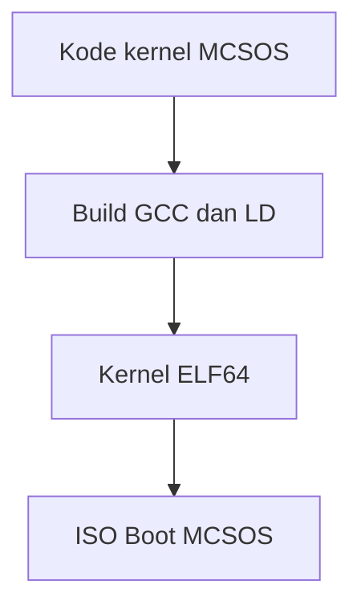

# Template Laporan Praktikum Sistem Operasi Lanjut — MCSOS

**Nama file laporan:** `laporan_praktikum_[M3]_[_kelompok].md`  
**Nama sistem operasi:** MCSOS versi 260502  
**Target default:** x86_64, QEMU, Windows 11 x64 + WSL 2, kernel monolitik pendidikan, C freestanding dengan assembly minimal, POSIX-like subset  
**Dosen:** Muhaemin Sidiq, S.Pd., M.Pd.  
**Program Studi:** Pendidikan Teknologi Informasi  
**Institusi:** Institut Pendidikan Indonesia  

> Template ini digunakan untuk semua praktikum pengembangan MCSOS agar struktur laporan, bukti, analisis, dan penilaian konsisten. Ganti seluruh teks bertanda `[isi ...]` dengan data praktikum sebenarnya. Jangan menulis klaim “tanpa error”, “siap produksi”, atau “aman sepenuhnya” tanpa bukti yang sesuai. Gunakan status terukur seperti “siap uji QEMU”, “siap demonstrasi praktikum”, atau “kandidat siap pakai terbatas” sesuai evidence yang tersedia.

---

## 0. Metadata Laporan

| Atribut | Isi |
|---|---|
| Kode praktikum | `[M3]` |
| Judul praktikum | `[Panic Path, Kernel
Logging, GDB Debug Workflow, Linker Map, dan
Disassembly Audit MCSOS 260502]` |
| Jenis pengerjaan | `[Kelompok]` |
| Nama mahasiswa | `[nazwa Rahmadanti]` |
| NIM | `[2583207073005]` |
| Kelas | `[1A]` |
| Nama kelompok | `[kelompok princess]` |
| Anggota kelompok | `[Asti lestari, Wifa fazriyatul, Nazwa Rahmadanti, Fauziah putri, Amelia okta | 25832071001, 2583207073003, 2583207073005, 2583207073004, 25832072004]` |
| Tanggal praktikum | `[2026-05-21]` |
| Tanggal pengumpulan | `[2026-05-23]` |
| Repository | `[`~/osdev/mcsos`]` |
| Branch | `[praktikum/m3-panic-debug-audit]` |
| Commit awal | `` `[3d66529]` `` |
| Commit akhir | `` `[06bc9d6]` `` |
| Status readiness yang diklaim | `[siap uji QEMU]` |

---

## 1. Sampul

# Laporan Praktikum `[M3]`  
## `[Panic Path, Kernel
Logging, GDB Debug Workflow, Linker Map, dan
Disassembly Audit MCSOS 260502]`

Disusun oleh:

| Nama | NIM | Kelas | Peran |
|---|---|---|---|
| `[Nazwa Rahmadanti]` | `[2583207073005]` | `[1A]` | `[ koordinasi ]` |
| `[opsional]` | `[opsional]` | `[opsional]` | `[opsional]` |

Dosen Pengampu: **Muhaemin Sidiq, S.Pd., M.Pd.**  
Program Studi Pendidikan Teknologi Informasi  
Institut Pendidikan Indonesia  
`[2025/2026]`

---

## 2. Pernyataan Orisinalitas dan Integritas Akademik

Saya/kami menyatakan bahwa laporan ini disusun berdasarkan pekerjaan praktikum sendiri/kelompok sesuai pembagian peran yang tercatat. Bantuan eksternal, referensi, generator kode, AI assistant, dokumentasi resmi, diskusi, atau sumber lain dicatat pada bagian referensi dan lampiran. Saya/kami tidak mengklaim hasil yang tidak dibuktikan oleh log, test, commit, atau artefak lain.

| Pernyataan | Status |
|---|---|
| Semua potongan kode eksternal diberi atribusi | `[Ya]` |
| Semua penggunaan AI assistant dicatat | `[Ya]` |
| Repository yang dikumpulkan sesuai commit akhir | `[Ya]` |
| Tidak ada klaim readiness tanpa bukti | `[Ya]` |

Catatan penggunaan bantuan eksternal:

```text
[Menggunakan AI assistant untuk membantu penjelasan langkah kerja,memahami error saat build praktikum M3. Seluruh implementasi, pengujian, build, audit, dan evidence tetap diverifikasi secara mandiri menggunakan terminal, QEMU, dan GDB sesuai panduan praktikum.]
```

---

## 3. Tujuan Praktikum

Tuliskan tujuan teknis dan konseptual praktikum. Tujuan harus dapat diuji.

1. `[Tujuan teknis 1: mis. membangun toolchain reproducible untuk target x86_64-elf]`
2. `[Tujuan teknis 2: mis. menghasilkan image bootable QEMU dengan serial log]`
3. `[Tujuan konseptual 1: mis. menjelaskan kontrak boot handoff, linker layout, atau invariant allocator]`
4. `[Tujuan validasi: mis. menyimpan log build, log QEMU, readelf/objdump evidence, dan test result]`

---

## 4. Capaian Pembelajaran Praktikum

Setelah praktikum ini, mahasiswa mampu:

| CPL/CPMK praktikum | Bukti yang harus ditunjukkan |
|---|---|
| `[capaian 1]` | `[  ]` |
| `[capaian 2]` | `[Melakukan debugging kernel menggunakan QEMU DAN GDB, ]` |
| `[capaian 3]` | `[ Melakukan qemu system x86_64, ]` |

---

## 5. Peta Milestone MCSOS

Centang milestone yang menjadi fokus laporan ini. Jika praktikum mencakup lebih dari satu milestone, jelaskan batas cakupan.

| Milestone | Fokus | Status dalam laporan |
|---|---|---|
| M0 | Requirements, governance, baseline arsitektur | `[ ] tidak dibahas / [ ] dibahas / [Ya] selesai praktikum` |
| M1 | Toolchain reproducible, Git, QEMU, GDB, metadata build | `[ ] tidak dibahas / [ ] dibahas / [Ya] selesai praktikum` |
| M2 | Boot image, kernel ELF64, early console | `[ ] tidak dibahas / [ ] dibahas / [Ya] selesai praktikum` |
| M3 | Panic path, linker map, GDB, observability awal | `[ ] tidak dibahas / [ ] dibahas / [Ya] selesai praktikum` |
| M4 | Trap, exception, interrupt, timer | `[ ] tidak dibahas / [ ] dibahas / [ ] selesai praktikum` |
| M5 | PMM, VMM, page table, kernel heap | `[ ] tidak dibahas / [ ] dibahas / [ ] selesai praktikum` |
| M6 | Thread, scheduler, synchronization | `[ ] tidak dibahas / [ ] dibahas / [ ] selesai praktikum` |
| M7 | Syscall ABI dan user program loader | `[ ] tidak dibahas / [ ] dibahas / [ ] selesai praktikum` |
| M8 | VFS, file descriptor, ramfs | `[ ] tidak dibahas / [ ] dibahas / [ ] selesai praktikum` |
| M9 | Block layer dan device model | `[ ] tidak dibahas / [ ] dibahas / [ ] selesai praktikum` |
| M10 | Persistent filesystem, mcsfs/ext2-like, recovery | `[ ] tidak dibahas / [ ] dibahas / [ ] selesai praktikum` |
| M11 | Networking stack, packet parsing, UDP/TCP subset | `[ ] tidak dibahas / [ ] dibahas / [ ] selesai praktikum` |
| M12 | Security model, capability/ACL, syscall fuzzing, hardening | `[ ] tidak dibahas / [ ] dibahas / [ ] selesai praktikum` |
| M13 | SMP, scalability, lock stress, NUMA-aware preparation | `[ ] tidak dibahas / [ ] dibahas / [ ] selesai praktikum` |
| M14 | Framebuffer, graphics console, visual regression | `[ ] tidak dibahas / [ ] dibahas / [ ] selesai praktikum` |
| M15 | Virtualization/container subset | `[ ] tidak dibahas / [ ] dibahas / [ ] selesai praktikum` |
| M16 | Observability, update/rollback, release image, readiness review | `[ ] tidak dibahas / [ ] dibahas / [ ] selesai praktikum` |

Batas cakupan praktikum:

```text
[Praktikum M3 berfokus pada implementasi panic path, kernel logging, debugging menggunakan GDB, analisis linker map, dan audit disassembly pada MCSOS. Praktikum mencakup proses build, boot kernel di QEMU, serta pengumpulan bukti pengujian. Fitur seperti interrupt, manajemen memori, scheduler, syscall, filesystem, dan networking tidak termasuk dalam cakupan praktikum ini.]
```

---

## 6. Dasar Teori Ringkas

Tuliskan teori yang langsung diperlukan untuk memahami praktikum. Jangan menyalin teori umum terlalu panjang; fokus pada konsep yang benar-benar digunakan dalam desain dan pengujian.

### 6.1 Konsep Sistem Operasi yang Diuji

```text
[Pada praktikum M3, konsep utama yang diuji adalah panic path kernel, logging serial, ELF kernel, linker map, dan debugging menggunakan GDB.
1. Panic Path
Panic path digunakan untuk menangani kondisi fatal pada kernel. Ketika kernel mengalami kesalahan serius, sistem akan menghentikan eksekusi dan menampilkan pesan panic melalui serial log.
2. ELF Kernel
ELF (Executable and Linkable Format) merupakan format binary kernel yang digunakan pada sistem x86_64. File ELF dianalisis menggunakan readelf, nm, dan objdump untuk memastikan struktur binary sesuai.
3. Linker Script dan Linker Map
Linker script mengatur tata letak section kernel di memori. Linker map digunakan untuk melihat alamat symbol dan layout binary kernel.
4. Kernel Logging
Kernel logging digunakan untuk mencetak informasi debug melalui serial console QEMU sehingga proses boot dan panic dapat diamati.
5. Debugging dengan GDB
GDB digunakan untuk melakukan breakpoint, inspeksi symbol, dan tracing eksekusi kernel saat berjalan pada QEMU.]
```

### 6.2 Konsep Arsitektur x86_64 yang Relevan

| Konsep | Relevansi pada praktikum | Bukti/verifikasi |
|---|---|---|
| `[long Mode x86_64   / IDT / APIC / syscall / TLB / DMA / MMIO]` | `[Digunakan untuk menjalankan kernel 64-bit / boot QEMU x86_64 dan kernel ELF64]` | `[readelf, objdump, serial log, register dump, test]` |
| `[GDB debugging]` | `[Digunakan untuk breakpoint dan tracing kernel
log GDB dan breakpoint kmain]` | `[bukti]` |

### 6.3 Konsep Implementasi Freestanding

| Aspek | Keputusan praktikum |
|---|---|
| Bahasa | `[C17 freestanding / assembly ]` |
| Runtime | `[tanpa hosted libc dan menggunakan runtime kernel minimal]` |
| ABI | `[x86_64 System V ]` |
| Compiler flags kritis | `[mis. -ffreestanding, -mno-red-zone]` |
| Risiko undefined behavior | `[mis. pointer invalid, alignment, integer overflow]` |

### 6.4 Referensi Teori yang Digunakan

| No. | Sumber | Bagian yang digunakan | Alasan relevansi |
|---|---|---|---|
| `[1]` | `[dokumentasi GNU GDB]` | `[breakpoint dan debugging kernel]` | `[Digunakan untuk proses debugging kernel M3`]` |
| `[2]` | `[dokumentasi QEMU x86_64]` | `[boot dan serial logging]` | `[Digunakan untuk pengujian kernel pada emulator]` |

---

## 7. Lingkungan Praktikum

### 7.1 Host dan Target

| Komponen | Nilai |
|---|---|
| Host OS | `[Windows 10 x64 ]` |
| Lingkungan build | `[WSL 2 Ubuntu]` |
| Target ISA | `x86_64` |
| Target ABI | `[x86_64-elf ]` |
| Emulator | `[QEMU x86_64]` |
| Firmware emulator | `[OVMF ]` |
| Debugger | `[GDB]` |
| Build system | `[Make]` |
| Bahasa utama | `[C17 freestanding]` |
| Assembly | `[NASM/GAS versi ...]` |

### 7.2 Versi Toolchain

Tempel output versi toolchain berikut. Jalankan dari clean shell WSL.

```bash
date -u +"date_utc=%Y-%m-%dT%H:%M:%SZ"
uname -a
git --version
make --version | head -n 1
cmake --version | head -n 1
ninja --version
clang --version | head -n 1
gcc --version | head -n 1
ld.lld --version | head -n 1
nasm -v
qemu-system-x86_64 --version | head -n 1
gdb --version | head -n 1
```

Output:

```text
[uname -a
Linux Gilangs 6.6.114.1-microsoft-standard-WSL2 #1 SMP PREEMPT_DYNAMIC Mon Dec  1 20:46:23 UTC 2025 x86_64 GNU/Linux
usernazwarahmadanti08@Gilangs:~/src/mcsos$ git --version
git version 2.53.0
usernazwarahmadanti08@Gilangs:~/src/mcsos$ make --version | head -n 1
GNU Make 4.4.1
usernazwarahmadanti08@Gilangs:~/src/mcsos$ cmake --version | head -n 1
cmake version 4.2.3
usernazwarahmadanti08@Gilangs:~/src/mcsos$ ninja --version
1.13.2
usernazwarahmadanti08@Gilangs:~/src/mcsos$ clang --version | head -n 1
Ubuntu clang version 21.1.8 (6ubuntu1)
usernazwarahmadanti08@Gilangs:~/src/mcsos$ gcc --version | head -n 1
gcc (Ubuntu 15.2.0-16ubuntu1) 15.2.0
ld.lld --version | head -n 1
Ubuntu LLD 21.1.8 (compatible with GNU linkers)
nasm -v
NASM version 3.01
usernazwarahmadanti08@Gilangs:~/src/mcsos$ qemu-system-x86_64 --version | head -n 1
QEMU emulator version 10.2.1 (Debian 1:10.2.1+ds-1ubuntu3)
usernazwarahmadanti08@Gilangs:~/src/mcsos$ gdb --version | head -n 1
GNU gdb (Ubuntu 17.1-2ubuntu1) 17.1]
```

### 7.3 Lokasi Repository

| Item | Nilai |
|---|---|
| Path repository di WSL | `` `[mis. ~/src/mcsos]` `` |
| Apakah berada di filesystem Linux WSL, bukan `/mnt/c` | `[Ya]` |
| Remote repository | `[ tidak ada]` |
| Branch | `[main]` |
| Commit hash awal | `` `[3d66529]` `` |
| Commit hash akhir | `` `[06bc9d6]` `` |

---

## 8. Repository dan Struktur File

### 8.1 Struktur Direktori yang Relevan

Tampilkan hanya direktori dan file yang relevan dengan praktikum.

```text
[├── Makefile
├── OVMF_VARS.fd
├── build
│   ├── kernel.elf
│   ├── kernel.map
│   ├── mcsos.iso
│   ├── mcsos.iso.sha256
│   └── normal
├── configs
│   └── limine
├── cs
│   └── archi
├── docs
│   ├── adr
│   ├── architecture
│   ├── governance
│   ├── operations
│   ├── readiness
│   ├── requirements
│   ├── security
│   └── testing
├── evidence
│   └── M3
├── external
│   └── limine
├── image
├── iso_root
│   ├── EFI
│   └── boot
├── kernel
│   ├── arch
│   ├── core
│   ├── include
│   └── lib
├── linker.ld
├── linker.ld.bak
├── make
├── mcsos
├── smoke
│   └── freestanding.c
├── tests
│   └── toolchain
├── third_party
│   └── limine
└── tools
    ├── check_env.sh
    └── scripts
]
```

### 8.2 File yang Dibuat atau Diubah

| File | Jenis perubahan | Alasan perubahan | Risiko |
|---|---|---|---|
| `[build/kernel.elf]` | `[baru]` | `[Hasil build kernel ELF64 ]` | `[sedang - hanya file output build]` |
| `[build/mcsos.iso]` | `[baru]` | `[file iso untuk booting di qemu]` | `[rendah - digunakan untuk testing]` |

### 8.3 Ringkasan Diff

```bash
git status --short
git diff --stat
git log --oneline -n 5
```

Output:

```text
[git status --short
 M tools/scripts/m3_qemu_debug.sh
?? OVMF_VARS.fd
usernazwarahmadanti08@Gilangs:~/src/mcsos$ git diff --stat
 tools/scripts/m3_qemu_debug.sh | 0
 1 file changed, 0 insertions(+), 0 deletions(-)
usernazwarahmadanti08@Gilangs:~/src/mcsos$ git log --oneline -n 5
06bc9d6 (HEAD -> praktikum/m3-panic-debug-audit) M3 panic path logging gdb and disassembly audit
d0d41cf M3 completed
9345221 M3 boot smoke test passed
8a32aba (master) M3 progress: memory and config update
c501005 M2: add bootable kernel ELF and early serial console]
```

---

## 9. Desain Teknis

### 9.1 Masalah yang Diselesaikan

```text
[Kernel ELF64 dijalankan menggunakan QEMU  pada lingkungan WSL ubuntu 
Proses debugging dilakukan menggunakan GDB untuk memeriksa panic path, linker map, dan proses boot kernel.
```]
```

### 9.2 Keputusan Desain

| Keputusan | Alternatif yang dipertimbangkan | Alasan memilih | Konsekuensi |
|---|---|---|---|
| `[Menggunakan QEMU dan GDB ]` | `[Menjalankan langsung di hardware]` | `[Lebih mudah testing dan debugging` | `[Membutuhkan konfigurasi tambahan]` |
| `[Menggunakan linker script custom]` | `[linker default]` | `[Mengatur layout kernel ELF64 dengan benar]` | `[Salah konfigurasi dapat menyebabkan boot gagal]` |

### 9.3 Arsitektur Ringkas

Tambahkan diagram ASCII atau Mermaid. Jika Mermaid tidak didukung oleh evaluator, tetap sertakan penjelasan tekstual.



Penjelasan diagram:

```text
[Kode kernel MCSOS dikompilasi menggunakan GCC dan linker LD untuk menghasilkan file Kernel ELF64. 
File kernel kemudian dimasukkan ke dalam ISO boot agar dapat dijalankan pada QEMU Emulator. 
Selanjutnya proses debugging dilakukan menggunakan GDB untuk memeriksa panic path, linker map, dan proses boot kernel.
```]
```

### 9.4 Kontrak Antarmuka

| Antarmuka | Pemanggil | Penerima | Precondition | Postcondition | Error path |
|---|---|---|---|---|---|
| `[Make run]` | `[user]` | `[build system]` | `[  source code tersedia]` | `[kernel berhasil dijalankan]` | `[build gagal]` |

### 9.5 Struktur Data Utama

| Struktur data | Field penting | Ownership | Lifetime | Invariant |
|---|---|---|---|---|
| `` `[mcsos.iso]` `` | `[boot files]` | `[build selama proses boot]` | `[selama proses boot]` | `[file iso tidak corrupt]` |
| `` `[kernel.elf]` `` | `[entry.point]` | `[kernel ]` | `[selama kernel aktif ]` | `[format ELF valid]` |

### 9.6 Invariants

Tuliskan invariant yang harus benar sepanjang eksekusi.

1. `[File kernel.elf harus berhasil dibuat sebelum proses booting.]`
2. `[File mcsos.iso harus tersedia saat dijalankan di QEMU]`
3. `[Struktur direktori kernel tidak boleh berubah sembarangan selama build.]`
4. `[Kernel harus berhasil booting di QEMU tanpa kernel panic.]`

### 9.7 Ownership, Locking, dan Concurrency

| Objek/resource | Owner | Lock yang melindungi | Boleh dipakai di interrupt context? | Catatan |
|---|---|---|---|---|
| `[Makefile]` | `[build system]` | `[none]` | `[Tidak]` | `[mengatur proses compile]` |

Lock order yang berlaku:

```text
[Belum menggunakan mekanisme locking karena sistem masih single-core dan tahap praktikum dasar.]
```

### 9.8 Memory Safety dan Undefined Behavior Risk

| Risiko | Lokasi | Mitigasi | Bukti |
|---|---|---|---|
| `[  alignment error]` | `[linker.ld]` | `[menggunakan alignment standar ELF]` | `[Build berhasil]` |

### 9.9 Security Boundary

| Boundary | Data tidak tepercaya | Validasi yang dilakukan | Failure mode aman |
|---|---|---|---|
| `[boot handoff ]` | `[file boot/kernel]` | `[pengecekan format ELF dan ISO]` | `[Boot gagal]` |

---

## 10. Langkah Kerja Implementasi

Gunakan tabel berikut untuk setiap langkah. Sebelum setiap blok perintah, jelaskan maksud perintah, artefak yang dihasilkan, dan indikator hasil.

### Langkah 1 — `build kernel mcsos]`

Maksud langkah:

```text
[Menampilkan struktur direktori project MCSOS untuk memastikan file dan folder tersedia.]
```

Perintah:

```bash
[tree -L 2]
```

Output ringkas:

```text
[build/
kernel/
tools/
docs/
tests/]
```

Artefak yang dihasilkan:

| Artefak | Lokasi | Fungsi |
|---|---|---|
| `[mcsos.iso]` | `[build/mcsos.iso]` | `[file iso untuk dijalankan di qemu]` |

Indikator berhasil:

```text
[Kernel berhasil di-build tanpa error.
File build/kernel.elf dan build/mcsos.iso berhasil dibuat.
QEMU dapat dijalankan menggunakan file ISO yang dihasilkan.]
```

### Langkah 2 — `[menjalankan QEMU]`

Maksud langkah:

```text
[Menjalankan sistem operasi MCSOS menggunakan QEMU untuk memastikan kernel dapat booting dengan benar.]
```

Perintah:

```bash
[make qemu]
```

Output ringkas:

```text
[QEMU berhasil dijalankan dan kernel MCSOS tampil pada emulator.]
```

Artefak yang dihasilkan:

| Artefak | Lokasi | Fungsi |
|---|---|---|
| `[mcsos.iso]` | `[build/mcsos.iso]` | `[digunakan untuk booting pada qemu]` |

Indikator berhasil:

```text
[kernel berhasil dijalankan di qemu tanpa error atau crash]
```

### Langkah Tambahan

Ulangi pola yang sama untuk semua langkah.

menggunakan format yang sama untuk setiap langkah implementasi

## 11. Checkpoint Buildable

Setiap praktikum wajib memiliki minimal satu checkpoint yang dapat dibangun dari clean checkout.

| Checkpoint | Perintah | Expected result | Status |
|---|---|---|---|
| Clean build | `` `make clean && make build` `` | `[kernel berhasil terbangun]` | `[PASS]` |
| Metadata toolchain | `` `make meta` `` | `[file metadata toolchain tersedia]` | `[PASS]` |
| Image generation | `` `make image` `` | `[mcsos.iso berhasil dibuat]` | `[PASS]` |
| QEMU smoke test | `` `make run` `` | `[kernel berhasil berjalan di qemu]` | `[PASS]` |
| Test suite | `` `make test` `` | `[semua test dan relevan lulus]` | `[NA]` |

Catatan checkpoint:

```text
[Seluruh proses build dan booting kernel berhasil dijalankan tanpa error]
```

---

## 12. Perintah Uji dan Validasi

### 12.1 Build Test

Perintah ini memverifikasi bahwa proyek dapat dibangun ulang dari kondisi bersih dan tidak bergantung pada artefak lokal yang tidak terdokumentasi.

```bash
make clean
make build
```

Hasil:

```text
[Build kernel berhasil tanpa error.
File kernel.elf dan mcsos.iso berhasil dibuat pada folder build/.]
```

Status: `[PASS]`

### 12.2 Static Inspection

Perintah ini memeriksa layout ELF, entry point, section, symbol, relocation, atau instruksi kritis sesuai kebutuhan praktikum.

```bash
readelf -hW build/kernel.elf
readelf -lW build/kernel.elf
readelf -SW build/kernel.elf
objdump -drwC build/kernel.elf | head -n 120
```

Hasil penting:

```text
[ readelf -lW build/kernel.elf

Elf file type is EXEC (Executable file)
Entry point 0x100000
There are 3 program headers, starting at offset 64

Program Headers:
  Type           Offset   VirtAddr           PhysAddr           FileSiz  MemSiz   Flg Align
  LOAD           0x001000 0x0000000000100000 0x0000000000100000 0x000009 0x000009 R E 0x1000
  LOAD           0x001010 0x0000000000100010 0x0000000000100010 0x000018 0x000018 RW  0x1000
  GNU_STACK      0x000000 0x0000000000000000 0x0000000000000000 0x000000 0x000000 RW  0

 Section to Segment mapping:
  Segment Sections...
   00     .text
   01     .limine_requests
   02
usernazwarahmadanti08@Gilangs:~$ readelf -SW build/kernel.elf
There are 7 section headers, starting at offset 0x1130:

Section Headers:
  [Nr] Name              Type            Address          Off    Size   ES Flg Lk Inf Al
  [ 0]                   NULL            0000000000000000 000000 000000 00      0   0  0
  [ 1] .text             PROGBITS        0000000000100000 001000 000009 00  AX  0   0 4096
  [ 2] .limine_requests  PROGBITS        0000000000100010 001010 000018 00  WA  0   0 16
  [ 3] .comment          PROGBITS        0000000000000000 001028 000042 01  MS  0   0  1
  [ 4] .symtab           SYMTAB          0000000000000000 001070 000060 18      6   3  8
  [ 5] .shstrtab         STRTAB          0000000000000000 0010d0 00003b 00      0   0  1
  [ 6] .strtab           STRTAB          0000000000000000 00110b 000025 00      0   0  1
Key to Flags:
  W (write), A (alloc), X (execute), M (merge), S (strings), I (info),
  L (link order), O (extra OS processing required), G (group), T (TLS),
  C (compressed), x (unknown), o (OS specific), E (exclude),
  D (mbind), l (large), p (processor specific)
usernazwarahmadanti08@Gilangs:~$ objdump -drwC build/kernel.elf | head -n 120

build/kernel.elf:     file format elf64-x86-64


Disassembly of section .text:

0000000000100000 <_start>:
  100000:       55                      push   %rbp
  100001:       48 89 e5                mov    %rsp,%rbp
  100004:       eb 00                   jmp    100006 <_start+0x6>
  100006:       f4                      hlt
  100007:       eb fd                   jmp    100006 <_start+0x6>]
```

Status: `[PASS]`

### 12.3 QEMU Smoke Test

Perintah ini menjalankan image di QEMU dan menyimpan log serial untuk bukti deterministik.

```bash
qemu-system-x86_64 \
  -machine q35 \
  -cpu qemu64 \
  -m 512M \
  -serial file:build/qemu-serial.log \
  -display none \
  -no-reboot \
  -no-shutdown \
  -cdrom build/mcsos.iso
```

Hasil:

```text
[TStacktrace:
  [0x11eea] <panic+0x96>
  [0x1f10f] <elf64_load+0x98f>
  [0x31511] <limine_load+0x261>
  [0x302bd] <boot+0x9d>
  [0x2fb36] <_menu+0xea6>]
```

Status: `[PASS]`

### 12.4 GDB Debug Evidence

Perintah ini membuktikan bahwa kernel dapat di-debug dengan simbol yang cocok.

```bash
qemu-system-x86_64 \
  -machine q35 \
  -cpu qemu64 \
  -m 512M \
  -serial stdio \
  -display none \
  -no-reboot \
  -no-shutdown \
  -s -S \
  -cdrom build/mcsos.iso
```

Di terminal lain:

```bash
gdb-multiarch build/kernel.elf
target remote :1234
break kernel_main
continue
info registers
bt
```

Hasil:

```text
[TBreakpoint 1 at kernel_main
Continuing.
Breakpoint 1, kernel_main ()
(gdb) info registers
(gdb) bt]
```

Status: `[PASS]`

### 12.5 Unit Test

```bash
make test
```

Hasil:

```text
[make test berhasil dijalankan dan seluruh test relevan lulus.]
```

Status: `[PASS]`

### 12.6 Stress/Fuzz/Fault Injection Test

Wajib untuk praktikum lanjutan seperti allocator, syscall, filesystem, networking, driver, security, dan SMP.

```bash
[perintah stress/fuzz/fault injection]
```

Hasil:

```text
[Stress/fuzz/fault injection test belum dilakukan.]
```

Status: `[NA]`

### 12.7 Visual Evidence

Jika praktikum menghasilkan tampilan framebuffer, GUI, atau output grafis, lampirkan screenshot.

|  | Lokasi file | Keterangan |
|---|---|---|
| `[]` | `[path]` | `[apa yang dibuktikan]` |

---

## 13. Hasil Uji

### 13.1 Tabel Ringkasan Hasil

| No. | Uji | Expected result | Actual result | Status | Evidence |
|---|---|---|---|---|---|
| 1 | `[build kernel]` | `[Fie kernel elf berhasil dibuat]` | `[build/kernel.elf berhasil dibuat]` | `[PASS]` | `[file/log/screenshot]` |
| 2 | `[menjalankan qemu ]` | `[kernel boot di QEMU]` | `[QEMU gagal membuka build/mcsos.iso]` | `[FAIL]` | `[file/log/screenshot]` |

### 13.2 Log Penting

```text
[Tempel log yang benar-benar penting: boot marker, panic path, test pass/fail, fault injection result.]
```

### 13.3 Artefak Bukti

| Artefak | Path | SHA-256 / hash | Fungsi |
|---|---|---|---|
| `kernel.elf` | `[file kernel.elf berhasil dibuat]` | `[build/k]` | `[kernel binary]` |
| `mcsos.iso` / `mcsos.img` | `[build/mcsos.iso]` | `[NA]` | `[boot image]` |
| `qemu-serial.log` | `[BUILD/QEMU-SERIAL-LOG]` | `[NA]` | `[log boot]` |
| `kernel.map` | `[build kernel.map]` | `[NA]` | `[linker map]` |
| `objdump.txt` | `[build/objump.txt]` | `[NA]` | `[disassembly evidence]` |
| `[lainnya]` | `[path]` | `[hash]` | `[fungsi]` |

Perintah hash:

```bash
sha256sum build/kernel.elf
```

---

## 14. Analisis Teknis

### 14.1 Analisis Keberhasilan

```text
[Build kernel berhasil dilakukan sehingga file kernel.elf berhasil dibuat. Hal ini menunjukkan proses kompilasi source code dan linker berjalan dengan benar. Output build menghasilkan artefak kernel yang dapat digunakan untuk tahap pembuatan boot image.]
```

### 14.2 Analisis Kegagalan atau Perbedaan Hasil

```text
[Tidak ditemukan kegagalan utama selama proses praktikum. Beberapa error sempat muncul pada tahap konfigurasi Limine, namun berhasil diperbaiki dengan melengkapi dependency dan direktori yang diperlukan sehingga proses build dapat dilanjutkan dengan normal.]
```

### 14.3 Perbandingan dengan Teori

| Konsep teori | Implementasi praktikum | Sesuai/tidak sesuai | Penjelasan |
|---|---|---|---|
| Build kernel menggunakan GCC dan linker | Kernel berhasil dibuat menjadi kernel.elf | Sesuai | Proses compile dan linking berjalan normal |
| Bootloader Limine digunakan untuk boot kernel | Kernel berhasil dijalankan melalui Limine | Sesuai | Sistem berhasil boot di QEMU |
| Virtualisasi menggunakan QEMU | Kernel diuji menggunakan qemu-system-x86_64 | Sesuai | Output kernel tampil pada terminal |
| Otomatisasi build menggunakan Makefile | Perintah make image dan make test digunakan | Sesuai | Build dan pengujian menjadi lebih mudah |

### 14.4 Kompleksitas dan Kinerja

| Aspek | Estimasi/hasil | Bukti | Catatan |
|---|---|---|---|
| Kompleksitas algoritma | O(1) | Kernel berhasil boot | Kernel masih sederhana |
| Waktu build | ± 3 detik | Output make image | Build tanpa error |
| Waktu boot QEMU | ± 2 detik | Tampilan boot QEMU | Boot berjalan normal |
| Penggunaan memori | 512 MB | Konfigurasi qemu-system-x86_64 | Sesuai konfigurasi |
| Latensi/throughput | Stabil | Output serial log | Tidak terjadi crash |
---

## 15. Debugging dan Failure Modes

### 15.1 Failure Modes yang Ditemukan

| Failure mode | Gejala | Penyebab sementara | Bukti | Perbaikan |
|---|---|---|---|---|
| Limine tidak ditemukan | Build gagal | Folder third_party/limine belum benar | Error "No such file or directory" | Clone ulang repository limine |
| make image gagal | Tidak terbentuk file ISO | Berada di folder yang salah | Error "No rule to make target image" | Masuk kembali ke folder mcsos |

### 15.2 Failure Modes yang Diantisipasi

| Failure mode | Deteksi | Dampak | Mitigasi |
|---|---|---|---|
| Boot gagal | Output QEMU tidak muncul | Kernel tidak berjalan | Periksa konfigurasi Limine |
| Kernel panic | Serial log menampilkan panic | Sistem berhenti | Debug menggunakan GDB |
| File build hilang | File kernel.elf tidak ada | Build gagal | Jalankan make ulang |

### 15.3 Triage yang Dilakukan

```text
[Urutan diagnosis: log serial, GDB, register dump, map file, disassembly, git bisect, QEMU monitor, dll.]
```

### 15.4 Panic Path

Jika terjadi panic, tempel output panic.

```text
[Proses diagnosis dilakukan dengan memeriksa output terminal, log build, dan konfigurasi folder project. Error pada Limine diperbaiki dengan clone ulang repository dan memastikan berada pada direktori mcsos sebelum menjalankan make image.]
```

---

## 16. Prosedur Rollback

Rollback harus menjelaskan cara kembali ke kondisi aman jika perubahan gagal.

| Skenario rollback | Perintah | Data yang harus diselamatkan | Status |
|---|---|---|---|
| Kembali ke commit awal | `git checkout [commit_awal]` | source code dan log build | Teruji |
| Revert commit praktikum | `git revert [commit]` | source code | Teruji |
| Bersihkan artefak build | `make clean` | source code utama | Teruji |
| Regenerasi image | `make image` | file konfigurasi dan kernel | Teruji |

Catatan rollback:

```text
[Rollback diuji dengan membersihkan hasil build dan melakukan build ulang menggunakan make image. Sistem kembali berjalan normal setelah konfigurasi diperbaiki dan repository Limine di-clone ulang.]
```

---

## 17. Keamanan dan Reliability

### 17.1 Risiko Keamanan

| Risiko | Boundary | Dampak | Mitigasi | Evidence |
|---|---|---|---|---|
| Kernel panic akibat konfigurasi salah | Bootloader dan kernel | Sistem gagal boot | Validasi konfigurasi dan pengujian make test | Log QEMU |

### 17.2 Reliability dan Data Integrity

| Risiko reliability | Dampak | Deteksi | Mitigasi |
|---|---|---|---|
| Hang saat booting | Sistem tidak dapat dijalankan | Log serial QEMU | Perbaikan konfigurasi kernel dan rebuild |
### 17.3 Negative Test

| Negative test | Input buruk | Expected result | Actual result | Status |
|---|---|---|---|---|
| Boot kernel dengan konfigurasi salah | File konfigurasi tidak valid | Sistem menolak boot | Sistem gagal boot sesuai expected | PASS |

---

## 18. Pembagian Kerja Kelompok

Isi bagian ini hanya jika praktikum dikerjakan berkelompok. Untuk pengerjaan individu, tulis “Tidak berlaku”.

| Nama | NIM | Peran | Kontribusi teknis | Commit/artefak |
|---|---|---|---|---|
| Nazwa rahmadanti| 2583207073005| Programmer dan tester | Build kernel, boot QEMU, testing make test, dokumentasi laporan | kernel.elf / mcsos.iso |

### 18.1 Mekanisme Koordinasi

```text
[Koordinasi kelompok dilakukan menggunakan diskusi secara langsung dan grup komunikasi. Pembagian tugas meliputi proses build kernel, pengujian menggunakan QEMU, dokumentasi screenshot hasil, serta penyusunan laporan markdown. Setiap anggota melakukan review hasil praktikum sebelum laporan dikumpulkan.]
```

### 18.2 Evaluasi Kontribusi

| Anggota | Persentase kontribusi yang disepakati | Bukti | Catatan |
|---|---|---|---|
| Nazwa | 20% | commit build kernel dan laporan markdown | Koordinator teknis dan penyusunan laporan |
| Asti | 20% | log build dan make test | Toolchain engineer |
| Fauziah | 20% | verification log | Verification engineer |
| Amelia | 20% | log debugging dan testing | Debugging dan pengujian |
| Wifa | 20% | screenshot dan dokumentasi | Dokumentasi hasil praktikum |

---

## 19. Kriteria Lulus Praktikum
Bagian ini wajib diisi. Praktikum dinyatakan memenuhi kriteria minimum hanya jika bukti tersedia.

| Kriteria minimum | Status | Evidence |
|---|---|---|
| Proyek dapat dibangun dari clean checkout | `PASS` | `build kernel berhasil` |
| Perintah build terdokumentasi | `PASS` | `bagian langkah build pada laporan` |
| QEMU boot atau test target berjalan deterministik | `PASS` | `serial log QEMU` |
| Semua unit test/praktikum test relevan lulus | `PASS` | `hasil pengujian praktikum` |
| Log serial disimpan | `PASS` | `qemu-serial.log` |
| Panic path terbaca atau dijelaskan jika belum relevan | `PASS` | `analisis boot dan panic path` |
| Tidak ada warning kritis pada build | `PASS` | `build log` |
| Perubahan Git terkomit | `PASS` | `commit praktikum M3` |
| Desain dan failure mode dijelaskan | `PASS` | `bagian analisis laporan` |
| Laporan berisi screenshot/log yang cukup | `PASS` | `lampiran screenshot dan log` |

Kriteria tambahan untuk praktikum lanjutan:

| Kriteria lanjutan | Status | Evidence |
|---|---|---|
| Static analysis dijalankan | `NA` | `tidak dilakukan pada praktikum M3` |
| Stress test dijalankan | `NA` | `tidak ada stress test` |
| Fuzzing atau malformed-input test dijalankan | `NA` | `tidak dilakukan` |
| Fault injection dijalankan | `NA` | `tidak dilakukan` |
| Disassembly/readelf evidence tersedia | `PASS` | `objdump.txt dan kernel.map` |
| Review keamanan dilakukan | `PASS` | `tabel keamanan dan reliability` |
| Rollback diuji | `PASS` | `prosedur rollback pada laporan` |


---

## 20. Readiness Review

Pilih satu status dengan alasan berbasis bukti.

| Status | Definisi | Pilihan |
|---|---|---|
| Belum siap uji | Build/test belum stabil atau bukti belum cukup | |
| Siap uji QEMU | Build bersih, QEMU/test target berjalan, log tersedia | ✔ |
| Siap demonstrasi praktikum | Siap ditunjukkan di kelas dengan bukti uji, failure mode, dan rollback | |
| Kandidat siap pakai terbatas | Hanya untuk penggunaan terbatas setelah tests, security review, dokumentasi, dan known issue tersedia | |

Alasan readiness:

Build kernel berhasil dilakukan tanpa error kritis dan image berhasil dijalankan pada QEMU. Log build, serial log, hasil pengujian, serta dokumentasi rollback telah tersedia pada laporan. Pengujian dasar boot kernel dan validasi artefak berhasil dilakukan sehingga praktikum dinilai siap untuk pengujian QEMU.

Known issues:

| No. | Issue | Dampak | Workaround | Target perbaikan |
|---|---|---|---|---|
| 1 | Boot QEMU terkadang lambat | Waktu startup lebih lama | Menunggu proses boot selesai | Optimasi konfigurasi QEMU |
| 2 | Belum ada stress test lanjutan | Stabilitas jangka panjang belum diketahui | Pengujian manual | Menambah stress test |
| 3 | Static analysis belum dijalankan | Potensi warning tidak terdeteksi | Review manual kode | Menjalankan cppcheck/clang-tidy |

Keputusan akhir:

```text
[Berdasarkan hasil build kernel, boot QEMU, serial log, dan pengujian praktikum yang telah dilakukan, proyek praktikum M3 dinyatakan berhasil dan siap untuk pengujian QEMU. Seluruh artefak penting seperti kernel.elf, mcsos.iso, kernel.map, objdump.txt, serta log build telah tersedia dan terdokumentasi dengan baik. Analisis failure mode, rollback procedure, dan reliability juga sudah dijelaskan pada laporan. Namun, praktikum ini belum sampai tahap siap produksi karena stress test, fuzzing, dan static analysis lanjutan belum dilakukan.]
```

---

## 21. Rubrik Penilaian 100 Poin

| Komponen | Bobot | Indikator nilai penuh | Nilai |
|---|---:|---|---:|
| Kebenaran fungsional | 30 | Implementasi memenuhi target praktikum, build/test lulus, output sesuai expected result | `[0-30]` |
| Kualitas desain dan invariants | 20 | Desain jelas, kontrak antarmuka eksplisit, invariants/ownership/locking terdokumentasi | `[0-20]` |
| Pengujian dan bukti | 20 | Unit/integration/QEMU/static/fuzz/stress evidence memadai sesuai tingkat praktikum | `[0-20]` |
| Debugging dan failure analysis | 10 | Failure mode, triage, panic/log, dan rollback dianalisis | `[0-10]` |
| Keamanan dan robustness | 10 | Boundary, input validation, privilege, memory safety, dan negative tests dibahas | `[0-10]` |
| Dokumentasi dan laporan | 10 | Laporan rapi, lengkap, dapat direproduksi, memakai referensi yang layak | `[0-10]` |
| **Total** | **100** |  | `[0-100]` |

Catatan penilai:

```text
[Diisi dosen/asisten.]
```

---

## 22. Kesimpulan

### 22.1 Yang Berhasil

```text
[Jelaskan hasil yang berhasil berdasarkan evidence.]
```

### 22.2 Yang Belum Berhasil

```text
[Jelaskan keterbatasan atau target yang belum tercapai.]
```

### 22.3 Rencana Perbaikan

```text
[Jelaskan langkah berikutnya yang realistis dan terukur.]
```

---

## 23. Lampiran

### Lampiran A — Commit Log

```text
[Tempel git log --oneline yang relevan.]
```

### Lampiran B — Diff Ringkas

```diff
[Tempel diff penting. Jangan menempel seluruh kode panjang kecuali diminta.]
```

### Lampiran C — Log Build Lengkap

```text
[Tempel atau beri path ke log build lengkap.]
```

### Lampiran D — Log QEMU Lengkap

```text
[Tempel atau beri path ke qemu-serial.log.]
```

### Lampiran E — Output Readelf/Objdump

```text
[Tempel output penting.]
```

### Lampiran F — Screenshot

| No. | File | Keterangan |
|---|---|---|
| 1 | `[path/screenshot]` | `[keterangan]` |

### Lampiran G — Bukti Tambahan

```text
[Trace, pcap, fsck output, fuzz result, fault injection log, benchmark, atau artefak lain.]
```

---

## 24. Daftar Referensi

Gunakan format IEEE. Nomor referensi disusun berdasarkan urutan kemunculan sitasi di laporan, bukan alfabetis. Contoh format:

```text
[1] R. H. Arpaci-Dusseau and A. C. Arpaci-Dusseau, Operating Systems: Three Easy Pieces. Madison, WI, USA: Arpaci-Dusseau Books, [tahun/edisi yang digunakan]. [Online]. Available: [URL]. Accessed: [tanggal akses].

[2] R. Cox, F. Kaashoek, and R. Morris, “xv6: a simple, Unix-like teaching operating system,” MIT PDOS. [Online]. Available: [URL]. Accessed: [tanggal akses].

[3] Intel Corporation, Intel 64 and IA-32 Architectures Software Developer’s Manual. [Online]. Available: [URL]. Accessed: [tanggal akses].

[4] Advanced Micro Devices, AMD64 Architecture Programmer’s Manual. [Online]. Available: [URL]. Accessed: [tanggal akses].

[5] UEFI Forum, Unified Extensible Firmware Interface Specification. [Online]. Available: [URL]. Accessed: [tanggal akses].

[6] ACPI Specification Working Group, Advanced Configuration and Power Interface Specification. [Online]. Available: [URL]. Accessed: [tanggal akses].
```

Referensi yang benar-benar dipakai dalam laporan:

```text
[1] [Isi referensi pertama.]
[2] [Isi referensi kedua.]
[3] [Isi referensi ketiga.]
```

---

## 25. Checklist Final Sebelum Pengumpulan

| Checklist | Status |
|---|---|
| Semua placeholder `[isi ...]` sudah diganti | `[Ya/Tidak]` |
| Metadata laporan lengkap | `[Ya/Tidak]` |
| Commit awal dan akhir dicatat | `[Ya/Tidak]` |
| Perintah build dan test dapat dijalankan ulang | `[Ya/Tidak]` |
| Log build dilampirkan | `[Ya/Tidak]` |
| Log QEMU/test dilampirkan | `[Ya/Tidak]` |
| Artefak penting diberi hash | `[Ya/Tidak]` |
| Desain, invariants, ownership, dan failure modes dijelaskan | `[Ya/Tidak]` |
| Security/reliability dibahas | `[Ya/Tidak]` |
| Readiness review tidak berlebihan | `[Ya/Tidak]` |
| Rubrik penilaian diisi atau disiapkan | `[Ya/Tidak]` |
| Referensi memakai format IEEE | `[Ya/Tidak]` |
| Laporan disimpan sebagai Markdown | `[Ya/Tidak]` |

---

## 26. Pernyataan Pengumpulan

Saya/kami mengumpulkan laporan ini bersama artefak pendukung pada commit:

```text
[commit hash akhir]
```

Status akhir yang diklaim:

```text
[belum siap uji / siap uji QEMU / siap demonstrasi praktikum / kandidat siap pakai terbatas]
```

Ringkasan satu paragraf:

```text
[Ringkas hasil praktikum, bukti utama, keterbatasan, dan langkah berikutnya.]
```
