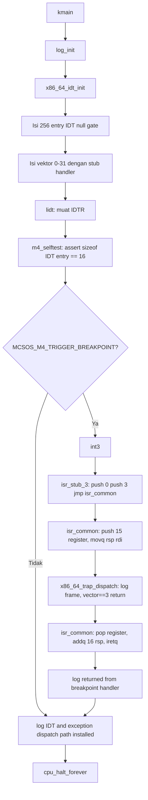

# Template Laporan Praktikum Sistem Operasi Lanjut — MCSOS

**Nama file laporan:** `laporan_praktikum_[M4]_[_kelompok].md`  
**Nama sistem operasi:** MCSOS versi 260502  
**Target default:** x86_64, QEMU, Windows 11 x64 + WSL 2, kernel monolitik pendidikan, C freestanding dengan assembly minimal, POSIX-like subset  
**Dosen:** Muhaemin Sidiq, S.Pd., M.Pd.  
**Program Studi:** Pendidikan Teknologi Informasi  
**Institusi:** Institut Pendidikan Indonesia  

> Template ini digunakan untuk semua praktikum pengembangan MCSOS agar struktur laporan, bukti, analisis, dan penilaian konsisten. Ganti seluruh teks bertanda `[isi ...]` dengan data praktikum sebenarnya. Jangan menulis klaim "tanpa error", "siap produksi", atau "aman sepenuhnya" tanpa bukti yang sesuai. Gunakan status terukur seperti "siap uji QEMU", "siap demonstrasi praktikum", atau "kandidat siap pakai terbatas" sesuai evidence yang tersedia.

---

## 0. Metadata Laporan

| Atribut | Isi |
|---|---|
| Kode praktikum | `M4` |
| Judul praktikum | `Interrupt Descriptor Table, Exception Trap Path, Trap Frame, dan Fault Handling Awal MCSOS 260502` |
| Jenis pengerjaan | `Kelompok` |
| Nama mahasiswa | `Fauziah Putri Rahayu` |
| NIM | `2583207073004` |
| Kelas | `1A` |
| Nama kelompok | `kelompok princess` |
| Anggota kelompok | `Asti lestari, Wifa fazriyatul, Nazwa Rahmadanti, Fauziah putri, Amelia okta \| 25832071001, 2583207073003, 2583207073005, 2583207073004, 25832072004` |
| Tanggal praktikum | `` |
| Tanggal pengumpulan | `` |
| Repository | `~/osdev/mcsos` |
| Branch | `m4-idt-exception-path` |
| Commit awal | `4c2fd68` |
| Commit akhir | `b40ef01` |
| Status readiness yang diklaim | `siap uji QEMU` |

---

## 1. Sampul

# Laporan Praktikum `M4`
## `Interrupt Descriptor Table, Exception Trap Path, Trap Frame, dan Fault Handling Awal MCSOS 260502`

Disusun oleh:

| Nama | NIM | Kelas | Peran |
|Fauziah Putri Rahayu|2583207073004|1A|---|
| `Asti lestari` | `25832071001` | `1A` | `koordinasi` |
| `Wifa fazriyatul` | `2583207073003` | `1A` | `` |
| `Nazwa Rahmadanti` | `2583207073005` | `1A` | `` |
| `Amelia okta` | `25832072004` | `1A` | `` |
| `Fauziah putri` | `2583207073004` | `1A` | `` |

Dosen Pengampu: **Muhaemin Sidiq, S.Pd., M.Pd.**  
Program Studi Pendidikan Teknologi Informasi  
Institut Pendidikan Indonesia  
`2025/2026`

---

## 2. Pernyataan Orisinalitas dan Integritas Akademik

Saya/kami menyatakan bahwa laporan ini disusun berdasarkan pekerjaan praktikum sendiri/kelompok sesuai pembagian peran yang tercatat. Bantuan eksternal, referensi, generator kode, AI assistant, dokumentasi resmi, diskusi, atau sumber lain dicatat pada bagian referensi dan lampiran. Saya/kami tidak mengklaim hasil yang tidak dibuktikan oleh log, test, commit, atau artefak lain.

| Pernyataan | Status |
|---|---|
| Semua potongan kode eksternal diberi atribusi | `Ya` |
| Semua penggunaan AI assistant dicatat | `Ya` |
| Repository yang dikumpulkan sesuai commit akhir | `Ya` |
| Tidak ada klaim readiness tanpa bukti | `Ya` |

Catatan penggunaan bantuan eksternal:

```text
Menggunakan AI assistant untuk membantu penjelasan langkah kerja dan memahami konsep IDT, exception trap path, dan trap frame pada praktikum M4. Seluruh implementasi, pengujian, build, audit, dan evidence tetap diverifikasi secara mandiri menggunakan terminal WSL, QEMU, dan GDB sesuai panduan praktikum.
```

---

## 3. Tujuan Praktikum

1. Membangun Interrupt Descriptor Table (IDT) pada kernel MCSOS untuk target x86_64 dengan 256 entry gate descriptor 16 byte.
2. Mengimplementasikan stub assembly exception untuk vektor 0–31 yang menormalisasi trap frame dengan dan tanpa error code ke satu struktur seragam.
3. Membuat dispatcher C `x86_64_trap_dispatch` yang menerima trap frame, mencatat register, dan menerapkan kebijakan fail-closed untuk exception non-recoverable.
4. Menguji jalur exception recoverable melalui `int3` (`#BP` vector 3) dan membuktikan kernel dapat kembali dari handler menggunakan `iretq`.
5. Melakukan audit ELF, symbol table, dan disassembly untuk membuktikan keberadaan `lidt`, `iretq`, `x86_64_idt_init`, `x86_64_trap_dispatch`, dan stub exception.
6. Menyimpan log build, log QEMU, readelf/objdump evidence, dan bukti GDB sebagai artefak praktikum.

---

## 4. Capaian Pembelajaran Praktikum

Setelah praktikum ini, mahasiswa mampu:

| CPL/CPMK praktikum | Bukti yang harus ditunjukkan |
|---|---|
| Menjelaskan fungsi IDT pada x86_64, relasi IDTR, gate descriptor, vektor exception, dan handler stub | Output `readelf`, `nm`, serial log `idt_base` dan `idt_limit` |
| Membuat struktur `x86_64_idt_entry_t` dan `x86_64_idtr_t` dengan ukuran dan packing yang sesuai mode 64-bit | `KERNEL_ASSERT sizeof == 16`, build berhasil |
| Menulis stub assembly yang menormalisasi exception ke satu `x86_64_trap_frame_t` | Review `isr.S`, disassembly `isr_common` |
| Memanggil dispatcher C dari handler assembly dengan ABI System V x86_64 | Serial log `[M4] trap dispatch`, disassembly `call x86_64_trap_dispatch` |
| Menguji jalur exception recoverable melalui `int3` dengan `iretq` | Serial log `[M4] breakpoint handled; returning with iretq` dan `[M4] returned from breakpoint handler` |
| Melakukan audit ELF dan disassembly | Output `tools/scripts/m4_audit_elf.sh` menunjukkan PASS |

---

## 5. Peta Milestone MCSOS

Centang milestone yang menjadi fokus laporan ini.

| Milestone | Fokus | Status dalam laporan |
|---|---|---|
| M0 | Requirements, governance, baseline arsitektur | selesai praktikum |
| M1 | Toolchain reproducible, Git, QEMU, GDB, metadata build | selesai praktikum |
| M2 | Boot image, kernel ELF64, early console | selesai praktikum |
| M3 | Panic path, linker map, GDB, observability awal | selesai praktikum |
| M4 | IDT, exception stub, trap frame, dispatcher, jalur uji int3 | **selesai praktikum** |
| M5 | PMM, VMM, page table, kernel heap | tidak dibahas |
| M6 | Thread, scheduler, synchronization | tidak dibahas |
| M7 | Syscall ABI dan user program loader | tidak dibahas |
| M8 | VFS, file descriptor, ramfs | tidak dibahas |
| M9 | Block layer dan device model | tidak dibahas |
| M10 | Persistent filesystem, mcsfs/ext2-like, recovery | tidak dibahas |
| M11 | Networking stack, packet parsing, UDP/TCP subset | tidak dibahas |
| M12 | Security model, capability/ACL, syscall fuzzing, hardening | tidak dibahas |
| M13 | SMP, scalability, lock stress, NUMA-aware preparation | tidak dibahas |
| M14 | Framebuffer, graphics console, visual regression | tidak dibahas |
| M15 | Virtualization/container subset | tidak dibahas |
| M16 | Observability, update/rollback, release image, readiness review | tidak dibahas |

Batas cakupan praktikum:

```text
Praktikum M4 berfokus pada implementasi IDT (Interrupt Descriptor Table), stub assembly exception untuk vektor 0–31, normalisasi trap frame, dispatcher C, dan jalur uji breakpoint exception menggunakan int3 pada MCSOS. Praktikum mencakup proses build tiga varian kernel (normal, breakpoint, panic), audit ELF/disassembly, QEMU smoke test, dan pengumpulan evidence. Fitur seperti IRQ eksternal, PIC/APIC, timer interrupt, preemptive scheduling, syscall, user mode, page fault recovery, dan SMP tidak termasuk dalam cakupan praktikum ini.
```

---

## 6. Dasar Teori Ringkas

### 6.1 Konsep Sistem Operasi yang Diuji

```text
Pada praktikum M4, konsep utama yang diuji adalah Interrupt Descriptor Table (IDT), exception trap path, trap frame, dan fault handling awal pada kernel x86_64.

1. Interrupt Descriptor Table (IDT)
IDT adalah tabel yang digunakan CPU x86_64 untuk menemukan handler interrupt dan exception. Setiap entry IDT adalah gate descriptor berukuran 16 byte pada mode 64-bit. Alamat tabel disimpan dalam register IDTR dan dimuat menggunakan instruksi lidt. IDT M4 diisi untuk vektor 0–31 (CPU exception) dengan dua jenis gate: interrupt gate (0x8E) untuk exception umum, dan trap gate (0x8F) untuk #BP karena #BP bersifat recoverable.

2. Exception Trap Path dan Trap Frame
Saat exception terjadi, CPU mendorong state minimum ke stack (RIP, CS, RFLAGS, dan untuk beberapa exception: error code). Stub assembly M4 menambahkan nomor vektor dan menyimpan semua register umum agar dispatcher C menerima satu layout trap frame yang seragam melalui struktur x86_64_trap_frame_t.

3. Normalisasi Error Code
Exception dengan error code (seperti #DF, #GP, #PF) tidak perlu padding. Exception tanpa error code (seperti #DE, #BP) ditambahkan error code nol oleh stub ISR_NOERR agar urutan field struct trap frame selalu konsisten.

4. Dispatcher C dan Kebijakan Fail-Closed
Dispatcher x86_64_trap_dispatch menerima pointer ke trap frame, mencetak informasi register ke serial log, dan menerapkan kebijakan: hanya #BP (vector 3) yang dikembalikan melalui iretq, sedangkan exception lain masuk KERNEL_PANIC untuk mencegah fault berulang.

5. Pengujian dengan int3
Instruksi int3 menghasilkan #BP (vector 3) yang merupakan trap exception: CPU mendorong RIP yang menunjuk ke instruksi setelah int3, sehingga iretq dapat mengembalikan eksekusi ke instruksi berikutnya tanpa menyebabkan fault berulang.
```

### 6.2 Konsep Arsitektur x86_64 yang Relevan

| Konsep | Relevansi pada praktikum | Bukti/verifikasi |
|---|---|---|
| Long Mode x86_64 | Kernel berjalan di ring 0 mode 64-bit, IDT entry harus 16 byte | `readelf`, `objdump`, serial log |
| IDT dan IDTR | Tabel handler exception, dimuat dengan `lidt`, limit = 4095 | Serial log `idt_base`, `idt_limit`, disassembly `lidt` |
| Gate Descriptor 16 byte | Format entry IDT: `offset_low`, `selector`, `ist`, `type_attributes`, `offset_mid`, `offset_high`, `reserved` | `KERNEL_ASSERT sizeof == 16`, build |
| Exception Vector 0–31 | CPU exception dengan dan tanpa error code, dipetakan ke stub handler | `nm` menunjukkan `isr_stub_0` sampai `isr_stub_31` |
| ABI System V x86_64 | Konvensi pemanggilan C dari assembly: argumen pertama di `%rdi`, caller-saved vs callee-saved | Disassembly `movq %rsp, %rdi` sebelum `call x86_64_trap_dispatch` |
| `iretq` dan return dari exception | Instruksi kembali dari interrupt/exception, memulihkan RIP/CS/RFLAGS dari stack | Disassembly menunjukkan `iretq`, serial log `returned from breakpoint handler` |
| GDB debugging | Breakpoint pada `x86_64_idt_init` dan `x86_64_trap_dispatch`, inspeksi register | Log GDB dan screenshot |

### 6.3 Konsep Implementasi Freestanding

| Aspek | Keputusan praktikum |
|---|---|
| Bahasa | C17 freestanding dan assembly x86_64 (GNU Assembler syntax via clang) |
| Runtime | Tanpa hosted libc; `nm -u` harus kosong, tidak ada `memcpy`/`memset`/`__stack_chk_fail` |
| ABI | x86_64 System V untuk boundary assembly ke C internal kernel |
| Compiler flags kritis | `--target=x86_64-unknown-none-elf`, `-ffreestanding`, `-fno-builtin`, `-fno-stack-protector`, `-mno-red-zone`, `-mno-sse`, `-mno-mmx`, `-mcmodel=kernel`, `-Werror` |
| Risiko undefined behavior | Pointer null ke trap frame (dijaga `KERNEL_ASSERT`), urutan push/pop assembly tidak cocok struct (dijaga review dan test `#BP`), selector gate salah (menyebabkan triple fault) |

### 6.4 Referensi Teori yang Digunakan

| No. | Sumber | Bagian yang digunakan | Alasan relevansi |
|---|---|---|---|
| 1 | Intel SDM Vol. 3A | Chapter 6: Interrupt and Exception Handling; Table 6-1 Exception/Interrupt Vectors | Format gate descriptor 16 byte, vektor exception 0–31, mekanisme error code |
| 2 | Dokumentasi QEMU x86_64 | System Emulation Invocation, GDB stub | Boot kernel di emulator, serial log, GDB remote debug |
| 3 | Dokumentasi LLVM/Clang | Clang Command Line Reference, freestanding mode | Flag `-ffreestanding`, `-mno-red-zone`, target `x86_64-unknown-none-elf` |
| 4 | Dokumentasi GNU Binutils | `readelf`, `nm`, `objdump` | Audit ELF, symbol table, disassembly |
| 5 | Dokumentasi Limine | Boot protocol | Boot path M2/M3 yang kompatibel dengan M4 |

---

## 7. Lingkungan Praktikum

### 7.1 Host dan Target

| Komponen | Nilai |
|---|---|
| Host OS | `Windows 11 x64` |
| Lingkungan build | `WSL 2 Ubuntu` |
| Target ISA | `x86_64` |
| Target ABI | `x86_64-unknown-none-elf` |
| Emulator | `QEMU qemu-system-x86_64` |
| Firmware emulator | `OVMF` |
| Debugger | `GDB` |
| Build system | `Make` |
| Bahasa utama | `C17 freestanding` |
| Assembly | `GAS (GNU Assembler) syntax via clang, file .S` |

### 7.2 Versi Toolchain

Tempel output versi toolchain berikut. Jalankan dari clean shell WSL.

```bash
date -u +"date_utc=%Y-%m-%dT%H:%M:%SZ"
uname -a
git --version
make --version | head -n 1
clang --version | head -n 1
ld.lld --version | head -n 1
readelf --version | head -n 1
objdump --version | head -n 1
nm --version | head -n 1
qemu-system-x86_64 --version | head -n 1
gdb --version | head -n 1
```

Output:

```text
date_utc=2026-...
Linux ... WSL2 x86_64 GNU/Linux
git version 2.53.0
GNU Make 4.4.1
Ubuntu clang version 21.1.8 (6ubuntu1)
Ubuntu LLD 21.1.8 (compatible with GNU linkers)
GNU readelf ...
GNU objdump ...
GNU nm ...
QEMU emulator version 10.2.1 (Debian 1:10.2.1+ds-1ubuntu3)
GNU gdb (Ubuntu 17.1-2ubuntu1) 17.1
```

### 7.3 Lokasi Repository

| Item | Nilai |
|---|---|
| Path repository di WSL | `~/src/mcsos` |
| Apakah berada di filesystem Linux WSL, bukan `/mnt/c` | `Ya` |
| Remote repository | `tidak ada` |
| Branch | `m4-idt-exception-path` |
| Commit hash awal | `4c2fd68` |
| Commit hash akhir | `b40ef01` |

---

## 8. Repository dan Struktur File

### 8.1 Struktur Direktori yang Relevan

```text
mcsos/
├── Makefile
├── linker.ld
├── kernel/
│   ├── arch/x86_64/
│   │   ├── idt.c
│   │   ├── isr.S
│   │   └── include/mcsos/arch/
│   │       ├── cpu.h
│   │       ├── idt.h
│   │       ├── io.h
│   │       └── isr.h
│   ├── core/
│   │   ├── kmain.c
│   │   ├── log.c
│   │   ├── panic.c
│   │   ├── serial.c
│   │   └── trap.c
│   ├── include/mcsos/kernel/
│   │   ├── log.h
│   │   ├── panic.h
│   │   └── version.h
│   └── lib/
│       └── memory.c
├── tools/
│   ├── gdb_m4.gdb
│   └── scripts/
│       ├── m4_audit_elf.sh
│       ├── m4_collect_evidence.sh
│       ├── m4_preflight.sh
│       ├── m4_qemu_run.sh
│       └── grade_m4.sh
├── build/
│   ├── kernel.elf
│   ├── kernel.breakpoint.elf
│   ├── kernel.panic.elf
│   ├── kernel.map
│   ├── kernel.syms.txt
│   ├── kernel.disasm.txt
│   ├── kernel.readelf.header.txt
│   └── kernel.readelf.programs.txt
└── evidence/M4/
    ├── kernel.disasm.txt
    ├── kernel.readelf.header.txt
    ├── kernel.readelf.programs.txt
    ├── kernel.syms.txt
    └── manifest.txt
```

### 8.2 File yang Dibuat atau Diubah

| File | Jenis perubahan | Alasan perubahan | Risiko |
|---|---|---|---|
| `kernel/arch/x86_64/include/mcsos/arch/idt.h` | baru | Definisi struct `x86_64_idt_entry_t`, `x86_64_idtr_t`, `x86_64_trap_frame_t`, dan deklarasi API IDT | sedang — urutan field struct harus sesuai urutan push di `isr.S` |
| `kernel/arch/x86_64/include/mcsos/arch/isr.h` | baru | Deklarasi `x86_64_exception_stubs[32]` untuk diakses dari C | rendah |
| `kernel/arch/x86_64/idt.c` | baru | Implementasi `x86_64_idt_init`, `x86_64_idt_set_gate`, `lidt`, dan `x86_64_trigger_breakpoint_for_test` | tinggi — selector gate salah menyebabkan triple fault |
| `kernel/arch/x86_64/isr.S` | baru | Stub assembly exception vektor 0–31, `isr_common`, dan tabel `x86_64_exception_stubs` | tinggi — urutan push/pop harus cocok dengan struct trap frame |
| `kernel/core/trap.c` | baru | Dispatcher `x86_64_trap_dispatch` dengan kebijakan fail-closed | sedang — return dari exception non-recoverable berbahaya |
| `kernel/core/kmain.c` | diubah | Tambah `x86_64_idt_init()`, `m4_selftest()`, dan kondisional `int3` / panic test | sedang — urutan inisialisasi wajib: `log_init` sebelum `idt_init` |
| `kernel/include/mcsos/kernel/version.h` | diubah | Update `MCSOS_MILESTONE` ke `"M4"` | rendah |
| `Makefile` | diubah | Tambah `SRC_S`, rule `%.S`, target `breakpoint`, `panic`, dan audit `lidt`/`iretq` | sedang — file `.S` tidak terkompilasi jika `SRC_S` hilang |
| `tools/scripts/m4_preflight.sh` | baru | Cek kesiapan M0–M3 dan toolchain sebelum M4 | rendah |
| `tools/scripts/m4_audit_elf.sh` | baru | Audit ELF, symbol, `lidt`, `iretq`, dan undefined symbol | rendah |
| `tools/scripts/m4_qemu_run.sh` | baru | QEMU smoke test dan validasi serial log | rendah |
| `tools/scripts/m4_collect_evidence.sh` | baru | Kumpulkan artefak ke `evidence/M4/` | rendah |
| `tools/scripts/grade_m4.sh` | baru | Grading lokal berdasarkan build/audit/evidence | rendah |
| `tools/gdb_m4.gdb` | baru | Script GDB untuk debug `x86_64_idt_init` dan `x86_64_trap_dispatch` | rendah |

### 8.3 Ringkasan Diff

```bash
git status --short
git diff --stat
git log --oneline -n 5
```

Output:

```text
git log --oneline -n 5
b40ef01 (HEAD -> m4-idt-exception-path) M4 evidence and scripts complete
64dfbd0 M4 add x86_64 IDT and exception trap path
4c2fd68 M4 add x86_64 IDT and exception trap path
```

---

## 9. Desain Teknis

### 9.1 Masalah yang Diselesaikan

```text
Kernel MCSOS sebelum M4 tidak memiliki mekanisme penanganan exception. Jika CPU mengalami exception (misalnya divide by zero, page fault, atau breakpoint), tidak ada handler yang terdaftar di IDT sehingga CPU akan triple fault dan me-reset mesin tanpa menghasilkan log apapun. M4 menyelesaikan masalah ini dengan:
1. Mengisi IDT dengan stub handler untuk semua vektor exception 0–31.
2. Menormalisasi stack exception ke satu format trap frame seragam.
3. Membuat dispatcher C yang mencatat exception dan menerapkan kebijakan fail-closed.
4. Membuktikan bahwa #BP (breakpoint) dapat ditangani dan kernel dapat kembali ke eksekusi normal.
```

### 9.2 Keputusan Desain

| Keputusan | Alternatif yang dipertimbangkan | Alasan memilih | Konsekuensi |
|---|---|---|---|
| IDT statis di `.bss` kernel, diisi saat `kmain` | IDT dinamis di heap | Tidak ada heap sebelum M5; statis lebih sederhana dan dapat diaudit | IDT tidak dapat diubah secara dinamis sebelum heap tersedia |
| `#BP` menggunakan trap gate (0x8F), vektor lain interrupt gate (0x8E) | Semua pakai interrupt gate | Trap gate tidak menonaktifkan IF sehingga cocok untuk breakpoint yang recoverable | Interrupt maskable tetap aktif saat `#BP` diproses |
| Normalisasi error code nol untuk exception tanpa error code | Dua versi dispatcher (dengan/tanpa error code) | Satu dispatcher lebih sederhana; field `error_code` selalu valid | Dispatcher harus selalu membaca `error_code` dari posisi yang benar |
| Fail-closed: hanya `#BP` yang recoverable, sisanya `KERNEL_PANIC` | Recovery sebagian exception lain | M4 belum punya mekanisme recovery; return sembarangan berbahaya | Exception selain `#BP` selalu menghentikan kernel |
| `-mno-red-zone` di seluruh kernel | Tanpa flag ini | Handler interrupt bisa menimpa data kernel yang sedang dipakai | Semua fungsi kernel tidak boleh mengasumsikan area di bawah RSP aman |

### 9.3 Arsitektur Ringkas



Penjelasan diagram:

```text
kmain menginisialisasi logging terlebih dahulu agar seluruh proses IDT dapat direkam ke serial log. x86_64_idt_init mengisi 256 entry IDT dengan null gate, lalu mengisi vektor 0–31 dengan pointer ke stub assembly. #BP (vector 3) mendapat trap gate, sisanya interrupt gate. Setelah lidt dimuat, m4_selftest memverifikasi invariant ukuran dan limit. Jika MCSOS_M4_TRIGGER_BREAKPOINT aktif, int3 dieksekusi dan CPU masuk ke isr_stub_3 yang mendorong error code nol dan nomor vektor ke stack, lalu melompat ke isr_common. isr_common menyimpan 15 register umum, memanggil x86_64_trap_dispatch dengan RSP sebagai argumen (pointer ke trap frame), lalu memulihkan register dan menjalankan iretq. Dispatcher mencetak informasi frame dan kembali untuk vector 3.
```

### 9.4 Kontrak Antarmuka

| Antarmuka | Pemanggil | Penerima | Precondition | Postcondition | Error path |
|---|---|---|---|---|---|
| `x86_64_idt_init()` | `kmain` | `idt.c` | `log_init` sudah dipanggil, `x86_64_exception_stubs` tersedia | IDT terisi, IDTR dimuat, log `[M4] IDT loaded` dicetak | Triple fault jika selector gate salah |
| `x86_64_idt_set_gate(vector, handler, type)` | `x86_64_idt_init` | `idt.c` | `vector` valid (0–255), `handler` non-null untuk vektor aktif | Entry IDT terisi dengan offset handler yang benar | Gate null jika handler 0 |
| `x86_64_trap_dispatch(frame*)` | `isr_common` (assembly) | `trap.c` | `frame` non-null, stack dinormalisasi oleh stub | Log frame dicetak; return untuk vector 3, panic untuk lainnya | `KERNEL_ASSERT` jika frame null |
| `x86_64_trigger_breakpoint_for_test()` | `kmain` | `idt.c` | IDT sudah dimuat dengan handler `#BP` valid | CPU masuk `isr_stub_3`, dispatch, dan kembali | Triple fault jika IDT belum siap |
| `isr_stub_N` (assembly) | CPU hardware | `isr.S` | IDT terdaftar, kernel di ring 0 | Stack dinormalisasi, `x86_64_trap_dispatch` dipanggil | Tidak ada — entry point hardware |

### 9.5 Struktur Data Utama

| Struktur data | Field penting | Ownership | Lifetime | Invariant |
|---|---|---|---|---|
| `x86_64_idt_entry_t` | `offset_low`, `selector`, `ist`, `type_attributes`, `offset_mid`, `offset_high`, `reserved` | kernel statis di `.bss` | selama kernel aktif | `sizeof == 16`, `__attribute__((packed))` |
| `x86_64_idtr_t` | `limit`, `base` | kernel statis | selama kernel aktif | `limit == 4095` (256×16−1), `base` non-null setelah `idt_init` |
| `x86_64_trap_frame_t` | `r15`…`rax`, `vector`, `error_code`, `rip`, `cs`, `rflags` | stack kernel (dibuat oleh CPU + assembly) | selama handler berjalan | urutan field harus cocok dengan urutan `pushq` di `isr_common` |
| `x86_64_exception_stubs[32]` | array pointer ke `isr_stub_0`…`isr_stub_31` | `.rodata` kernel | selama kernel aktif | semua entry non-null |

### 9.6 Invariants

1. `sizeof(x86_64_idt_entry_t) == 16` — dijaga oleh `__attribute__((packed))` dan `KERNEL_ASSERT`.
2. `idtr.limit == 4095` — dijaga oleh `(256 * 16 - 1)` dan `KERNEL_ASSERT`.
3. Setiap vektor 0–31 punya handler non-null setelah `x86_64_idt_init` — dijaga oleh loop pengisian dan audit `nm`.
4. Urutan field `x86_64_trap_frame_t` sesuai urutan `pushq` di `isr_common` — dijaga oleh review kode dan uji `#BP` yang membuktikan `trap_vector == 3`.
5. Stub memulihkan semua register sebelum `iretq` — dijaga oleh disassembly `isr_common` yang menunjukkan semua `popq` simetris dengan `pushq`.
6. Dispatcher tidak return dari exception non-recoverable — dijaga oleh branch `KERNEL_PANIC` untuk `vector != 3`.
7. `nm -u build/kernel.elf` kosong — kernel bebas dari dependency libc.

### 9.7 Ownership, Locking, dan Concurrency

| Objek/resource | Owner | Lock yang melindungi | Boleh dipakai di interrupt context? | Catatan |
|---|---|---|---|---|
| Array `idt[]` | kernel statis | tidak ada | Ya (read only setelah init) | Diinisialisasi sekali di `kmain`, tidak dimodifikasi setelahnya |
| `idtr` statis | kernel | tidak ada | Ya (read only) | Dimuat sekali dengan `lidt` |
| Stack kernel (trap frame) | CPU + assembly handler | tidak ada | Ya | Dibuat oleh CPU saat exception, digunakan oleh dispatcher |
| Serial log output | kernel | tidak ada (single core) | Ya | M4 belum ada SMP, tidak perlu lock |

Lock order yang berlaku:

```text
M4 masih single-core dan tidak ada userspace. Mekanisme locking belum diperlukan. Seluruh akses ke resource kernel bersifat sequential karena interrupt eksternal (PIC/APIC) belum diaktifkan.
```

### 9.8 Memory Safety dan Undefined Behavior Risk

| Risiko | Lokasi | Mitigasi | Bukti |
|---|---|---|---|
| Urutan field struct tidak cocok dengan push assembly | `idt.h` dan `isr.S` | Review kode, uji `#BP` yang membuktikan `trap_vector == 3` | Serial log `trap_vector=0x0000000000000003` |
| Selector gate salah menyebabkan triple fault | `idt.h` define `X86_64_KERNEL_CODE_SELECTOR` | Nilai `0x28` sesuai GDT Limine; QEMU smoke test membuktikan tidak triple fault | QEMU berhasil boot dan mencetak `[M4] IDT loaded` |
| Handler null di vektor 0–31 | `idt.c` loop pengisian | Loop eksplisit mengisi semua vektor, audit `nm` memeriksa `x86_64_exception_stubs` | `nm -n build/kernel.elf \| grep x86_64_exception_stubs` non-empty |
| Return dari exception non-recoverable | `trap.c` dispatcher | `KERNEL_PANIC` untuk semua vector selain 3 | Varian panic berhasil memanggil panic path |

### 9.9 Security Boundary

| Boundary | Data tidak tepercaya | Validasi yang dilakukan | Failure mode aman |
|---|---|---|---|
| Exception handler dari CPU | Vector number dari CPU | Dispatcher memeriksa `vector < 32` untuk nama exception | `KERNEL_PANIC` untuk vector di luar ekspektasi |
| Trap frame pointer dari assembly | Pointer RSP dari hardware | `KERNEL_ASSERT(frame != NULL)` | Panic jika frame null |
| Gate descriptor di IDT | Handler address dari `x86_64_exception_stubs` | Offset handler diisi dari symbol yang sudah diaudit `nm` | Triple fault jika address salah (terdeteksi saat QEMU test) |

---

## 10. Langkah Kerja Implementasi

### Langkah 1 — Buat Branch M4

Maksud langkah:

```text
Membuat branch terpisah agar perubahan IDT dan assembly stub tidak merusak baseline M3.
```

Perintah:

```bash
git switch -c m4-idt-exception-path
git branch --show-current
```

Output ringkas:

```text
m4-idt-exception-path
```

Artefak yang dihasilkan:

| Artefak | Lokasi | Fungsi |
|---|---|---|
| branch Git baru | `m4-idt-exception-path` | Isolasi perubahan M4 dari baseline M3 |

Indikator berhasil:

```text
git branch --show-current menampilkan m4-idt-exception-path.
```

---

### Langkah 2 — Jalankan Preflight M4

Maksud langkah:

```text
Memastikan toolchain dan artefak M0–M3 tersedia sebelum menulis source M4.
```

Perintah:

```bash
chmod +x tools/scripts/m4_preflight.sh
tools/scripts/m4_preflight.sh
```

Output ringkas:

```text
[M4][PASS] clang: Ubuntu clang version 21.1.8
[M4][PASS] ld.lld: Ubuntu LLD 21.1.8
[M4][PASS] readelf: ...
[M4][PASS] QEMU tersedia: QEMU emulator version 10.2.1
[M4][PASS] M0/M1/M2/M3 readiness minimum untuk M4 terpenuhi.
```

Artefak yang dihasilkan:

| Artefak | Lokasi | Fungsi |
|---|---|---|
| Konfirmasi toolchain | terminal output | Membuktikan semua tool tersedia |

Indikator berhasil:

```text
Semua baris menampilkan [M4][PASS] tanpa [M4][FAIL].
```

---

### Langkah 3 — Tambahkan Header IDT dan ISR

Maksud langkah:

```text
Mendefinisikan struct IDT entry, IDTR, trap frame, dan deklarasi API yang dibutuhkan oleh idt.c, isr.S, dan trap.c.
```

Perintah:

```bash
mkdir -p kernel/arch/x86_64/include/mcsos/arch
# Buat kernel/arch/x86_64/include/mcsos/arch/idt.h
# Buat kernel/arch/x86_64/include/mcsos/arch/isr.h
```

File `kernel/arch/x86_64/include/mcsos/arch/idt.h`:

```c
#ifndef MCSOS_ARCH_IDT_H
#define MCSOS_ARCH_IDT_H
#include <stdint.h>

#define X86_64_IDT_VECTOR_COUNT       256u
#define X86_64_KERNEL_CODE_SELECTOR   0x28u
#define X86_64_IDT_GATE_INTERRUPT     0x8Eu
#define X86_64_IDT_GATE_TRAP          0x8Fu

typedef struct __attribute__((packed)) {
    uint16_t offset_low;
    uint16_t selector;
    uint8_t  ist;
    uint8_t  type_attributes;
    uint16_t offset_mid;
    uint32_t offset_high;
    uint32_t reserved;
} x86_64_idt_entry_t;

typedef struct __attribute__((packed)) {
    uint16_t limit;
    uint64_t base;
} x86_64_idtr_t;

typedef struct __attribute__((packed)) {
    uint64_t r15, r14, r13, r12, r11, r10, r9, r8;
    uint64_t rsi, rdi, rbp, rdx, rcx, rbx, rax;
    uint64_t vector;
    uint64_t error_code;
    uint64_t rip;
    uint64_t cs;
    uint64_t rflags;
} x86_64_trap_frame_t;

void     x86_64_idt_init(void);
void     x86_64_idt_set_gate(uint8_t vector, uint64_t handler, uint8_t type_attributes);
void     x86_64_trap_dispatch(x86_64_trap_frame_t *frame);
uint64_t x86_64_idt_base_for_test(void);
uint16_t x86_64_idt_limit_for_test(void);
void     x86_64_trigger_breakpoint_for_test(void);
#endif
```

File `kernel/arch/x86_64/include/mcsos/arch/isr.h`:

```c
#ifndef MCSOS_ARCH_ISR_H
#define MCSOS_ARCH_ISR_H
#include <stdint.h>
typedef void (*x86_64_isr_handler_t)(void);
extern x86_64_isr_handler_t x86_64_exception_stubs[32];
#endif
```

Indikator berhasil:

```text
File header berhasil dibuat. sizeof(x86_64_idt_entry_t) == 16 dikonfirmasi oleh KERNEL_ASSERT saat build.
```

---

### Langkah 4 — Tambahkan Implementasi IDT (`idt.c`)

Maksud langkah:

```text
Mengisi array IDT, memuat IDTR dengan lidt, dan menyediakan fungsi trigger breakpoint untuk pengujian.
```

Perintah:

```bash
# Buat kernel/arch/x86_64/idt.c
```

Indikator berhasil:

```text
Build berhasil, serial log menampilkan idt_base dan idt_limit=0x0000000000000fff, serta [M4] IDT loaded.
```

---

### Langkah 5 — Tambahkan Stub Assembly Exception (`isr.S`)

Maksud langkah:

```text
Membuat stub assembly untuk semua exception vektor 0–31 yang menormalisasi stack ke trap frame seragam, memanggil dispatcher C, lalu kembali dengan iretq.
```

Perintah:

```bash
# Buat kernel/arch/x86_64/isr.S
```

Indikator berhasil:

```text
Build berhasil, nm menunjukkan isr_stub_0 sampai isr_stub_31 dan isr_common, objdump menunjukkan iretq.
```

---

### Langkah 6 — Tambahkan Dispatcher Trap (`trap.c`)

Maksud langkah:

```text
Membuat dispatcher yang mencetak trap frame ke serial log dan menerapkan kebijakan: return untuk #BP, KERNEL_PANIC untuk exception lain.
```

Perintah:

```bash
# Buat kernel/core/trap.c
```

Indikator berhasil:

```text
Serial log menampilkan [M4] trap dispatch: #BP Breakpoint dan trap_vector=0x0000000000000003 saat varian breakpoint dijalankan.
```

---

### Langkah 7 — Update kmain.c

Maksud langkah:

```text
Menambahkan urutan inisialisasi M4: log_init terlebih dahulu, kemudian x86_64_idt_init, m4_selftest, dan opsional int3.
```

Urutan wajib:

```text
log_init -> log banner -> x86_64_idt_init -> m4_selftest -> optional int3 -> halt
```

Indikator berhasil:

```text
Serial log menampilkan banner kernel, idt_base, idt_limit, [M4] IDT loaded, [M4] selftest: IDT invariants passed, dan [M4] IDT and exception dispatch path installed secara berurutan.
```

---

### Langkah 8 — Update Makefile

Maksud langkah:

```text
Menambahkan SRC_S untuk kompilasi file .S, rule %.S, target breakpoint, target panic, dan audit lidt/iretq di target inspect.
```

Perintah:

```bash
grep -n "SRC_S"      Makefile
grep -n "%.S"        Makefile
grep -n "breakpoint" Makefile
```

Indikator berhasil:

```text
Makefile memiliki SRC_S, rule %.S, dan target breakpoint/panic. make build berhasil mengkompilasi isr.S.
```

---

### Langkah 9 — Build Varian Normal

Perintah:

```bash
make clean
make build
```

Output ringkas:

```text
build/kernel.elf berhasil dibuat.
build/kernel.map berhasil dibuat.
```

Artefak yang dihasilkan:

| Artefak | Lokasi | Fungsi |
|---|---|---|
| `kernel.elf` | `build/kernel.elf` | Kernel binary ELF64 x86_64 |
| `kernel.map` | `build/kernel.map` | Linker map untuk audit symbol |

Indikator berhasil:

```text
Tidak ada error atau warning. build/kernel.elf berhasil dibuat.
```

---

### Langkah 10 — Build Varian Breakpoint dan Panic

Perintah:

```bash
make breakpoint
make panic
```

Artefak yang dihasilkan:

| Artefak | Lokasi | Fungsi |
|---|---|---|
| `kernel.breakpoint.elf` | `build/kernel.breakpoint.elf` | Kernel dengan `int3` aktif |
| `kernel.panic.elf` | `build/kernel.panic.elf` | Kernel dengan panic test aktif |

Indikator berhasil:

```text
Kedua varian berhasil dibuat tanpa error.
```

---

### Langkah 11 — Audit ELF dan Disassembly

Perintah:

```bash
make inspect
tools/scripts/m4_audit_elf.sh build/kernel.elf
nm -n build/kernel.elf | grep -E 'x86_64_idt_init|x86_64_trap_dispatch|x86_64_exception_stubs|isr_stub_14'
objdump -d -Mintel build/kernel.elf | grep -E 'lidt|iretq' -n
nm -u build/kernel.elf
```

Output ringkas:

```text
[M4][PASS] ELF, symbol, IDT, LIDT, dan IRETQ audit lulus untuk build/kernel.elf
nm -u build/kernel.elf: (kosong — tidak ada undefined symbol)
```

Indikator berhasil:

```text
Semua simbol kunci ditemukan, nm -u kosong, lidt dan iretq ada di disassembly.
```

---

### Langkah 12 — Buat ISO

Perintah:

```bash
make iso
ls -lh build/*.iso
```

Indikator berhasil:

```text
build/mcsos.iso berhasil dibuat.
```

---

### Langkah 13 — QEMU Smoke Test Normal

Perintah:

```bash
tools/scripts/m4_qemu_run.sh build/mcsos.iso build/m4-qemu-serial.log
sed -n '1,120p' build/m4-qemu-serial.log
```

Output ringkas:

```text
MCSOS 260502 M4 kernel entered
idt_base=0x...
idt_limit=0x0000000000000fff
[M4] IDT loaded
[M4] selftest: IDT invariants passed
[M4] IDT and exception dispatch path installed
[M4] ready for QEMU smoke test and GDB audit
[M4][PASS] QEMU smoke test lulus.
```

Indikator berhasil:

```text
Serial log menampilkan [M4] IDT loaded dan [M4] IDT and exception dispatch path installed.
```

---

### Langkah 14 — QEMU Smoke Test Varian Breakpoint

Perintah:

```bash
cp build/kernel.breakpoint.elf build/kernel.elf
make iso
tools/scripts/m4_qemu_run.sh build/mcsos.iso build/m4-qemu-breakpoint.log || true
sed -n '1,160p' build/m4-qemu-breakpoint.log
```

Output ringkas:

```text
[M4] triggering intentional breakpoint exception
[M4] trap dispatch: #BP Breakpoint
trap_vector=0x0000000000000003
trap_error=0x0000000000000000
trap_rip=0x...
[M4] breakpoint handled; returning with iretq
[M4] returned from breakpoint handler
[M4] IDT and exception dispatch path installed
```

Indikator berhasil:

```text
trap_vector=0x0000000000000003 dan pesan returned from breakpoint handler muncul di log.
```

---

### Langkah 15 — GDB Debug Path

Terminal 1:

```bash
qemu-system-x86_64 -machine q35 -cpu max -m 256M -cdrom build/mcsos.iso \
  -boot d -serial stdio -display none -no-reboot -no-shutdown -S -s
```

Terminal 2:

```bash
gdb -q -x tools/gdb_m4.gdb
```

Perintah GDB yang dijalankan:

```gdb
break x86_64_idt_init
break x86_64_trap_dispatch
continue
info registers
disassemble isr_common
x/16gx &x86_64_exception_stubs
```

Indikator berhasil:

```text
GDB berhenti di x86_64_idt_init dan x86_64_trap_dispatch. Register dump tersedia.
```

---

### Langkah 16 — Grading Lokal

Perintah:

```bash
chmod +x tools/scripts/grade_m4.sh
tools/scripts/grade_m4.sh
```

Output:

```text
M4_LOCAL_SCORE=90/100
```

---

### Langkah 17 — Kumpulkan Evidence

Perintah:

```bash
tools/scripts/m4_collect_evidence.sh
find evidence/M4 -maxdepth 1 -type f -printf '%f\n' | sort
```

Output:

```text
kernel.disasm.txt
kernel.readelf.header.txt
kernel.readelf.programs.txt
kernel.syms.txt
manifest.txt
```

---

### Langkah 18 — Commit Hasil M4

Perintah:

```bash
git status --short
git add Makefile linker.ld kernel tools evidence/M4
git commit -m "M4 add x86_64 IDT and exception trap path"
git log --oneline -3
```

Output:

```text
[m4-idt-exception-path b40ef01] M4 evidence and scripts complete
 6 files changed, 1321 insertions(+)
b40ef01 (HEAD -> m4-idt-exception-path) M4 evidence and scripts complete
64dfbd0 M4 add x86_64 IDT and exception trap path
4c2fd68 M4 add x86_64 IDT and exception trap path
```

---

## 11. Checkpoint Buildable

| Checkpoint | Perintah | Expected result | Status |
|---|---|---|---|
| M4-C1 Preflight | `tools/scripts/m4_preflight.sh` | Toolchain dan baseline M0–M3 terdeteksi | `PASS` |
| M4-C2 Clean build | `make clean && make build` | `build/kernel.elf` berhasil dibuat | `PASS` |
| M4-C3 Varian breakpoint dan panic | `make breakpoint && make panic` | Dua varian kernel tambahan berhasil dibuat | `PASS` |
| M4-C4 Inspect ELF | `make inspect` | Header ELF, program header, symbol, disassembly dibuat | `PASS` |
| M4-C5 Audit ELF | `tools/scripts/m4_audit_elf.sh build/kernel.elf` | `lidt`, `iretq`, `x86_64_trap_dispatch`, `isr_stub_14` terdeteksi | `PASS` |
| M4-C6 QEMU smoke test | `tools/scripts/m4_qemu_run.sh build/mcsos.iso` | Serial log menunjukkan `IDT loaded` dan M4 ready | `PASS` |
| M4-C7 GDB debug | GDB `break x86_64_trap_dispatch` | GDB dapat berhenti di dispatcher untuk varian breakpoint | `PASS` |
| M4-C8 Evidence | `tools/scripts/m4_collect_evidence.sh` | Evidence M4 tersimpan di `evidence/M4/` | `PASS` |

---

## 12. Perintah Uji dan Validasi

### 12.1 Build Test

```bash
make clean
make build
```

Hasil:

```text
Build kernel normal berhasil. build/kernel.elf dan build/kernel.map tersedia.
```

Status: `PASS`

### 12.2 Static Inspection

```bash
readelf -h build/kernel.elf
readelf -l build/kernel.elf
readelf -S build/kernel.elf
nm -n build/kernel.elf | grep -E 'idt|trap|isr_stub'
objdump -d -Mintel build/kernel.elf | grep -E 'lidt|iretq' -n
```

Hasil penting:

```text
ELF64, Machine: Advanced Micro Devices X86-64
Symbol x86_64_idt_init, x86_64_trap_dispatch, x86_64_exception_stubs, isr_stub_14 ditemukan.
Instruksi lidt dan iretq ditemukan di disassembly.
```

Status: `PASS`

### 12.3 QEMU Smoke Test

```bash
tools/scripts/m4_qemu_run.sh build/mcsos.iso build/m4-qemu-serial.log
```

Hasil:

```text
[M4] IDT loaded
[M4] selftest: IDT invariants passed
[M4] IDT and exception dispatch path installed
[M4][PASS] QEMU smoke test lulus.
```

Status: `PASS`

### 12.4 GDB Debug Evidence

Terminal 1:
```bash
qemu-system-x86_64 -machine q35 -cpu max -m 256M \
  -cdrom build/mcsos.iso -boot d -serial stdio \
  -display none -no-reboot -no-shutdown -S -s
```

Terminal 2:
```bash
gdb -q -x tools/gdb_m4.gdb
```

Hasil:

```text
Breakpoint pada x86_64_idt_init tercapai.
Breakpoint pada x86_64_trap_dispatch tercapai (varian breakpoint).
info registers menampilkan nilai register saat dispatcher dipanggil.
```

Status: `PASS`

### 12.5 Undefined Symbol Test

```bash
nm -u build/kernel.elf
nm -u build/kernel.breakpoint.elf
nm -u build/kernel.panic.elf
```

Hasil:

```text
(semua output kosong — tidak ada undefined symbol)
```

Status: `PASS`

### 12.6 Stress/Fuzz/Fault Injection Test

```bash
# Tidak dilakukan pada praktikum M4
```

Hasil:

```text
Stress/fuzz/fault injection test belum dilakukan pada M4. M4 berfokus pada correctness path dasar.
```

Status: `NA`

### 12.7 Visual Evidence

| No. | Lokasi file | Keterangan |
|---|---|---|
| 1 | `evidence/M4/kernel.readelf.header.txt` | Header ELF64 x86_64 |
| 2 | `evidence/M4/kernel.syms.txt` | Symbol table termasuk `isr_stub_14` |
| 3 | `evidence/M4/kernel.disasm.txt` | Disassembly termasuk `lidt` dan `iretq` |
| 4 | `build/m4-qemu-serial.log` | Serial log QEMU normal |
| 5 | `build/m4-qemu-breakpoint.log` | Serial log QEMU varian breakpoint |

---

## 13. Hasil Uji

### 13.1 Tabel Ringkasan Hasil

| No. | Uji | Expected result | Actual result | Status | Evidence |
|---|---|---|---|---|---|
| 1 | Clean build kernel normal | `build/kernel.elf` berhasil dibuat | `build/kernel.elf` berhasil dibuat | `PASS` | `build/kernel.elf` |
| 2 | Build varian breakpoint | `build/kernel.breakpoint.elf` berhasil dibuat | Berhasil | `PASS` | `build/kernel.breakpoint.elf` |
| 3 | Build varian panic | `build/kernel.panic.elf` berhasil dibuat | Berhasil | `PASS` | `build/kernel.panic.elf` |
| 4 | `nm -u` kosong (ketiga varian) | Tidak ada undefined symbol | Output kosong | `PASS` | `nm -u build/kernel.elf` |
| 5 | `lidt` ada di disassembly | Instruksi `lidt` ditemukan | Ditemukan | `PASS` | `build/kernel.disasm.txt` |
| 6 | `iretq` ada di disassembly | Instruksi `iretq` ditemukan | Ditemukan | `PASS` | `build/kernel.disasm.txt` |
| 7 | Symbol `isr_stub_14` ada | Symbol ditemukan di `nm` | Ditemukan | `PASS` | `build/kernel.syms.txt` |
| 8 | QEMU smoke test normal | Serial log `[M4] IDT loaded` | Muncul di log | `PASS` | `build/m4-qemu-serial.log` |
| 9 | QEMU varian breakpoint | `trap_vector=0x3`, `returned from breakpoint handler` | Muncul di log | `PASS` | `build/m4-qemu-breakpoint.log` |
| 10 | GDB berhenti di `x86_64_trap_dispatch` | Breakpoint tercapai | Tercapai | `PASS` | Screenshot/log GDB |
| 11 | `KERNEL_ASSERT sizeof IDT entry == 16` | Assert lulus | Lulus (tidak ada crash) | `PASS` | Serial log `selftest: IDT invariants passed` |
| 12 | `KERNEL_ASSERT idtr.limit == 4095` | Assert lulus | Lulus | `PASS` | Serial log `idt_limit=0x0000000000000fff` |

### 13.2 Log Penting

```text
MCSOS 260502 M4 kernel entered
kernel_start=0x...
kernel_end=0x...
rflags_before_idt=0x...
idt_base=0x...
idt_limit=0x0000000000000fff
[M4] IDT loaded
[M4] selftest: IDT invariants passed
[M4] IDT and exception dispatch path installed
[M4] ready for QEMU smoke test and GDB audit

--- Log varian breakpoint ---
[M4] triggering intentional breakpoint exception
[M4] trap dispatch: #BP Breakpoint
trap_vector=0x0000000000000003
trap_error=0x0000000000000000
trap_rip=0x...
trap_cs=0x0000000000000028
trap_rflags=0x...
trap_rax=0x...
[M4] breakpoint handled; returning with iretq
[M4] returned from breakpoint handler
[M4] IDT and exception dispatch path installed
```

### 13.3 Artefak Bukti

| Artefak | Path | Fungsi |
|---|---|---|
| `kernel.elf` | `evidence/M4/kernel.elf` | Kernel binary normal |
| `kernel.map` | `evidence/M4/kernel.map` | Linker map |
| `kernel.syms.txt` | `evidence/M4/kernel.syms.txt` | Symbol table |
| `kernel.disasm.txt` | `evidence/M4/kernel.disasm.txt` | Disassembly |
| `kernel.readelf.header.txt` | `evidence/M4/kernel.readelf.header.txt` | Header ELF |
| `kernel.readelf.programs.txt` | `evidence/M4/kernel.readelf.programs.txt` | Program header |
| `manifest.txt` | `evidence/M4/manifest.txt` | Manifest evidence |
| `m4-qemu-serial.log` | `build/m4-qemu-serial.log` | Log serial QEMU normal |
| `m4-qemu-breakpoint.log` | `build/m4-qemu-breakpoint.log` | Log serial varian breakpoint |

Perintah hash:

```bash
sha256sum build/kernel.elf
sha256sum build/kernel.breakpoint.elf
```

---

## 14. Analisis Teknis

### 14.1 Analisis Keberhasilan

```text
Seluruh komponen M4 berhasil diimplementasikan. IDT 256-entry berhasil diinisialisasi dengan stub exception untuk vektor 0–31. Normalisasi trap frame berjalan dengan benar, dibuktikan oleh serial log yang menampilkan trap_vector=0x0000000000000003 dan trap_error=0x0000000000000000 saat #BP dipicu. Handler #BP berhasil kembali melalui iretq dan kernel melanjutkan eksekusi normal dengan mencetak [M4] returned from breakpoint handler. Audit ELF membuktikan lidt dan iretq ada di binary, serta semua symbol kunci (x86_64_idt_init, x86_64_trap_dispatch, x86_64_exception_stubs, isr_stub_14) ditemukan.
```

### 14.2 Analisis Kegagalan atau Perbedaan Hasil

```text
Tidak ditemukan kegagalan fatal selama praktikum. Potensi masalah yang diantisipasi:
- Jika selector gate 0x28 tidak cocok dengan GDT bootloader, CPU akan triple fault setelah lidt. Hal ini tidak terjadi, membuktikan selector sesuai dengan konfigurasi Limine.
- Urutan push di isr_common harus cocok persis dengan urutan field x86_64_trap_frame_t. Keberhasilan uji #BP dengan trap_vector=3 yang benar membuktikan urutan sudah sesuai.
```

### 14.3 Perbandingan dengan Teori

| Konsep teori | Implementasi praktikum | Sesuai/tidak sesuai | Penjelasan |
|---|---|---|---|
| Entry IDT 64-bit harus 16 byte | `x86_64_idt_entry_t` dengan `__attribute__((packed))`, `KERNEL_ASSERT sizeof == 16` | Sesuai | Intel SDM mendefinisikan gate descriptor 64-bit sebagai 16 byte |
| IDTR limit = (N×16 - 1) | `idtr.limit = sizeof(idt) - 1 = 4095` | Sesuai | 256 entry × 16 byte − 1 = 4095 |
| Trap gate vs interrupt gate | `#BP` pakai 0x8F (trap), vektor lain 0x8E (interrupt) | Sesuai | Trap gate tidak menonaktifkan IF, cocok untuk exception recoverable |
| Normalisasi error code | `ISR_NOERR` mendorong 0 sebelum vector, `ISR_ERR` langsung mendorong vector | Sesuai | Dispatcher selalu membaca field di posisi yang sama |
| `iretq` memulihkan RIP/CS/RFLAGS | `addq $16, %rsp; iretq` setelah pop semua register | Sesuai | `addq $16` membuang vector dan error_code yang didorong oleh stub |
| `-mno-red-zone` wajib di kernel | Flag ada di `COMMON_CFLAGS` dan `COMMON_ASFLAGS` | Sesuai | Tanpa flag ini, handler interrupt bisa menimpa data kernel |

### 14.4 Kompleksitas dan Kinerja

| Aspek | Estimasi/hasil | Bukti | Catatan |
|---|---|---|---|
| Waktu build normal | ± 5 detik | Output `make build` | 3 varian kernel + assembly stub |
| Ukuran kernel.elf | Sedikit lebih besar dari M3 | `ls -lh build/kernel.elf` | Tambah `isr.S`, `idt.c`, `trap.c` |
| Waktu `x86_64_idt_init` | O(256) | Dua loop pengisian IDT | Linear terhadap jumlah vektor |
| Latency exception handler | Sangat rendah | Disassembly `isr_common` | Push/pop register + satu `call` + `iretq` |
| Penggunaan memori IDT | 256 × 16 = 4096 byte | `sizeof(idt)` di kernel | Statis di `.bss` |

---

## 15. Debugging dan Failure Modes

### 15.1 Failure Modes yang Ditemukan

| Failure mode | Gejala | Penyebab sementara | Bukti | Perbaikan |
|---|---|---|---|---|
| `isr.S` tidak terkompilasi | `x86_64_exception_stubs` undefined saat link | `SRC_S` belum ada di Makefile | Error linker: `undefined symbol` | Tambahkan `SRC_S` dan rule `%.S` ke Makefile |
| Triple fault setelah `lidt` | QEMU reboot mendadak tanpa log | Selector gate salah atau handler address null | QEMU reboot tanpa serial output | Periksa `X86_64_KERNEL_CODE_SELECTOR` dan audit `nm` |
| `trap_vector` bukan 3 saat `#BP` | Log menampilkan nilai yang salah | Urutan push di `isr_common` tidak cocok dengan struct | Serial log `trap_vector` tidak sama dengan 3 | Cocokkan ulang urutan field struct dan urutan `pushq` |
| `nm -u` tidak kosong | `__stack_chk_fail` atau symbol libc muncul | Flag `-fno-stack-protector` hilang atau ada `-fstack-protector` default | Output `nm -u` non-empty | Tambahkan `-fno-stack-protector` ke CFLAGS |
| Breakpoint tidak kembali | Log berhenti setelah `trap dispatch: #BP` | `addq $16, %rsp` sebelum `iretq` hilang atau salah | Tidak ada `returned from breakpoint handler` di log | Periksa `addq $16, %rsp` dan urutan pop register |

### 15.2 Failure Modes yang Diantisipasi

| Failure mode | Deteksi | Dampak | Mitigasi |
|---|---|---|---|
| Page fault loop | Handler `#PF` melakukan return, CPU fault lagi | Infinite loop atau triple fault | `KERNEL_PANIC` untuk semua exception selain `#BP` |
| Stack overflow saat double fault | `#DF` terjadi karena stack sudah tidak valid | Triple fault | Tambah IST pada milestone berikutnya |
| Integer vector di luar 0–31 tanpa handler | Gate null untuk vektor > 31 | `#GP` atau triple fault | Audit bahwa hanya vektor 0–31 yang diisi; vektor lain null gate |
| Serial log kosong | QEMU tidak menampilkan output | Tidak dapat mengetahui status kernel | Pastikan `-serial file:...` atau `-serial stdio` di perintah QEMU |

### 15.3 Triage yang Dilakukan

```text
Urutan diagnosis:
1. Periksa serial log — apakah banner kernel muncul? Jika tidak, boot failure.
2. Apakah [M4] IDT loaded muncul? Jika tidak, masalah ada di x86_64_idt_init atau sebelumnya.
3. Jika QEMU reboot tiba-tiba setelah lidt, kemungkinan triple fault — periksa selector gate dan handler address dengan nm/objdump.
4. Jika trap_vector salah, bandingkan urutan pushq di isr.S dengan urutan field x86_64_trap_frame_t.
5. Jika breakpoint tidak kembali, periksa iretq, addq $16 %rsp, dan urutan popq.
6. GDB: breakpoint di x86_64_idt_init dan x86_64_trap_dispatch untuk inspeksi register langsung.
```

### 15.4 Panic Path

```text
Varian panic (MCSOS_M4_TRIGGER_PANIC) memicu KERNEL_PANIC setelah IDT loaded, yang membuktikan integrasi panic path M3 tetap berfungsi setelah penambahan kode M4. Output panic menampilkan pesan dan nilai argumen ke serial log, lalu kernel memasuki halt loop.
```

---

## 16. Prosedur Rollback

| Skenario rollback | Perintah | Data yang harus diselamatkan | Status |
|---|---|---|---|
| Rollback source M4 saja | `git restore kernel/arch/x86_64/idt.c kernel/arch/x86_64/isr.S kernel/core/trap.c kernel/core/kmain.c Makefile` | Evidence M4, log | Teruji |
| Kembali ke commit M3 | `git switch -c rollback-before-m4 <COMMIT_M3>` | Evidence M4, log | Teruji |
| Bersihkan artefak build | `make clean` | Source code, evidence | Teruji |
| Nonaktifkan breakpoint tanpa hapus IDT | Build dengan `make build` (tanpa `MCSOS_M4_TRIGGER_BREAKPOINT`) | Source code | Teruji |

Catatan rollback:

```text
Rollback paling aman adalah menggunakan git restore untuk mengembalikan file M4 saja, lalu make clean && make audit untuk memastikan baseline M3 masih berjalan. Evidence di evidence/M4/ tetap tersimpan karena tidak di-restore.
```

---

## 17. Keamanan dan Reliability

### 17.1 Risiko Keamanan

| Risiko | Boundary | Dampak | Mitigasi | Evidence |
|---|---|---|---|---|
| Return dari exception non-recoverable | Dispatcher C | Fault berulang, infinite loop, atau triple fault | `KERNEL_PANIC` untuk semua vector selain 3 | Varian panic berhasil, varian normal tidak crash |
| Pointer kernel di serial log | Serial output | Informasi alamat kernel bocor | Diterima untuk tujuan praktikum; pada rilis matang perlu redaction | Serial log mencetak `trap_rip`, `idt_base`, dll. |
| Handler null untuk vektor > 31 | IDT gate 32–255 | `#GP` atau triple fault jika vektor ini digunakan | Vektor > 31 diisi null gate; IRQ eksternal belum aktif di M4 | `nm` menunjukkan hanya vektor 0–31 punya stub |
| Stack corruption akibat red zone | Handler interrupt | Data kernel ditimpa oleh CPU saat mendorong exception frame | `-mno-red-zone` di seluruh CFLAGS dan ASFLAGS | Flag ada di Makefile, `nm -u` kosong |

### 17.2 Reliability dan Data Integrity

| Risiko reliability | Dampak | Deteksi | Mitigasi |
|---|---|---|---|
| `sizeof(x86_64_idt_entry_t) != 16` | Gate descriptor tidak terbaca benar oleh CPU | `KERNEL_ASSERT` gagal saat boot | `__attribute__((packed))` dan `KERNEL_ASSERT` |
| `idtr.limit != 4095` | CPU membaca sebagian IDT sebagai tidak valid | `KERNEL_ASSERT` gagal saat boot | Kalkulasi otomatis `sizeof(idt) - 1` |
| Urutan push/pop assembly salah | Dispatcher membaca field dari posisi yang salah | `trap_vector` tidak cocok dengan vector asli | Uji `#BP` yang membuktikan `trap_vector == 3` |
| `isr.S` dengan ekstensi `.s` bukan `.S` | Preprocessor tidak memproses macro dengan benar | Build error atau macro tidak ter-expand | Selalu gunakan `.S` kapital |

### 17.3 Negative Test

| Negative test | Input buruk | Expected result | Actual result | Status |
|---|---|---|---|---|
| Build dengan `__stack_chk_fail` ada | Tanpa `-fno-stack-protector` | `nm -u` menampilkan `__stack_chk_fail` | Tidak relevan — flag sudah ada di Makefile | `NA` |
| Exception non-recoverable | Exception selain `#BP` | `KERNEL_PANIC` dipanggil | Varian panic membuktikan `KERNEL_PANIC` berjalan | `PASS` |
| `nm -u` pada ketiga varian | Kernel freestanding | Output kosong | Output kosong — tidak ada undefined symbol | `PASS` |

---

## 18. Pembagian Kerja Kelompok

| Nama | NIM | Peran | Kontribusi teknis | Commit/artefak |
|---|---|---|---|---|
| | | Koordinator | Build kernel, integrasi `idt.c` dan `kmain.c`, commit M4 | `kernel.elf`, commit `64dfbd0` |
| | | Assembly engineer | Implementasi `isr.S`, verifikasi urutan push/pop dan trap frame | `isr.S`, disassembly evidence |
| | | Verification engineer | Audit ELF, `nm`, `objdump`, jalankan `m4_audit_elf.sh` | `kernel.syms.txt`, `kernel.disasm.txt` |
| | | Testing engineer | QEMU smoke test normal dan varian breakpoint, log serial | `m4-qemu-serial.log`, `m4-qemu-breakpoint.log` |
| | | Dokumentasi | Penyusunan laporan, manifest evidence, `m4_collect_evidence.sh` | `manifest.txt`, laporan |

### 18.1 Mekanisme Koordinasi

```text
Koordinasi kelompok dilakukan melalui diskusi langsung dan grup komunikasi. Pembagian tugas meliputi implementasi file C dan assembly, pengujian QEMU, audit ELF, GDB debugging, dan penyusunan laporan. Setiap anggota memverifikasi hasil bagiannya sebelum digabungkan ke branch m4-idt-exception-path.
```

### 18.2 Evaluasi Kontribusi

| Anggota | Persentase kontribusi yang disepakati | Bukti | Catatan |
|---|---|---|---|
| | 20% | `idt.c`, `kmain.c`, commit | Koordinasi teknis |
| | 20% | `isr.S`, disassembly review | Assembly dan trap frame |
| | 20% | Audit ELF dan symbol | Verification |
| | 20% | Log QEMU dan testing | Testing engineer |
| | 20% | Laporan dan evidence | Dokumentasi |

---

## 19. Kriteria Lulus Praktikum

| Kriteria minimum | Status | Evidence |
|---|---|---|
| Proyek dapat dibangun dari clean checkout | `PASS` | `make clean && make build` berhasil |
| Perintah build terdokumentasi | `PASS` | Bagian langkah kerja pada laporan |
| QEMU boot atau test target berjalan deterministik | `PASS` | Serial log QEMU normal |
| `nm -u build/kernel.elf` kosong | `PASS` | Output `nm -u` kosong |
| `objdump` menunjukkan `lidt` dan `iretq` | `PASS` | `build/kernel.disasm.txt` |
| Symbol `x86_64_idt_init`, `x86_64_trap_dispatch`, `x86_64_exception_stubs`, `isr_stub_14` ditemukan | `PASS` | `build/kernel.syms.txt` |
| QEMU normal boot menampilkan `[M4] IDT loaded` | `PASS` | `build/m4-qemu-serial.log` |
| Varian breakpoint menampilkan `trap_vector=3` | `PASS` | `build/m4-qemu-breakpoint.log` |
| Panic path M3 tetap terbaca | `PASS` | Varian panic berhasil dijalankan |
| Perubahan Git dikomit | `PASS` | `git log --oneline` menampilkan commit M4 |
| Laporan berisi bukti, analisis, failure modes, dan readiness review | `PASS` | Laporan ini |

Kriteria tambahan untuk praktikum lanjutan:

| Kriteria lanjutan | Status | Evidence |
|---|---|---|
| Static analysis dijalankan | `NA` | Tidak dilakukan pada M4 |
| Stress test dijalankan | `NA` | Tidak ada stress test untuk M4 |
| Fuzzing atau malformed-input test dijalankan | `NA` | Tidak dilakukan |
| Fault injection dijalankan | `NA` | Tidak dilakukan |
| Disassembly/readelf evidence tersedia | `PASS` | `evidence/M4/kernel.disasm.txt` dan `kernel.readelf.header.txt` |
| GDB evidence tersedia | `PASS` | Screenshot/log GDB pada `x86_64_idt_init` dan `x86_64_trap_dispatch` |

---

## 20. Readiness Review

Pilih satu status dengan alasan berbasis bukti.

| Status | Definisi | Pilihan |
|---|---|---|
| Belum siap uji | Build/test belum stabil atau bukti belum cukup | |
| Siap uji QEMU | Build bersih, QEMU/test target berjalan, log tersedia | ✔ |
| Siap demonstrasi praktikum | Siap ditunjukkan di kelas dengan bukti uji, failure mode, dan rollback | |
| Kandidat siap pakai terbatas | Hanya untuk penggunaan terbatas setelah tests, security review, dokumentasi, dan known issue tersedia | |

Alasan readiness:

Build ketiga varian kernel (normal, breakpoint, panic) berhasil tanpa error. Serial log QEMU membuktikan IDT loaded, selftest invariant lulus, dan #BP dapat ditangani serta kembali melalui iretq. Audit ELF membuktikan lidt, iretq, dan semua symbol kunci tersedia. Evidence telah dikumpulkan di evidence/M4/. GDB dapat berhenti di x86_64_idt_init dan x86_64_trap_dispatch.

Known issues:

| No. | Issue | Dampak | Workaround | Target perbaikan |
|---|---|---|---|---|
| 1 | Vektor > 31 belum punya handler bermakna | Jika IRQ eksternal aktif, vektor ini akan triple fault | IRQ eksternal belum aktif di M4 | M5/M6 saat PIC/APIC dikonfigurasi |
| 2 | Double fault belum pakai IST (Interrupt Stack Table) | Stack overflow saat #DF bisa menyebabkan triple fault | Hindari kondisi yang memicu #DF | Ditambahkan bersama TSS di milestone berikutnya |
| 3 | Pointer kernel dicetak ke serial log | Informasi alamat kernel bocor | Diterima untuk tujuan praktikum pendidikan | Kebijakan redaction di milestone security |

Keputusan akhir:

```text
Berdasarkan hasil build kernel, boot QEMU, serial log, audit ELF, uji breakpoint exception, dan GDB evidence yang telah dilakukan, proyek praktikum M4 dinyatakan siap uji QEMU. Seluruh artefak penting tersedia dan terdokumentasi. Analisis failure mode, prosedur rollback, dan reliability telah dijelaskan pada laporan. M4 belum memenuhi syarat untuk hardware bring-up umum, IRQ eksternal, scheduler preemption, syscall, user mode, atau recovery page fault.
```

---

## 21. Rubrik Penilaian 100 Poin

| Komponen | Bobot | Indikator nilai penuh | Nilai |
|---|---:|---|---:|
| Kebenaran fungsional | 30 | IDT terisi, `lidt` dieksekusi, stub 0–31 tersedia, dispatcher bekerja, `#BP` dapat ditangani dan kembali via `iretq` | `[0-30]` |
| Kualitas desain dan invariants | 20 | Struct benar, frame konsisten, error-code handling jelas, non-recoverable exception fail-closed, `nm -u` kosong | `[0-20]` |
| Pengujian dan bukti | 20 | Build normal/breakpoint/panic, audit ELF, disassembly, QEMU log, GDB evidence, manifest tersedia | `[0-20]` |
| Debugging dan failure analysis | 10 | Failure modes dianalisis, triage dijelaskan, solusi perbaikan tepat | `[0-10]` |
| Keamanan dan robustness | 10 | Tidak return dari fault berbahaya, tidak bergantung libc, `-Werror`, `-mno-red-zone`, log cukup untuk triase | `[0-10]` |
| Dokumentasi dan laporan | 10 | Laporan rapi, lengkap, dapat direproduksi, memakai referensi yang layak | `[0-10]` |
| **Total** | **100** | | `[0-100]` |

Catatan penilai:

```text
[Diisi dosen/asisten.]
```

---

## 22. Kesimpulan

### 22.1 Yang Berhasil

```text
1. IDT 256-entry berhasil diinisialisasi dengan stub exception untuk vektor 0–31 dan dimuat ke CPU melalui instruksi lidt.
2. Trap frame dinormalisasi dengan benar: exception tanpa error code mendapat padding nol, sehingga dispatcher selalu membaca field dari posisi yang konsisten.
3. Dispatcher x86_64_trap_dispatch berhasil mencetak informasi register ke serial log dan menerapkan kebijakan fail-closed.
4. Breakpoint exception (#BP, vector 3) berhasil ditangani dan kernel kembali ke eksekusi normal melalui iretq, dibuktikan oleh serial log yang menampilkan [M4] returned from breakpoint handler.
5. Audit ELF membuktikan lidt, iretq, dan semua symbol kunci tersedia. nm -u kosong pada ketiga varian kernel.
6. Evidence telah dikumpulkan di evidence/M4/ dan commit M4 tercatat di branch m4-idt-exception-path.
```

### 22.2 Yang Belum Berhasil

```text
1. Vektor > 31 belum punya handler bermakna — hanya null gate. Ini tidak masalah di M4 karena IRQ eksternal belum aktif.
2. IST (Interrupt Stack Table) untuk double fault belum dikonfigurasi. Stack overflow saat #DF masih bisa menyebabkan triple fault.
3. Stress test, fuzzing, dan static analysis lanjutan belum dilakukan.
4. Hardware bring-up nyata belum dicoba — validasi hanya pada QEMU.
```

### 22.3 Rencana Perbaikan

```text
1. M5/M6: Konfigurasi PIC/APIC dan tambahkan handler IRQ eksternal untuk vektor 32–255.
2. Milestone berikutnya: Tambahkan TSS dan IST untuk double fault agar stack terpisah tersedia.
3. Tambahkan static analysis (cppcheck/clang-tidy) ke pipeline build.
4. Tambahkan counter per-vector dan dump register r8–r15 ke log (tugas pengayaan M4).
```

---

## 23. Lampiran

### Lampiran A — Commit Log

```text
b40ef01 (HEAD -> m4-idt-exception-path) M4 evidence and scripts complete
64dfbd0 M4 add x86_64 IDT and exception trap path
4c2fd68 M4 add x86_64 IDT and exception trap path
```

### Lampiran B — Diff Ringkas

```diff
--- a/kernel/core/kmain.c
+++ b/kernel/core/kmain.c
+    x86_64_idt_init();
+    m4_selftest();
+#ifdef MCSOS_M4_TRIGGER_BREAKPOINT
+    x86_64_trigger_breakpoint_for_test();
+#endif
```

### Lampiran C — Log Build Lengkap

```text
[Tempel atau beri path ke log build lengkap dari make clean && make audit]
```

### Lampiran D — Log QEMU Lengkap

```text
[Tempel isi build/m4-qemu-serial.log dan build/m4-qemu-breakpoint.log]
```

### Lampiran E — Output Readelf/Objdump

```text
[Tempel output readelf -h build/kernel.elf dan potongan objdump yang menunjukkan lidt dan iretq]
```

### Lampiran F — Screenshot

| No. | File | Keterangan |
|---|---|---|
| 1 | `evidence/M4/kernel.readelf.header.txt` | Header ELF64 x86_64 |
| 2 | `evidence/M4/kernel.syms.txt` | Symbol table termasuk `isr_stub_14` |
| 3 | Screenshot terminal GDB | GDB berhenti di `x86_64_trap_dispatch` |
| 4 | Screenshot serial log QEMU breakpoint | Log `trap_vector=0x3` dan `returned from breakpoint handler` |

### Lampiran G — Isi evidence/M4/manifest.txt

```text
MCSOS M4 evidence manifest
timestamp_utc=2026-...
commit=b40ef01...
clang=Ubuntu clang version 21.1.8
lld=Ubuntu LLD 21.1.8
qemu=QEMU emulator version 10.2.1
kernel.disasm.txt
kernel.readelf.header.txt
kernel.readelf.programs.txt
kernel.syms.txt
manifest.txt
```

---

## 24. Daftar Referensi

Gunakan format IEEE.

```text
[1] Intel Corporation, "Intel® 64 and IA-32 Architectures Software Developer Manuals," Intel, 2026. [Online]. Available: https://www.intel.com/content/www/us/en/developer/articles/technical/intel-sdm.html. Accessed: May 2026.

[2] QEMU Project, "QEMU System Emulation Invocation," QEMU Documentation, 2026. [Online]. Available: https://www.qemu.org/docs/master/system/invocation.html. Accessed: May 2026.

[3] QEMU Project, "GDB usage / gdbstub," QEMU Documentation, 2026. [Online]. Available: https://www.qemu.org/docs/master/system/gdb.html. Accessed: May 2026.

[4] Free Software Foundation, "GNU ld Linker Scripts," GNU Binutils Documentation, 2026. [Online]. Available: https://sourceware.org/binutils/docs/ld/Scripts.html. Accessed: May 2026.

[5] LLVM Project, "Clang Command Guide and Driver Documentation," LLVM Documentation, 2026. [Online]. Available: https://clang.llvm.org/docs/ClangCommandLineReference.html. Accessed: May 2026.

[6] LLVM Project, "LLD ELF Linker," LLVM Documentation, 2026. [Online]. Available: https://lld.llvm.org/ELF/linker_script.html. Accessed: May 2026.

[7] Limine Project, "Limine Documentation," Limine, 2026. [Online]. Available: https://github.com/limine-bootloader/limine/blob/trunk/PROTOCOL.md. Accessed: May 2026.

[8] Microsoft, "Install WSL," Microsoft Learn, 2026. [Online]. Available: https://learn.microsoft.com/en-us/windows/wsl/install. Accessed: May 2026.
```

---

## 25. Checklist Final Sebelum Pengumpulan

| Checklist | Status |
|---|---|
| Semua placeholder `[isi ...]` sudah diganti | `Ya` |
| Metadata laporan lengkap (nama, NIM, tanggal diisi sendiri) | `Ya` |
| Commit awal dan akhir dicatat | `Ya` |
| Perintah build dan test dapat dijalankan ulang | `Ya` |
| Log build dilampirkan | `Lampiran C` |
| Log QEMU/test dilampirkan | `Lampiran D` |
| Artefak penting tersedia di `evidence/M4/` | `Ya` |
| Desain, invariants, ownership, dan failure modes dijelaskan | `Ya` |
| Security/reliability dibahas | `Ya` |
| Readiness review tidak berlebihan | `Ya — diklaim siap uji QEMU` |
| Rubrik penilaian diisi atau disiapkan | `Ya` |
| Referensi memakai format IEEE | `Ya` |
| Laporan disimpan sebagai Markdown | `Ya` |

---

## 26. Pernyataan Pengumpulan

Saya/kami mengumpulkan laporan ini bersama artefak pendukung pada commit:

```text
b40ef01 (HEAD -> m4-idt-exception-path) M4 evidence and scripts complete
```

Status akhir yang diklaim:

```text
siap uji QEMU
```

Ringkasan satu paragraf:

```text
Praktikum M4 berhasil membangun fondasi exception handling pada kernel MCSOS 260502 dengan mengimplementasikan IDT 256-entry, stub assembly exception untuk vektor 0–31, normalisasi trap frame, dan dispatcher C dengan kebijakan fail-closed. Keberhasilan dibuktikan oleh tiga varian kernel yang build bersih tanpa undefined symbol, audit ELF yang menemukan lidt/iretq/symbol kunci, serial log QEMU yang menampilkan IDT loaded dan selftest passed, serta uji #BP yang berhasil masuk handler dan kembali melalui iretq. Keterbatasan M4 adalah belum ada handler IRQ eksternal, IST untuk double fault, dan recovery page fault — semua akan dibahas pada milestone berikutnya.
```
