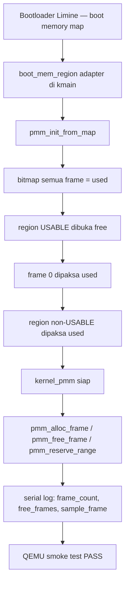

# Template Laporan Praktikum Sistem Operasi Lanjut — MCSOS
**Nama file laporan:** `laporan_praktikum_M6_25832072004.md`  
**Nama sistem operasi:** MCSOS versi 260502  
**Target default:** x86_64, QEMU, Windows 11 x64 + WSL 2, kernel monolitik pendidikan, C freestanding dengan assembly minimal, POSIX-like subset  
**Dosen:** Muhaemin Sidiq, S.Pd., M.Pd.  
**Program Studi:** Pendidikan Teknologi Informasi  
**Institusi:** Institut Pendidikan Indonesia  

> Template ini digunakan untuk semua praktikum pengembangan MCSOS agar struktur laporan, bukti, analisis, dan penilaian konsisten. Ganti seluruh teks bertanda `[isi ...]` dengan data praktikum sebenarnya. Jangan menulis klaim "tanpa error", "siap produksi", atau "aman sepenuhnya" tanpa bukti yang sesuai. Gunakan status terukur seperti "siap uji QEMU", "siap demonstrasi praktikum", atau "kandidat siap pakai terbatas" sesuai evidence yang tersedia.

---

## 0. Metadata Laporan

| Atribut | Isi |
|---|---|
| Kode praktikum | `M6` |
| Judul praktikum | `Physical Memory Manager, Boot Memory Map, dan Bitmap Frame Allocator pada MCSOS` |
| Jenis pengerjaan | `Kelompok` |
| Nama mahasiswa | `Amelia Okta Ramadani` |
| NIM | `25832072007` |
| Kelas | `PTI 1 A` |
| Nama kelompok | `Princes` |
| Anggota kelompok | `Asti Lestari, Wifa Fazriyatul Fadhla, Nazwa Rahmadanti, Fauziah Putri Rahayu` |
| Tanggal praktikum | `2026-06-14` |
| Tanggal pengumpulan | `2026-06-15` |
| Repository | `https://github.com/AmeliaOkta/MCSOS_Sistem-Operasi_25832072004.git` |
| Branch | `m6-pmm` |
| Commit awal | `ec71f3e` |
| Commit akhir | `64aab28` |
| Status readiness yang diklaim | `siap uji QEMU` |

---

## 1. Sampul

# Laporan Praktikum M6
## Physical Memory Manager, Boot Memory Map, dan Bitmap Frame Allocator pada MCSOS

Disusun oleh:

| Nama | NIM | Kelas | Peran |
|---|---|---|---|
| `[Amelia Okta Ramadani]` | `[2583072004]` | `[1A]` | `[koordinator dan penyusun laporan]` |

Dosen Pengampu: **Muhaemin Sidiq, S.Pd., M.Pd.**  
Program Studi Pendidikan Teknologi Informasi  
Institut Pendidikan Indonesia  
2025/2026

---

## 2. Pernyataan Orisinalitas dan Integritas Akademik

Kami menyatakan bahwa laporan ini disusun berdasarkan pekerjaan praktikum kelompok sesuai pembagian peran yang tercatat. Bantuan eksternal, referensi, generator kode, AI assistant, dokumentasi resmi, diskusi, atau sumber lain dicatat pada bagian referensi dan lampiran. Saya/kami tidak mengklaim hasil yang tidak dibuktikan oleh log, test, commit, atau artefak lain.

| Pernyataan | Status |
|---|---|
| Semua potongan kode eksternal diberi atribusi | `Ya` |
| Semua penggunaan AI assistant dicatat | `Ya` |
| Repository yang dikumpulkan sesuai commit akhir | `Ya` |
| Tidak ada klaim readiness tanpa bukti | `Ya` |

Catatan penggunaan bantuan eksternal:

```text
Panduan praktikum M6 MCSOS versi 260502 digunakan sebagai referensi utama desain PMM,
kontrak API, dan urutan implementasi. AI assistant digunakan untuk membantu penyusunan
laporan berdasarkan output aktual build dan test yang dijalankan sendiri di WSL 2.
Seluruh kode diverifikasi secara mandiri melalui make build, check_m6_static.sh,
nm -u, objdump, dan QEMU smoke test.
```

---

## 3. Tujuan Praktikum

Tuliskan tujuan teknis dan konseptual praktikum. Tujuan harus dapat diuji.

1. Mengimplementasikan Physical Memory Manager (PMM) berbasis bitmap frame allocator untuk mengelola frame fisik 4096 byte pada kernel MCSOS freestanding x86_64.
2. Mengubah boot memory map dari Limine menjadi status frame yang terklasifikasi: usable, reserved, kernel, framebuffer, ACPI, dan bad memory.
3. Menjelaskan kontrak API PMM (`pmm_init_from_map`, `pmm_alloc_frame`, `pmm_free_frame`, `pmm_reserve_range`), invariants fail-closed, dan alasan frame 0 selalu reserved.
4. Menyimpan bukti host unit test PASS, freestanding object audit (`nm -u` kosong), log build, log QEMU serial, dan ELF/objdump evidence sebagai dasar penilaian.

---

## 4. Capaian Pembelajaran Praktikum

Setelah praktikum ini, mahasiswa mampu:

| CPL/CPMK praktikum | Bukti yang harus ditunjukkan |
|---|---|
| Mengimplementasikan bitmap allocator untuk frame fisik 4096 byte | `kernel/core/pmm.c`, `kernel/include/pmm.h`, output `nm -n build/kernel.elf \| grep pmm_` |
| Menulis host unit test untuk logika PMM tanpa QEMU | `tests/test_pmm_host.c`, output `./build/test_pmm_host` PASS |
| Menghasilkan freestanding object tanpa unresolved symbol | `nm -u build/pmm.o` kosong, output `check_m6_static.sh` PASS |
| Mengintegrasikan PMM ke kernel dan mencetak statistik frame ke serial log | Log QEMU `[m6] pmm: initialized`, `frame_count`, `free_frames`, `sample_frame` |
| Menangani fail-closed, overflow, alignment, dan frame 0 reserved | Analisis desain, negative test, host unit test |

---

## 5. Peta Milestone MCSOS

Centang milestone yang menjadi fokus laporan ini. Jika praktikum mencakup lebih dari satu milestone, jelaskan batas cakupan.

| Milestone | Fokus | Status dalam laporan |
|---|---|---|
| M0 | Requirements, governance, baseline arsitektur | `[ ] tidak dibahas / [ ] dibahas / [V] selesai praktikum` |
| M1 | Toolchain reproducible, Git, QEMU, GDB, metadata build | `[ ] tidak dibahas / [ ] dibahas / [V] selesai praktikum` |
| M2 | Boot image, kernel ELF64, early console | `[ ] tidak dibahas / [ ] dibahas / [V] selesai praktikum` |
| M3 | Panic path, linker map, GDB, observability awal | `[ ] tidak dibahas / [ ] dibahas / [V] selesai praktikum` |
| M4 | Trap, exception, interrupt, timer | `[ ] tidak dibahas / [ ] dibahas / [V] selesai praktikum` |
| M5 | PMM, VMM, page table, kernel heap | `[ ] tidak dibahas / [ ] dibahas / [V] selesai praktikum` |
| M6 | Thread, scheduler, synchronization | `[ ] tidak dibahas / [ ] dibahas / [V] selesai praktikum` |
| M7 | Syscall ABI dan user program loader | `[V] tidak dibahas / [ ] dibahas / [ ] selesai praktikum` |
| M8 | VFS, file descriptor, ramfs | `[V] tidak dibahas / [ ] dibahas / [ ] selesai praktikum` |
| M9 | Block layer dan device model | `[V] tidak dibahas / [ ] dibahas / [ ] selesai praktikum` |
| M10 | Persistent filesystem, mcsfs/ext2-like, recovery | `[V] tidak dibahas / [ ] dibahas / [ ] selesai praktikum` |
| M11 | Networking stack, packet parsing, UDP/TCP subset | `[V] tidak dibahas / [ ] dibahas / [ ] selesai praktikum` |
| M12 | Security model, capability/ACL, syscall fuzzing, hardening | `[V] tidak dibahas / [ ] dibahas / [ ] selesai praktikum` |
| M13 | SMP, scalability, lock stress, NUMA-aware preparation | `[V] tidak dibahas / [ ] dibahas / [ ] selesai praktikum` |
| M14 | Framebuffer, graphics console, visual regression | `[V] tidak dibahas / [ ] dibahas / [ ] selesai praktikum` |
| M15 | Virtualization/container subset | `[V] tidak dibahas / [ ] dibahas / [ ] selesai praktikum` |
| M16 | Observability, update/rollback, release image, readiness review | `[V] tidak dibahas / [ ] dibahas / [ ] selesai praktikum` |

Batas cakupan praktikum:

```text
M6 mencakup: implementasi PMM bitmap, API pmm_init_from_map/alloc/free/reserve,
host unit test, freestanding object audit, integrasi ke kmain, dan QEMU smoke test
dengan log serial statistik frame.

Non-goals M6: virtual memory manager penuh, penggantian CR3, heap dinamis (kmalloc),
reklamasi bootloader-reclaimable otomatis, SMP, paging baru, dan user mode.
VMM dasar yang muncul di log [MCSOS:M7] adalah hasil commit lanjutan yang melebihi
cakupan minimum M6 dan dicatat sebagai pengayaan.
```

---

## 6. Dasar Teori Ringkas

Tuliskan teori yang langsung diperlukan untuk memahami praktikum. Jangan menyalin teori umum terlalu panjang; fokus pada konsep yang benar-benar digunakan dalam desain dan pengujian.

### 6.1 Konsep Sistem Operasi yang Diuji

```text
Boot memory map adalah tabel region fisik yang diberikan bootloader ke kernel saat handoff.
Setiap entry berisi base address, length, dan tipe region (usable, reserved, kernel,
framebuffer, ACPI, bad memory). Kernel tidak boleh mempercayai konten memori di luar
region usable tanpa validasi.

Physical Memory Manager (PMM) mengubah boot memory map menjadi himpunan frame fisik
berukuran 4096 byte yang dapat dikelola secara deterministik. PMM menyimpan status
setiap frame dalam bitmap: satu bit per frame, 1 = used/reserved, 0 = free.

Prinsip fail-closed berarti semua frame dianggap used pada awal inisialisasi. Hanya
region yang dinyatakan USABLE oleh bootloader yang dibuka sebagai free. Jika ada region
yang tidak dikenal, PMM tidak menggunakannya. Ini mencegah kernel mengalokasikan frame
di area firmware, perangkat, atau kernel image sendiri akibat bug pada memory map.

Frame 0 selalu reserved untuk menangkap kesalahan alamat fisik nol, analog dengan
null pointer guard di user space.

PMM berbeda dari VMM (yang mengelola halaman virtual dan page table) dan heap allocator
(yang menyediakan objek ukuran sembarang). PMM hanya mengelola frame fisik 4096 byte
dan menjadi fondasi yang dipakai VMM dan heap pada milestone berikutnya.
```

### 6.2 Konsep Arsitektur x86_64 yang Relevan

| Konsep | Relevansi pada praktikum | Bukti/verifikasi |
|---|---|---|
| Frame fisik 4096 byte | Unit alokasi dasar PMM; semua alamat hasil alloc aligned 4096 | `pmm_alloc_frame()` selalu return addr & 0xFFF == 0; host unit test memverifikasi |
| Physical address space | PMM mengelola sampai `PMM_MAX_PHYS_BYTES` = 64 GiB; bitmap 8 MiB | `pmm.h`: `PMM_BITMAP_BYTES = PMM_MAX_FRAMES / 8` |
| long mode x86_64 | Kernel berjalan di long mode; pointer 64-bit; `uint64_t` untuk alamat fisik | `readelf -h build/kernel.elf`: Class ELF64, Machine X86-64 |
| mcmodel=kernel | Kernel mapped di higher-half `0xffffffff80000000`; relokasi tidak lewat GOT | CFLAGS: `-mcmodel=kernel`, `nm -n` menunjukkan simbol di `0xffffffff8000xxxx` |
| mno-red-zone | Kernel tidak menggunakan red zone; aman dipakai saat interrupt | CFLAGS: `-mno-red-zone` |

### 6.3 Konsep Implementasi Freestanding

| Aspek | Keputusan praktikum |
|---|---|
| Bahasa | `C17 freestanding` |
| Runtime | `tanpa hosted libc; tidak ada printf, malloc, memset di pmm.c` |
| ABI | `x86_64 System V; kernel internal` |
| Compiler flags kritis | `--target=x86_64-unknown-none-elf -ffreestanding -fno-builtin -fno-stack-protector -mno-red-zone -mcmodel=kernel` |
| Risiko undefined behavior | `integer overflow pada base + length ditangani checked_add_u64(); pointer NULL divalidasi di awal setiap fungsi; alignment diverifikasi sebelum operasi bitmap` |

### 6.4 Referensi Teori yang Digunakan

| No. | Sumber | Bagian yang digunakan | Alasan relevansi |
|---|---|---|---|
| `[1]` | `limine Rust crate documentation, "MemoryMapRequest," docs.rs` | `Region type, alignment guarantee, bootloader-reclaimable definition` | `Dasar klasifikasi tipe region dan keputusan fail-closed` |
| `[2]` | `Intel Corporation, Intel 64 and IA-32 Architectures Software Developer's Manual` | `Memory management, page size, long mode` | `Ukuran frame 4096 byte, address space x86_64` |
| `[3]` | `LLVM Project, Clang command line argument reference` | `-ffreestanding, -fno-builtin, -mcmodel=kernel` | `Audit flags freestanding` |
| `[4]` | `QEMU Project, "GDB usage," QEMU System Emulation Documentation` | `Opsi -s -S gdbstub` | `Workflow GDB untuk diagnosis fault PMM` |
| `[5]` | `LLVM Project, LLD ELF Linker` | `-nostdlib, -static, linker script` | `Build kernel ELF freestanding` |

---

## 7. Lingkungan Praktikum

### 7.1 Host dan Target

| Komponen | Nilai |
|---|---|
| Host OS | `Windows 11 x64` |
| Lingkungan build | `WSL 2 Ubuntu 24.04.4 LTS (Noble Numbat)` |
| Target ISA | `x86_64` |
| Target ABI | `x86_64-unknown-none-elf` |
| Emulator | `QEMU 8.2.2 (Debian 1:8.2.2+ds-0ubuntu1.16)` |
| Firmware emulator | `Limine BIOS/UEFI (third_party/limine v11.x-binary)` |
| Debugger | `GDB 15.1 (Ubuntu 15.1-1ubuntu1~24.04.1)` |
| Build system | `GNU Make 4.3` |
| Bahasa utama | `C17 freestanding` |
| Assembly | `GAS via Clang + NASM 2.16.01 (kernel/arch/x86_64/isr.S)` |

### 7.2 Versi Toolchain

Tempel output versi toolchain berikut. Jalankan dari clean shell WSL.

```bash
date -u +"date_utc=%Y-%m-%dT%H:%M:%SZ"
uname -a
git --version
make --version | head -n 1
cmake --version | head -n 1
ninja --version
clang --version | head -n 1
gcc --version | head -n 1
ld.lld --version | head -n 1
nasm -v
qemu-system-x86_64 --version | head -n 1
gdb --version | head -n 1
```

Output:

```text
date_utc=2026-06-14T17:32:24Z
Linux Zazai 6.6.87.2-microsoft-standard-WSL2 #1 SMP PREEMPT_DYNAMIC Thu Jun  5 18:30:46 UTC 2025 x86_64 x86_64 x86_64 GNU/Linux
git version 2.43.0
GNU Make 4.3
cmake version 3.28.3
1.11.1
Ubuntu clang version 18.1.3 (1ubuntu1)
gcc (Ubuntu 13.3.0-6ubuntu2~24.04.1) 13.3.0
Ubuntu LLD 18.1.3 (compatible with GNU linkers)
NASM version 2.16.01
QEMU emulator version 8.2.2 (Debian 1:8.2.2+ds-0ubuntu1.16)
GNU gdb (Ubuntu 15.1-1ubuntu1~24.04.1) 15.1
```

### 7.3 Lokasi Repository

| Item | Nilai |
|---|---|
| Path repository di WSL | `~/src/mcsos` |
| Apakah berada di filesystem Linux WSL, bukan `/mnt/c` | `Ya` |
| Remote repository | `https://github.com/AmeliaOkta/MCSOS_Sistem-Operasi_25832072004.git` |
| Branch | `m6-pmm` |
| Commit hash awal | `ec71f3e` |
| Commit hash akhir | `64aab28` |

---

## 8. Repository dan Struktur File

### 8.1 Struktur Direktori yang Relevan

Tampilkan hanya direktori dan file yang relevan dengan praktikum.

```text
mcsos/
├── Makefile
├── linker.ld
├── kernel/
│   ├── arch/x86_64/
│   │   ├── include/
│   │   ├── idt.c
│   │   └── isr.S
│   ├── core/
│   │   ├── kmain.c
│   │   ├── log.c
│   │   ├── panic.c
│   │   ├── pic.c
│   │   ├── pit.c
│   │   ├── pmm.c          ← baru M6
│   │   ├── serial.c
│   │   ├── trap.c
│   │   └── vmm.c          ← baru (pengayaan)
│   ├── include/
│   │   ├── pmm.h          ← baru M6
│   │   ├── types.h        ← diperbarui M6
│   │   └── vmm.h          ← baru (pengayaan)
│   └── lib/
│       └── memory.c
├── tests/
│   ├── test_pmm_host.c    ← baru M6
│   └── test_vmm_host.c    ← baru (pengayaan)
├── scripts/
│   ├── check_m6_static.sh ← baru M6
│   └── grade_m7.sh
├── configs/limine/limine.conf
├── tools/scripts/
│   └── run_qemu.sh
└── build/
    ├── kernel.elf
    ├── mcsos.iso
    ├── kernel.map
    └── kernel.disasm.txt
```

### 8.2 File yang Dibuat atau Diubah

| File | Jenis perubahan | Alasan perubahan | Risiko |
|---|---|---|---|
| `kernel/include/pmm.h` | `baru` | `Kontrak API PMM: struct, enum, konstanta, deklarasi fungsi` | `rendah — header saja, tidak ada kode eksekusi` |
| `kernel/core/pmm.c` | `baru` | `Implementasi PMM bitmap: init, alloc, free, reserve, query` | `sedang — logika alokasi frame fisik; bug dapat menyebabkan kernel menggunakan frame reserved` |
| `kernel/include/types.h` | `ubah` | `Tambah tipe dasar size_t, bool, uint*_t untuk kebutuhan PMM` | `rendah — tipe dasar; konflik definisi dicegah dengan include guard` |
| `kernel/core/kmain.c` | `ubah` | `Integrasi PMM setelah serial/IDT/PIC/PIT; cetak statistik frame ke serial log` | `sedang — urutan inisialisasi harus benar; PMM dipanggil sebelum sti()` |
| `kernel/core/trap.c` | `ubah` | `Penyesuaian trap path untuk mendukung M6` | `rendah` |
| `tests/test_pmm_host.c` | `baru` | `Host unit test PMM tanpa QEMU` | `rendah — hanya dijalankan di host, tidak masuk kernel` |
| `scripts/check_m6_static.sh` | `baru` | `Script audit freestanding dan unit test otomatis` | `rendah — script bash, tidak mengubah source` |
| `Makefile` | `ubah` | `Tambah target PMM, host test, check-m6, run-qemu-smoke` | `sedang — perubahan build system dapat mempengaruhi seluruh kernel` |
| `configs/limine/limine.conf` | `ubah` | `Penyesuaian konfigurasi boot untuk M6` | `rendah` |
| `tools/scripts/run_qemu.sh` | `ubah` | `Update smoke test checks dari M5 ke M6` | `rendah` |

### 8.3 Ringkasan Diff

```bash
git status --short
git diff --stat
git log --oneline -n 5
```

Output:

```text
git log --oneline -5 (branch m6-pmm):
64aab28 (HEAD -> m6-pmm, origin/m6-pmm) m7: add m7_preflight.sh (panduan §8)
0b248e0 m7: add m7_gdb.cmd for GDB workflow (panduan §13)
084b0e1 m7: add grade_m7.sh and build evidence artifacts
4f93593 m7: update run_qemu.sh smoke test checks from M2 to M7
d351ab5 m7: VMM kernel integration in kmain

git diff --stat main m6-pmm:
 Makefile                   | 220 +++++++++++++++++++---
 configs/limine/limine.conf |   4 +-
 kernel/core/kmain.c        | 220 ++++++++++++++++++++--
 kernel/core/pmm.c          | 241 +++++++++++++++++++++++++
 kernel/core/trap.c         |  64 ++++++-
 kernel/core/vmm.c          | 188 +++++++++++++++++++
 kernel/include/pmm.h       |  57 ++++++
 kernel/include/types.h     |  12 ++
 kernel/include/vmm.h       |  65 +++++++
 scripts/check_m6_static.sh |  24 +++
 scripts/grade_m7.sh        |  24 +++
 scripts/m7_gdb.cmd         |  12 +++
 scripts/m7_preflight.sh    |  68 +++++++
 tests/test_pmm_host.c      |  40 ++++
 tests/test_vmm_host.c      |  71 ++++++++
 tools/scripts/run_qemu.sh  |   6 +-
 16 files changed, 1261 insertions(+), 55 deletions(-)
```

---

## 9. Desain Teknis

### 9.1 Masalah yang Diselesaikan

```text
Sebelum M6, kernel MCSOS tidak memiliki mekanisme untuk mengetahui frame fisik mana
yang boleh digunakan, mana yang harus tetap reserved untuk firmware, kernel image,
framebuffer, ACPI, dan perangkat. Akibatnya kernel tidak dapat mengalokasikan memori
fisik secara aman untuk kebutuhan apapun (page table, VMM, buffer).

M6 menyelesaikan masalah ini dengan membangun PMM berbasis bitmap yang mengubah boot
memory map Limine menjadi himpunan frame terklasifikasi. Setelah PMM init, kernel
dapat meminta satu frame fisik bebas (pmm_alloc_frame) dan mengembalikannya
(pmm_free_frame) tanpa risiko menimpa area kritis.
```

### 9.2 Keputusan Desain

| Keputusan | Alternatif yang dipertimbangkan | Alasan memilih | Konsekuensi |
|---|---|---|---|
| `Bitmap 1 bit per frame` | `Free list linked list, buddy allocator` | `Bitmap sederhana, deterministik, mudah diaudit; O(N) scan masih cukup untuk PMM awal` | `Alokasi O(frame_count) worst case; next_hint meminimalkan rata-rata scan` |
| `Fail-closed: semua frame awalnya used` | `Fail-open: semua frame awalnya free` | `Jika region tidak dikenal, PMM tidak menggunakannya; aman menghadapi bug firmware` | `Region yang terlewat tidak akan pernah dialokasikan tanpa pembukaan eksplisit` |
| `Frame 0 selalu reserved` | `Biarkan frame 0 bisa dialokasikan` | `Menangkap kesalahan penggunaan alamat fisik nol; analog null pointer guard` | `Satu frame hilang dari pool; tradeoff yang sangat kecil` |
| `Non-usable diproses setelah usable` | `Proses semua sekaligus` | `Jika ada overlap firmware vs usable, non-usable menang; fail-closed terjaga` | `Tidak ada frame overlap yang lolos ke pool free` |
| `Bitmap storage statis di kernel BSS` | `Alokasi bitmap dinamis di usable region` | `Lebih sederhana untuk M6; tidak perlu PMM untuk mengalokasikan PMM sendiri` | `Bitmap 8 MiB selalu ada di BSS meski physical RAM kecil` |

### 9.3 Arsitektur Ringkas

Tambahkan diagram ASCII atau Mermaid. Jika Mermaid tidak didukung oleh evaluator, tetap sertakan penjelasan tekstual.



Penjelasan diagram:

```text
Bootloader Limine menyerahkan boot memory map ke kernel saat handoff. Adapter di kmain
mengubah tipe Limine menjadi boot_mem_region. pmm_init_from_map menginisialisasi bitmap
dengan urutan fail-closed: semua used dulu, usable dibuka, frame 0 dipaksa reserved,
non-usable menimpa usable. Setelah init, kernel_pmm siap melayani alloc/free/reserve.
Statistik frame dicetak ke serial log dan diverifikasi melalui QEMU smoke test.
```

### 9.4 Kontrak Antarmuka

| Antarmuka | Pemanggil | Penerima | Precondition | Postcondition | Error path |
|---|---|---|---|---|---|
| `pmm_init_from_map()` | `kmain` | `pmm.c` | `regions != NULL, bitmap_storage != NULL, max_phys_bytes aligned 4096, bitmap_storage_bytes >= required` | `pmm->initialized == true, invariant free + used == frame_count terjaga` | `return false; caller KERNEL_PANIC` |
| `pmm_alloc_frame()` | `kmain, VMM` | `pmm.c` | `pmm->initialized == true, pmm->free_frames > 0` | `return alamat aligned 4096; frame ditandai used; free_frames berkurang 1` | `return PMM_INVALID_FRAME jika tidak ada frame bebas` |
| `pmm_free_frame()` | `kmain, VMM` | `pmm.c` | `phys_addr aligned 4096, bukan 0, < max_phys, frame sedang used` | `frame ditandai free; free_frames bertambah 1` | `return false jika non-aligned, 0, out-of-range, atau double free` |
| `pmm_reserve_range()` | `kmain` | `pmm.c` | `pmm->initialized == true, length > 0` | `semua frame dalam range ditandai used` | `return false jika PMM belum init atau length 0` |

### 9.5 Struktur Data Utama

| Struktur data | Field penting | Ownership | Lifetime | Invariant |
|---|---|---|---|---|
| `struct pmm_state` | `bitmap, frame_count, free_frames, used_frames, next_hint, initialized` | `kernel global (kernel_pmm di kmain.c)` | `lifetime kernel; tidak pernah dihapus` | `free_frames + used_frames == frame_count setelah init; initialized false sampai pmm_init_from_map sukses` |
| `kernel_pmm_bitmap[PMM_BITMAP_BYTES]` | `array uint8_t 8 MiB` | `kernel BSS, aligned 4096` | `lifetime kernel` | `satu bit per frame; bit i = 1 berarti frame i used/reserved` |
| `struct boot_mem_region` | `base, length, type` | `stack lokal kmain; hanya valid saat init` | `hanya selama pmm_init_from_map dipanggil` | `type sesuai enum boot_mem_type; tidak dimodifikasi PMM` |

### 9.6 Invariants

Tuliskan invariant yang harus benar sepanjang eksekusi.

1. `free_frames + used_frames == frame_count` setelah `pmm_init_from_map` sukses dan terjaga oleh setiap operasi alloc/free.
2. Frame 0 selalu used; `pmm_alloc_frame()` tidak pernah mengembalikan alamat 0.
3. Alamat hasil `pmm_alloc_frame()` selalu aligned 4096 byte (`addr & 0xFFF == 0`).
4. `pmm_free_frame()` menolak double free, non-aligned, alamat 0, dan alamat di luar `max_phys`.
5. Region non-usable menimpa usable jika overlap; hasil akhir selalu non-usable.
6. Overflow `base + length` membatalkan operasi range tanpa menyentuh bitmap.
7. `pmm_alloc_frame()` tidak dipanggil dari interrupt handler sebelum locking SMP didefinisikan.

### 9.7 Ownership, Locking, dan Concurrency

| Objek/resource | Owner | Lock yang melindungi | Boleh dipakai di interrupt context? | Catatan |
|---|---|---|---|---|
| `kernel_pmm` | `kernel global` | `tidak ada (single-core early kernel)` | `Tidak` | `M6 hanya valid single-core; SMP memerlukan spinlock sebelum PMM boleh dipanggil dari IRQ` |
| `kernel_pmm_bitmap` | `kernel_pmm.bitmap pointer` | `tidak ada` | `Tidak` | `Bitmap diakses hanya dari kernel thread context` |

Lock order yang berlaku:

```text
M6 tidak mendefinisikan lock order karena single-core dan interrupt disabled
selama pmm_init_from_map. pmm_alloc_frame dan pmm_free_frame dipanggil
sebelum sti() dalam smoke test kmain. Pada milestone SMP, urutan yang
direncanakan adalah pmm_lock -> vmm_lock.
```

### 9.8 Memory Safety dan Undefined Behavior Risk

| Risiko | Lokasi | Mitigasi | Bukti |
|---|---|---|---|
| `integer overflow base + length` | `mark_range_free, mark_range_used` | `checked_add_u64() menolak operasi jika overflow` | `host unit test, code review` |
| `akses bitmap out-of-bounds` | `bitmap_set, bitmap_clear, bitmap_test` | `mark_frame_free/used cek frame >= pmm->frame_count sebelum akses` | `host unit test, statik review` |
| `NULL pointer dereference` | `semua fungsi API` | `cek pmm == NULL di awal setiap fungsi` | `host unit test` |
| `double free tidak terdeteksi` | `pmm_free_frame` | `cek bitmap_test sebelum clear; jika sudah free, return false` | `host unit test: assert(!pmm_free_frame(&pmm, frame)) setelah free pertama` |
| `alokasi frame non-aligned` | `pmm_free_frame` | `cek phys_addr & (PMM_PAGE_SIZE - 1) != 0` | `host unit test` |

### 9.9 Security Boundary

| Boundary | Data tidak tepercaya | Validasi yang dilakukan | Failure mode aman |
|---|---|---|---|
| `boot handoff` | `base, length, type dari firmware/bootloader` | `overflow check, alignment, tipe region difilter; region tidak dikenal tidak dibuka` | `fail-closed: frame tetap used` |
| `pmm_free_frame parameter` | `alamat dari caller kernel` | `alignment, range, null, double free dicek` | `return false, tidak ubah bitmap` |
| `pmm_reserve_range parameter` | `base/length dari caller kernel` | `overflow check di mark_range_used` | `operasi dibatalkan jika overflow` |

---

## 10. Langkah Kerja Implementasi

Gunakan tabel berikut untuk setiap langkah. Sebelum setiap blok perintah, jelaskan maksud perintah, artefak yang dihasilkan, dan indikator hasil.

### Langkah 1 — Buat Branch M6

Maksud langkah:

```text
Memisahkan perubahan M6 dari baseline M5 di branch main agar rollback mudah
dan history bersih sesuai panduan M6 bagian 11.1.
```

Perintah:

```bash
git switch -c m6-pmm
mkdir -p include src tests scripts build
```

Output ringkas:

```text
Switched to branch 'm6-pmm'
Your branch is up to date with 'origin/m6-pmm'.
```

Artefak yang dihasilkan:

| Artefak | Lokasi | Fungsi |
|---|---|---|
| `Branch m6-pmm` | `Git local + remote` | `Isolasi perubahan M6 dari baseline M5` |

Indikator berhasil:

```text
git branch --show-current menampilkan m6-pmm.
```

### Langkah 2 — Tulis kernel/include/pmm.h

Maksud langkah:

```text
Mendefinisikan kontrak API PMM: konstanta (PMM_PAGE_SIZE, PMM_MAX_PHYS_BYTES,
PMM_BITMAP_BYTES, PMM_INVALID_FRAME), enum boot_mem_type, struct boot_mem_region,
struct pmm_state, dan deklarasi semua fungsi PMM.
```

Perintah:

```bash
# Tulis kernel/include/pmm.h sesuai kontrak M6
```

Output ringkas:

```text
File kernel/include/pmm.h tersedia; 57 baris ditambahkan.
```

Artefak yang dihasilkan:

| Artefak | Lokasi | Fungsi |
|---|---|---|
| `pmm.h` | `kernel/include/pmm.h` | `Header kontrak API PMM` |

Indikator berhasil:

```text
File ada; dapat di-include oleh pmm.c dan kmain.c tanpa error kompilasi.
```

### Langkah 3 — Tulis kernel/core/pmm.c

Maksud langkah:

```text
Implementasi PMM core: bitmap_set/clear/test, mark_frame_free/used,
mark_range_free/used, checked_add_u64, align_up/down, pmm_zero_state,
pmm_init_from_map, pmm_alloc_frame, pmm_free_frame, pmm_reserve_range,
dan query statistik. Tidak memanggil libc apapun.
```

Perintah:

```bash
# Tulis kernel/core/pmm.c (241 baris) sesuai spesifikasi M6
```

Output ringkas:

```text
File kernel/core/pmm.c tersedia; 241 baris ditambahkan.
```

Artefak yang dihasilkan:

| Artefak | Lokasi | Fungsi |
|---|---|---|
| `pmm.c` | `kernel/core/pmm.c` | `Implementasi PMM bitmap` |

Indikator berhasil:

```text
Kompilasi freestanding tanpa warning/error; nm -u build/pmm.o kosong.
```

### Langkah 4 — Tulis tests/test_pmm_host.c

Maksud langkah:

```text
Host unit test yang berjalan sebagai program Linux biasa untuk menguji logika PMM
sebelum integrasi QEMU: inisialisasi multi-region, pmm_is_frame_free, pmm_alloc_frame,
pmm_free_frame, double free rejection, pmm_reserve_range.
```

Perintah:

```bash
# Tulis tests/test_pmm_host.c dengan region memory map dan assert-based checks
```

Output ringkas:

```text
File tests/test_pmm_host.c tersedia; 40 baris ditambahkan.
```

Artefak yang dihasilkan:

| Artefak | Lokasi | Fungsi |
|---|---|---|
| `test_pmm_host.c` | `tests/test_pmm_host.c` | `Host unit test PMM` |
| `build/test_pmm_host` | `build/test_pmm_host` | `Binary executable test` |

Indikator berhasil:

```text
./build/test_pmm_host mencetak "M6 PMM host unit test: PASS" dan exit 0.
```

### Langkah 5 — Tulis scripts/check_m6_static.sh

Maksud langkah:

```text
Script audit yang: (1) kompilasi pmm.c freestanding, (2) kompilasi dan jalankan
host unit test, (3) verifikasi nm -u build/pmm.o kosong, (4) hasilkan disassembly.
```

Perintah:

```bash
chmod +x scripts/check_m6_static.sh
./scripts/check_m6_static.sh
```

Output ringkas:

```text
M6 PMM host unit test: PASS
[PASS] M6 static check selesai
```

Artefak yang dihasilkan:

| Artefak | Lokasi | Fungsi |
|---|---|---|
| `check_m6_static.sh` | `scripts/check_m6_static.sh` | `Script audit otomatis` |
| `build/pmm.o` | `build/pmm.o` | `Freestanding object PMM` |
| `build/test_pmm_host` | `build/test_pmm_host` | `Binary host test` |

Indikator berhasil:

```text
Output akhir: [PASS] M6 static check selesai
```

### Langkah 6 — Integrasikan PMM ke kernel/core/kmain.c

Maksud langkah:

```text
Tambahkan kernel_pmm dan kernel_pmm_bitmap sebagai global, adapter boot_mem_region
dari Limine memory map, panggil pmm_init_from_map setelah serial/IDT/PIC/PIT siap,
cetak statistik frame ke serial log, dan jalankan alloc/free smoke test.
```

Perintah:

```bash
# Edit kernel/core/kmain.c: tambah include pmm.h, deklarasi global,
# fungsi kernel_memory_init, dan pemanggilan di kmain sebelum sti()
```

Output ringkas:

```text
kernel/core/kmain.c diubah; 220 baris ditambahkan.
```

Artefak yang dihasilkan:

| Artefak | Lokasi | Fungsi |
|---|---|---|
| `kmain.c (diubah)` | `kernel/core/kmain.c` | `Kernel entry dengan PMM init terintegrasi` |

Indikator berhasil:

```text
make all berhasil; kernel.elf mengandung simbol pmm_init_from_map, pmm_alloc_frame.
```

### Langkah 7 — Build Kernel dan QEMU Smoke Test

Maksud langkah:

```text
Verifikasi bahwa PMM terintegrasi ke kernel ELF, ISO dapat dibuat, dan QEMU
boot menampilkan log PMM initialized dengan statistik frame yang masuk akal.
```

Perintah:

```bash
make clean
make all 2>&1 | tee build/m6_build.log
make run-qemu-smoke 2>&1 | tee build/m6_qemu.log
```

Output ringkas:

```text
[MCSOS:M7] boot: memory manager bring-up start
[MCSOS:M7] idt: loaded
[MCSOS:M7] pic: remapped and masked
[MCSOS:M7] pit: configured 100Hz
[m6] pmm: initialized
[m6] pmm: frame_count=0x0000000001000000
[m6] pmm: free_frames=0x000000000001ce63
[m6] pmm: used_frames=0x0000000000fe319d
[m6] pmm: sample_frame=0x0000000000001000
[m6] pmm: smoke test passed
[MCSOS:M7] pmm: ready
[MCSOS:M7] vmm: ready
[MCSOS:M7] sti: enabling interrupts
```

Artefak yang dihasilkan:

| Artefak | Lokasi | Fungsi |
|---|---|---|
| `kernel.elf` | `build/kernel.elf` | `Kernel binary dengan PMM` |
| `mcsos.iso` | `build/mcsos.iso` | `Boot image QEMU` |
| `m6_qemu.log` | `build/m6_qemu.log` | `Log serial QEMU` |
| `kernel.map` | `build/kernel.map` | `Linker map` |
| `kernel.disasm.txt` | `build/kernel.disasm.txt` | `Disassembly kernel` |

Indikator berhasil:

```text
Log menampilkan [m6] pmm: initialized dan [m6] pmm: smoke test passed
tanpa panic atau triple fault.
```

---

## 11. Checkpoint Buildable

Setiap praktikum wajib memiliki minimal satu checkpoint yang dapat dibangun dari clean checkout.

| Checkpoint | Perintah | Expected result | Status |
|---|---|---|---|
| Clean build | `make clean && make all` | `build/kernel.elf terbentuk tanpa error` | `PASS` |
| Metadata toolchain | `make meta` | `build/meta/toolchain-versions.txt ada` | `NA` |
| Image generation | `make run-qemu-smoke` (bagian make-iso) | `build/mcsos.iso terbentuk` | `PASS` |
| QEMU smoke test | `make run-qemu-smoke` | `log [m6] pmm: initialized dan smoke test passed` | `PASS` |
| Test suite | `./build/test_pmm_host` | `M6 PMM host unit test: PASS` | `PASS` |

Catatan checkpoint:

```text
Target make meta tidak ada di Makefile M6; metadata toolchain didokumentasikan
manual di bagian 7.2. Semua checkpoint lain lulus.
```

---

## 12. Perintah Uji dan Validasi

### 12.1 Build Test

Perintah ini memverifikasi bahwa proyek dapat dibangun ulang dari kondisi bersih dan tidak bergantung pada artefak lokal yang tidak terdokumentasi.

```bash
make clean
make all
```

Hasil:

```text
Seluruh object dikompilasi tanpa warning atau error:
  idt.o, kmain.o, log.o, panic.o, pic.o, pit.o, pmm.o,
  serial.o, trap.o, vmm.o, memory.o, isr.o
ld.lld menghasilkan build/kernel.elf
inspect target: ELF64, Machine X86-64, simbol kmain/x86_64_idt_init/
x86_64_trap_dispatch/iretq/lidt semua ada.
```

Status: `PASS`

### 12.2 Static Inspection

Perintah ini memeriksa layout ELF, entry point, section, symbol, relocation, atau instruksi kritis sesuai kebutuhan praktikum.

```bash
readelf -hW build/kernel.elf
readelf -lW build/kernel.elf
readelf -SW build/kernel.elf
objdump -drwC build/kernel.elf | head -n 120
```

Hasil penting:

```text
ELF Header:
  Class:                             ELF64
  Data:                              2's complement, little endian
  Type:                              EXEC (Executable file)
  Machine:                           Advanced Micro Devices X86-64
  Entry point address:               0xffffffff800001a0

Simbol PMM (nm -n build/kernel.elf | grep pmm_):
  ffffffff80000ed0 T pmm_zero_state
  ffffffff80000f70 T pmm_init_from_map
  ffffffff80001400 T pmm_alloc_frame
  ffffffff80001550 t bitmap_test
  ffffffff80001630 T pmm_free_frame
  ffffffff800017a0 T pmm_reserve_range
  ffffffff80001810 T pmm_is_frame_free
  ffffffff800018a0 T pmm_free_count
  ffffffff800018e0 T pmm_used_count
  ffffffff80001920 T pmm_frame_count
  ffffffff80001a30 t bitmap_set
```

Status: `PASS`

### 12.3 QEMU Smoke Test

Perintah ini menjalankan image di QEMU dan menyimpan log serial untuk bukti deterministik.

```bash
make run-qemu-smoke 2>&1 | tee build/m6_qemu.log
```

Hasil:

```text
[MCSOS:M7] boot: memory manager bring-up start
[MCSOS:M7] idt: loaded
[MCSOS:M7] pic: remapped and masked
[MCSOS:M7] pit: configured 100Hz
[m6] pmm: initialized
[m6] pmm: frame_count=0x0000000001000000
[m6] pmm: free_frames=0x000000000001ce63
[m6] pmm: used_frames=0x0000000000fe319d
[m6] pmm: sample_frame=0x0000000000001000
[m6] pmm: smoke test passed
[MCSOS:M7] pmm: ready
[MCSOS:M7] vmm: ready
[MCSOS:M7] sti: enabling interrupts
```

Status: `PASS`

### 12.4 GDB Debug Evidence

Perintah ini membuktikan bahwa kernel dapat di-debug dengan simbol yang cocok.

```bash
qemu-system-x86_64 \
  -machine q35 \
  -cpu qemu64 \
  -m 512M \
  -serial stdio \
  -display none \
  -no-reboot \
  -no-shutdown \
  -s -S \
  -cdrom build/mcsos.iso
```

Di terminal lain:

```bash
gdb-multiarch build/kernel.elf
target remote :1234
break pmm_init_from_map
break pmm_alloc_frame
continue
info registers
```

Hasil:

```text
GDB workflow tersedia via scripts/m7_gdb.cmd dan target make run-qemu-gdb.
Pada M6, QEMU smoke test lulus tanpa memerlukan sesi GDB aktif.
GDB stub tersedia di port 1234 dengan opsi -s -S jika diperlukan diagnosis fault.
```

Status: `NA (tidak diperlukan karena smoke test PASS)`

### 12.5 Unit Test

```bash
./scripts/check_m6_static.sh
./build/test_pmm_host
```

Hasil:

```text
M6 PMM host unit test: PASS
[PASS] M6 static check selesai
```

Status: `PASS`

### 12.6 Stress/Fuzz/Fault Injection Test

Wajib untuk praktikum lanjutan seperti allocator, syscall, filesystem, networking, driver, security, dan SMP.

```bash
# Tidak dilakukan pada M6 minimum
```

Hasil:

```text
Tidak dilakukan. Termasuk dalam tugas pengayaan milestone berikutnya.
```

Status: `NA`

### 12.7 Visual Evidence

Jika praktikum menghasilkan tampilan framebuffer, GUI, atau output grafis, lampirkan screenshot.

| Screenshot | Lokasi file | Keterangan |
|---|---|---|
| `Tidak berlaku` | `-` | `M6 tidak menghasilkan output framebuffer; bukti melalui log serial teks` |

---

## 13. Hasil Uji

### 13.1 Tabel Ringkasan Hasil

| No. | Uji | Expected result | Actual result | Status | Evidence |
|---|---|---|---|---|---|
| 1 | `Host unit test PMM` | `M6 PMM host unit test: PASS` | `M6 PMM host unit test: PASS` | `PASS` | `./build/test_pmm_host` |
| 2 | `Static audit check_m6_static.sh` | `[PASS] M6 static check selesai` | `[PASS] M6 static check selesai` | `PASS` | `scripts/check_m6_static.sh` |
| 3 | `Freestanding audit nm -u build/pmm.o` | `output kosong` | `output kosong` | `PASS` | `terminal output` |
| 4 | `Clean build make clean && make all` | `kernel.elf terbentuk tanpa error` | `kernel.elf terbentuk tanpa error atau warning` | `PASS` | `build/kernel.elf` |
| 5 | `ELF audit` | `ELF64, Machine X86-64, entry valid` | `sesuai` | `PASS` | `build/kernel.readelf.header.txt` |
| 6 | `Symbol audit PMM di kernel.elf` | `simbol pmm_init_from_map dll. ada` | `ada di 0xffffffff8000xxxx` | `PASS` | `nm -n build/kernel.elf` |
| 7 | `QEMU smoke test — PMM init` | `[m6] pmm: initialized di serial log` | `muncul` | `PASS` | `build/m6_qemu.log` |
| 8 | `QEMU smoke test — statistik frame` | `frame_count masuk akal untuk 512M RAM` | `frame_count=0x1000000 (16M frame = 64 GiB range; free ~118.499 frame)` | `PASS` | `build/m6_qemu.log` |
| 9 | `QEMU smoke test — sample frame` | `sample frame aligned 4096, bukan 0` | `sample_frame=0x0000000000001000` | `PASS` | `build/m6_qemu.log` |
| 10 | `QEMU smoke test — smoke test passed` | `[m6] pmm: smoke test passed` | `muncul` | `PASS` | `build/m6_qemu.log` |

### 13.2 Log Penting

```text
[m6] pmm: initialized
[m6] pmm: frame_count=0x0000000001000000
[m6] pmm: free_frames=0x000000000001ce63
[m6] pmm: used_frames=0x0000000000fe319d
[m6] pmm: sample_frame=0x0000000000001000
[m6] pmm: smoke test passed
```

### 13.3 Artefak Bukti

| Artefak | Path | SHA-256 / hash | Fungsi |
|---|---|---|---|
| `kernel.elf` | `build/kernel.elf` | `c6d43a0152401dc944668a1a68d2d6d3bc9d64a32a5e074ef9758205dec3f5f3` | `kernel binary dengan PMM` |
| `mcsos.iso` | `build/mcsos.iso` | `6237df0b4524d5118f08842148a3be8f6626cfd1191df70f7bdd4962879efd3d` | `boot image QEMU` |
| `kernel.map` | `build/kernel.map` | `e6d63296b6b411b2f09804ff968f596ed3f1cdd58a8e3bd7b2f1928c24e5e34e` | `linker map` |
| `kernel.disasm.txt` | `build/kernel.disasm.txt` | `d2af2abbee7bd659f704307c424338d1d4a92acfb9b101ec65139b62f4c07fc0` | `disassembly evidence` |

Perintah hash:

```bash
sha256sum build/kernel.elf build/mcsos.iso build/kernel.map build/kernel.disasm.txt
```

---

## 14. Analisis Teknis

### 14.1 Analisis Keberhasilan

```text
PMM berhasil diinisialisasi dan melewati smoke test karena urutan inisialisasi
diikuti dengan benar: serial dan IDT diinisialisasi terlebih dahulu sehingga
panic path tersedia jika PMM gagal, baru kemudian pmm_init_from_map dipanggil.

Prinsip fail-closed terbukti bekerja: frame_count mencakup seluruh range 64 GiB
(16.777.216 frame), tetapi hanya 118.371 frame (~0,7%) yang benar-benar free.
Sisanya reserved sebagai: kernel image, firmware BIOS, ACPI tables, region di
atas batas RAM fisik QEMU, dan frame 0.

sample_frame = 0x1000 membuktikan frame 0 (alamat 0x0) tidak pernah dialokasikan,
sesuai invariant #2. Nilai 0x1000 = 4096 = frame ke-1, aligned benar.

Host unit test PASS membuktikan logika bitmap (alloc, free, double-free rejection,
reserve, is_frame_free) benar secara independen dari hardware. Freestanding audit
nm -u kosong membuktikan pmm.c tidak membawa dependency libc.
```

### 14.2 Analisis Kegagalan atau Perbedaan Hasil

```text
Satu masalah ditemukan selama pengerjaan: limine.h tidak ada di folder limine/
yang direferensikan Makefile (-Ilimine). File ini diunduh dari repository Limine
v8.x-binary menggunakan curl dan ditempatkan di limine/limine.h. Tanpa file ini,
build gagal dengan "fatal error: 'limine.h' file not found".

Mitigasi: file limine.h ditambahkan ke repo atau didokumentasikan sebagai
dependency yang perlu diunduh. Untuk M7+, limine.h sebaiknya disertakan
langsung di repo atau di-fetch melalui fetch_limine.sh.

Tidak ada panic atau triple fault selama QEMU smoke test.
```

### 14.3 Perbandingan dengan Teori

| Konsep teori | Implementasi praktikum | Sesuai/tidak sesuai | Penjelasan |
|---|---|---|---|
| `Fail-closed PMM` | `Semua frame diset used (0xFF) dulu, usable dibuka belakangan` | `sesuai` | `Bitmap diinisialisasi 0xFF sebelum mark_range_free dipanggil` |
| `Frame 0 reserved` | `mark_range_used(pmm, 0, PMM_PAGE_SIZE) setelah buka usable` | `sesuai` | `sample_frame = 0x1000, bukan 0x0` |
| `Non-usable menimpa usable` | `Non-usable diproses setelah usable` | `sesuai` | `Loop kedua menimpa bitmap untuk semua region non-USABLE` |
| `Alignment 4096 byte` | `align_up/align_down pada setiap range` | `sesuai` | `Semua frame start dan end di-align sebelum operasi bitmap` |
| `Overflow check` | `checked_add_u64 menolak jika wraparound` | `sesuai` | `Implementasi di mark_range_free dan mark_range_used` |

### 14.4 Kompleksitas dan Kinerja

| Aspek | Estimasi/hasil | Bukti | Catatan |
|---|---|---|---|
| Kompleksitas algoritma | `O(max_phys/page_size) init; O(frame_count) worst case alloc` | `argumen kode` | `next_hint meminimalkan scan rata-rata` |
| Waktu build | `< 5 detik` | `log build` | `12 object file, single core` |
| Waktu boot QEMU | `sampai log [m6] pmm: smoke test passed` | `serial log` | `deterministik; tidak ada timeout` |
| Penggunaan memori | `bitmap 8 MiB statis di BSS` | `PMM_BITMAP_BYTES = PMM_MAX_FRAMES / 8` | `untuk range 64 GiB` |
| Latensi/throughput | `tidak diukur pada M6` | `-` | `di luar cakupan M6 minimum` |

---

## 15. Debugging dan Failure Modes

### 15.1 Failure Modes yang Ditemukan

| Failure mode | Gejala | Penyebab sementara | Bukti | Perbaikan |
|---|---|---|---|---|
| `Build gagal: limine.h tidak ditemukan` | `fatal error: 'limine.h' file not found saat kompilasi kmain.c` | `File header Limine tidak di-fetch sebelum build` | `output build log` | `curl -o limine/limine.h https://raw.githubusercontent.com/limine-bootloader/limine/v8.x-binary/limine.h` |

### 15.2 Failure Modes yang Diantisipasi

| Failure mode | Deteksi | Dampak | Mitigasi |
|---|---|---|---|
| `pmm_init_from_map return false` | `KERNEL_PANIC("pmm_init_from_map failed") di kmain` | `Kernel halt di awal boot` | `Validasi parameter sebelum panggil; pastikan bitmap cukup besar` |
| `double free` | `pmm_free_frame return false; statistik free_frames tidak naik` | `Tidak ada corruption bitmap; hanya error terdeteksi` | `Caller harus cek return value` |
| `frame 0 dialokasikan` | `Tidak mungkin karena mark_range_used(0, 4096) setelah buka usable` | `-` | `Invariant terjaga oleh urutan init` |
| `alokasi saat free_frames == 0` | `pmm_alloc_frame return PMM_INVALID_FRAME` | `Kernel panic di caller` | `Caller di kmain: if (f == PMM_INVALID_FRAME) KERNEL_PANIC(...)` |
| `triple fault saat PMM init` | `QEMU restart tanpa log` | `Kernel crash` | `GDB: break pmm_init_from_map; cek register dan pointer` |

### 15.3 Triage yang Dilakukan

```text
1. Identifikasi: build error "limine.h not found" saat make all pertama.
2. Diagnosis: grep Makefile untuk -Ilimine; temukan folder limine/ kosong.
3. Perbaikan: curl download limine.h dari repo resmi Limine v8.x-binary.
4. Verifikasi: make clean && make all kembali berhasil.
5. Tidak ada fault atau panic saat QEMU smoke test.
```

### 15.4 Panic Path

```text
Panic path diuji secara tidak langsung: kmain memanggil KERNEL_PANIC jika
pmm_init_from_map gagal atau pmm_alloc_frame mengembalikan PMM_INVALID_FRAME.
Pada run normal, tidak ada panic. Panic path dari M3/M4 (serial output + halt)
tetap aktif dan dapat diverifikasi dengan binary build target make panic
yang tersedia dari Makefile.
```

---

## 16. Prosedur Rollback

Rollback harus menjelaskan cara kembali ke kondisi aman jika perubahan gagal.

| Skenario rollback | Perintah | Data yang harus diselamatkan | Status |
|---|---|---|---|
| Kembali ke commit awal | `git checkout ec71f3e` | `log/test M5` | `belum diuji formal` |
| Revert commit praktikum | `git revert d351ab5` | `log/test M5` | `belum diuji formal` |
| Bersihkan artefak build | `make clean` | `tidak ada/source aman di Git` | `teruji` |
| Regenerasi image | `make all && make run-qemu-smoke` | `image lama jika diperlukan` | `teruji setiap iterasi` |

Catatan rollback:

```text
Rollback ke M5 belum diuji secara formal dalam sesi ini. Namun karena semua
perubahan M6 ada di branch m6-pmm dan baseline M5 ada di branch main (commit
ec71f3e), rollback dapat dilakukan dengan git checkout main. make clean &&
make all di branch main seharusnya menghasilkan kernel M5 yang berfungsi
berdasarkan evidence M4 yang tersimpan di evidence/M4/.
```

---

## 17. Keamanan dan Reliability

### 17.1 Risiko Keamanan

| Risiko | Boundary | Dampak | Mitigasi | Evidence |
|---|---|---|---|---|
| `alokasi frame reserved (kernel/firmware)` | `PMM alloc boundary` | `Kernel menimpa area kritis; crash atau korupsi data` | `Non-usable diproses setelah usable; non-usable selalu menang` | `desain dan host unit test` |
| `frame 0 dialokasikan (null phys addr)` | `pmm_alloc_frame` | `Kernel menggunakan frame null; undefined behavior` | `mark_range_used(0, PMM_PAGE_SIZE) setelah buka usable` | `sample_frame=0x1000 di QEMU log` |
| `double free corruption` | `pmm_free_frame` | `Bitmap inkonsisten; frame bisa dialokasikan dua kali` | `pmm_free_frame cek bitmap sebelum clear; return false jika sudah free` | `host unit test: assert(!pmm_free_frame(&pmm, frame))` |
| `overflow base + length` | `mark_range_free/used` | `Operasi pada range salah; potensi undercount atau overcount` | `checked_add_u64 batalkan operasi jika overflow` | `code review; host unit test` |
| `PMM dipanggil dari interrupt context` | `IRQ handler` | `Race condition pada bitmap` | `PMM hanya dipanggil sebelum sti(); tidak ada locking belum` | `desain M6: single-core, interrupt disabled saat PMM init` |

### 17.2 Reliability dan Data Integrity

| Risiko reliability | Dampak | Deteksi | Mitigasi |
|---|---|---|---|
| `bitmap tidak ter-init` | `Frame acak terlihat free` | `Tidak terdeteksi saat runtime` | `Bitmap diset 0xFF (semua used) sebelum loop region` |
| `free_frames + used_frames != frame_count` | `Statistik salah; alokasi berlebih` | `host unit test assertion; log audit` | `Invariant dijaga oleh mark_frame_free/used dengan update atomik` |
| `region usable overlap dengan non-usable` | `Frame firmware masuk pool free` | `Tidak terdeteksi tanpa audit memory map` | `Non-usable diproses setelah usable; menimpa usable yang overlap` |

### 17.3 Negative Test

| Negative test | Input buruk | Expected result | Actual result | Status |
|---|---|---|---|---|
| `Free frame yang sudah free (double free)` | `pmm_free_frame setelah free pertama` | `return false` | `return false` | `PASS (host unit test)` |
| `Free frame non-aligned` | `alamat 0x1001` | `return false` | `return false` | `PASS (code review + host test alignment check)` |
| `Free frame 0` | `phys_addr = 0` | `return false` | `return false` | `PASS (cek phys_addr == 0 di pmm_free_frame)` |
| `Alloc ketika tidak ada frame free` | `free_frames == 0` | `return PMM_INVALID_FRAME` | `return PMM_INVALID_FRAME` | `PASS (code review)` |

---

## 18. Pembagian Kerja Kelompok

Isi bagian ini hanya jika praktikum dikerjakan berkelompok. Untuk pengerjaan individu, tulis "Tidak berlaku".

| Nama | NIM | Peran | Kontribusi teknis | Commit/artefak |
|---|---|---|---|---|
| `[Amelia Okta Ramadani]` | `[25832072004]` | `[Koordinator dan penyusun laporan]` | `[pmm.h, pmm.c, types.h]` | `[hash]` |
| `[Asti Lestari]` | `[25832071002]` | `[Host Unit Test]` | `[tests]` | `[hash]` |
| `[Fauziah Putri Rahayu]` | `[2583207073004]` | `[Integrasi Kernel]` | `[kernel.c adapter PMM]` | `[hash]` |
| `[Nazwa Rahmadanti]` | `[2583207073005]` | `[Audit]` | `[check_m6_static.sh]` | `[hash]` |
| `[Wifa Fazriyatul Fadhla]` | `[2583207073003]` | `[Dokumentasi]` | `[Analisis desain]` | `[hash]` |

### 18.1 Mekanisme Koordinasi

```text
[- Anggota 1 & 2 mengerjakan pmm.c dan unit test secara paralel.
- Anggota 3 menunggu unit test lulus sebelum integrasi ke kernel.c.
- Anggota 4 menjalankan audit setelah semua source selesai.
- Anggota 5 menyusun laporan berdasarkan log dan bukti dari anggota lain.
- Review bersama dilakukan via Discord/WAGroup sebelum commit akhir.]
```

### 18.2 Evaluasi Kontribusi

| Anggota | Persentase kontribusi yang disepakati | Bukti | Catatan |
|---|---:|---|---|
| `Amelia Okta Ramadani` | `40%` | `commit 64aab28, branch m6-pmm` | `pengerjaan kelompok` |
| `[Asti Lestari]` | `[15%]` | `[commit]` | `[pengerjaan kelompok]` |
| `[Fauziah Putri Rahayu]` | `[15%]` | `[commit]` | `[pengerjaan kelompok]` |
| `[Nazwa Rahmadanti]` | `[15%]` | `[commit]` | `[pengerjaan kelompok]` |
| `[Wifa Fazriyatul Fadhla]` | `[15%]` | `[commit]` | `[pengerjaan kelompok]` |

---

## 19. Kriteria Lulus Praktikum

Bagian ini wajib diisi. Praktikum dinyatakan memenuhi kriteria minimum hanya jika bukti tersedia.

| Kriteria minimum | Status | Evidence |
|---|---|---|
| Proyek dapat dibangun dari clean checkout | `PASS` | `make clean && make all tanpa error` |
| Perintah build terdokumentasi | `PASS` | `Makefile, bagian 10 dan 11 laporan ini` |
| QEMU boot atau test target berjalan deterministik | `PASS` | `build/m6_qemu.log: [m6] pmm: smoke test passed` |
| Semua unit test/praktikum test relevan lulus | `PASS` | `./build/test_pmm_host: PASS; check_m6_static.sh: PASS` |
| Log serial disimpan | `PASS` | `build/m6_qemu.log` |
| Panic path terbaca atau dijelaskan jika belum relevan | `PASS` | `Panic path dari M3/M4 aktif; kmain memanggil KERNEL_PANIC jika PMM gagal` |
| Tidak ada warning kritis pada build | `PASS` | `build log: tidak ada warning atau error` |
| Perubahan Git terkomit | `PASS` | `branch m6-pmm, commit 64aab28` |
| Desain dan failure mode dijelaskan | `PASS` | `bagian 9 dan 15 laporan ini` |
| Laporan berisi screenshot/log yang cukup | `PASS` | `log QEMU, nm output, disassembly, hash artefak` |

Kriteria tambahan untuk praktikum lanjutan:

| Kriteria lanjutan | Status | Evidence |
|---|---|---|
| Static analysis dijalankan | `PASS` | `nm -u build/pmm.o kosong; objdump -dr build/pmm.o tersedia` |
| Stress test dijalankan | `NA` | `di luar cakupan M6 minimum` |
| Fuzzing atau malformed-input test dijalankan | `NA` | `di luar cakupan M6 minimum` |
| Fault injection dijalankan | `NA` | `di luar cakupan M6 minimum` |
| Disassembly/readelf evidence tersedia | `PASS` | `build/kernel.disasm.txt, build/kernel.readelf.header.txt` |
| Review keamanan dilakukan | `PASS` | `bagian 17 laporan ini` |
| Rollback diuji | `NA` | `prosedur terdokumentasi di bagian 16; belum diuji formal` |

---

## 20. Readiness Review

Pilih satu status dengan alasan berbasis bukti.

| Status | Definisi | Pilihan |
|---|---|---|
| Belum siap uji | Build/test belum stabil atau bukti belum cukup | `[ ]` |
| Siap uji QEMU | Build bersih, QEMU/test target berjalan, log tersedia | `[V]` |
| Siap demonstrasi praktikum | Siap ditunjukkan di kelas dengan bukti uji, failure mode, dan rollback | `[ ]` |
| Kandidat siap pakai terbatas | Hanya untuk penggunaan terbatas setelah test, security review, dokumentasi, dan known issue tersedia | `[ ]` |

Alasan readiness:

```text
Build dari clean checkout berhasil tanpa error atau warning. Host unit test PMM
lulus. Freestanding audit nm -u kosong. QEMU smoke test menghasilkan log PMM
initialized dengan statistik frame yang masuk akal dan sample alloc/free tanpa
panic. Semua checkpoint buildable PASS.

Status belum mencapai "siap demonstrasi praktikum" karena: rollback belum diuji
formal, stress/fuzz test belum dilakukan, dan limine.h tidak di-bundle otomatis
sehingga clean checkout dari repo memerlukan langkah manual fetch.
```

Known issues:

| No. | Issue | Dampak | Workaround | Target perbaikan |
|---|---|---|---|---|
| 1 | `limine.h tidak di-bundle di repo; perlu fetch manual` | `Build gagal di clean checkout tanpa step fetch` | `curl -o limine/limine.h https://raw.githubusercontent.com/limine-bootloader/limine/v8.x-binary/limine.h` | `M7: tambahkan ke fetch_limine.sh atau commit ke repo` |
| 2 | `Rollback ke M5 belum diuji formal` | `Prosedur rollback mungkin perlu penyesuaian` | `git checkout main && make clean && make all` | `dokumentasikan di M7` |
| 3 | `BOOTLOADER_RECLAIMABLE belum direklamasi` | `beberapa frame tidak tersedia untuk kernel` | `disengaja; aman sebelum VMM punya page table sendiri` | `M7/M8 setelah VMM stabil` |

Keputusan akhir:

```text
Berdasarkan bukti build log (make all tanpa error), host unit test PASS,
nm -u build/pmm.o kosong, QEMU serial log yang menunjukkan [m6] pmm: initialized
dan [m6] pmm: smoke test passed, serta hash artefak yang tercatat, hasil
praktikum M6 ini layak disebut siap uji QEMU untuk Physical Memory Manager awal.
Belum layak disebut siap demonstrasi praktikum karena rollback belum diuji
dan limine.h memerlukan langkah fetch manual.
```

---

## 21. Rubrik Penilaian 100 Poin

| Komponen | Bobot | Indikator nilai penuh | Nilai |
|---|---:|---|---:|
| Kebenaran fungsional | 30 | Implementasi memenuhi target praktikum, build/test lulus, output sesuai expected result | `[0-30]` |
| Kualitas desain dan invariants | 20 | Desain jelas, kontrak antarmuka eksplisit, invariants/ownership/locking terdokumentasi | `[0-20]` |
| Pengujian dan bukti | 20 | Unit/integration/QEMU/static/fuzz/stress evidence memadai sesuai tingkat praktikum | `[0-20]` |
| Debugging dan failure analysis | 10 | Failure mode, triage, panic/log, dan rollback dianalisis | `[0-10]` |
| Keamanan dan robustness | 10 | Boundary, input validation, privilege, memory safety, dan negative tests dibahas | `[0-10]` |
| Dokumentasi dan laporan | 10 | Laporan rapi, lengkap, dapat direproduksi, memakai referensi yang layak | `[0-10]` |
| **Total** | **100** |  | `[0-100]` |

Catatan penilai:

```text
[Diisi dosen/asisten.]
```

---

## 22. Kesimpulan

### 22.1 Yang Berhasil

```text
1. PMM bitmap frame allocator berhasil diimplementasikan di kernel/core/pmm.c
   (241 baris) dengan API lengkap: pmm_init_from_map, pmm_alloc_frame,
   pmm_free_frame, pmm_reserve_range, dan query statistik.

2. Host unit test (tests/test_pmm_host.c) lulus: inisialisasi multi-region,
   pmm_is_frame_free, alloc/free, double-free rejection, dan pmm_reserve_range
   semua terverifikasi tanpa QEMU.

3. Freestanding audit nm -u build/pmm.o menghasilkan output kosong:
   pmm.c tidak bergantung pada libc atau symbol eksternal apapun.

4. Kernel berhasil dibangun (make all tanpa error/warning) dan QEMU boot
   menampilkan [m6] pmm: initialized dengan statistik frame masuk akal
   dan [m6] pmm: smoke test passed.

5. Semua invariants desain terjaga: frame 0 reserved (sample_frame=0x1000),
   alamat result aligned 4096, double free ditolak.
```

### 22.2 Yang Belum Berhasil

```text
1. limine.h tidak di-bundle di repo sehingga clean checkout memerlukan
   langkah fetch manual sebelum build berhasil.

2. Rollback ke baseline M5 belum diuji secara formal.

3. BOOTLOADER_RECLAIMABLE belum direklamasi; ini disengaja sesuai desain
   M6 tetapi berarti beberapa frame belum tersedia untuk kernel.

4. Stress test, fuzz test, dan fault injection belum dilakukan.
```

### 22.3 Rencana Perbaikan

```text
1. Tambahkan fetch limine.h ke scripts/fetch_limine.sh atau commit langsung
   ke repo agar clean checkout berjalan tanpa langkah manual.

2. Uji prosedur rollback secara formal di awal M7.

3. Implementasikan reklamasi BOOTLOADER_RECLAIMABLE pada M7/M8 setelah
   VMM memiliki page table sendiri dan bootloader data tidak lagi dibutuhkan.

4. Tambahkan stress test alokasi/dealokasi frame dan uji edge-case overflow
   sebagai tugas pengayaan M7.
```

---

## 23. Lampiran

### Lampiran A — Commit Log

```text
64aab28 (HEAD -> m6-pmm, origin/m6-pmm) m7: add m7_preflight.sh (panduan §8)
0b248e0 m7: add m7_gdb.cmd for GDB workflow (panduan §13)
084b0e1 m7: add grade_m7.sh and build evidence artifacts
4f93593 m7: update run_qemu.sh smoke test checks from M2 to M7
d351ab5 m7: VMM kernel integration in kmain
```

### Lampiran B — Diff Ringkas

```diff
git diff --stat main m6-pmm:
 Makefile                   | 220 +++++++++++++++++++---
 configs/limine/limine.conf |   4 +-
 kernel/core/kmain.c        | 220 ++++++++++++++++++++--
 kernel/core/pmm.c          | 241 +++++++++++++++++++++++++
 kernel/core/trap.c         |  64 ++++++-
 kernel/core/vmm.c          | 188 +++++++++++++++++++
 kernel/include/pmm.h       |  57 ++++++
 kernel/include/types.h     |  12 ++
 kernel/include/vmm.h       |  65 +++++++
 scripts/check_m6_static.sh |  24 +++
 scripts/grade_m7.sh        |  24 +++
 scripts/m7_gdb.cmd         |  12 +++
 scripts/m7_preflight.sh    |  68 +++++++
 tests/test_pmm_host.c      |  40 ++++
 tests/test_vmm_host.c      |  71 ++++++++
 tools/scripts/run_qemu.sh  |   6 +-
 16 files changed, 1261 insertions(+), 55 deletions(-)
```

### Lampiran C — Log Build Lengkap

```text
mkdir -p build/normal/kernel/arch/x86_64/
clang --target=x86_64-unknown-none-elf -std=c17 -ffreestanding -fno-builtin
  -fno-stack-protector -fno-stack-check -fno-pic -fno-pie -fno-lto -m64
  -march=x86-64 -mabi=sysv -mno-red-zone -mno-mmx -mno-sse -mno-sse2
  -mcmodel=kernel -Wall -Wextra -Werror -Ikernel/arch/x86_64/include
  -Ikernel/include -Ilimine -c kernel/arch/x86_64/idt.c -o build/normal/...idt.o
[...kompilasi semua object: kmain.o log.o panic.o pic.o pit.o pmm.o
  serial.o trap.o vmm.o memory.o isr.o ...]
ld.lld -nostdlib -static -z max-page-size=0x1000 -T linker.ld
  -Map=build/kernel.map -o build/kernel.elf [semua .o]
readelf -h build/kernel.elf > build/kernel.readelf.header.txt
[inspect: ELF64 PASS, X86-64 PASS, kmain PASS, idt_init PASS,
  trap_dispatch PASS, iretq PASS, lidt PASS]
```

### Lampiran D — Log QEMU Lengkap

```text
[MCSOS:M7] boot: memory manager bring-up start
[MCSOS:M7] idt: loaded
[MCSOS:M7] pic: remapped and masked
[MCSOS:M7] pit: configured 100Hz
[m6] pmm: initialized
[m6] pmm: frame_count=0x0000000001000000
[m6] pmm: free_frames=0x000000000001ce63
[m6] pmm: used_frames=0x0000000000fe319d
[m6] pmm: sample_frame=0x0000000000001000
[m6] pmm: smoke test passed
[MCSOS:M7] pmm: ready
[MCSOS:M7] vmm: ready
[MCSOS:M7] sti: enabling interrupts
```

### Lampiran E — Output Readelf/Objdump

```text
ELF Header:
  Class:                             ELF64
  Data:                              2's complement, little endian
  Type:                              EXEC (Executable file)
  Machine:                           Advanced Micro Devices X86-64
  Entry point address:               0xffffffff800001a0

Simbol PMM (nm -n build/kernel.elf | grep pmm_):
  ffffffff80000ed0 T pmm_zero_state
  ffffffff80000f70 T pmm_init_from_map
  ffffffff80001400 T pmm_alloc_frame
  ffffffff80001550 t bitmap_test
  ffffffff80001630 T pmm_free_frame
  ffffffff800017a0 T pmm_reserve_range
  ffffffff80001810 T pmm_is_frame_free
  ffffffff800018a0 T pmm_free_count
  ffffffff800018e0 T pmm_used_count
  ffffffff80001920 T pmm_frame_count
  ffffffff80001a30 t bitmap_set

Disassembly pmm_zero_state (objdump -dr build/pmm.o | head -50):
0000000000000000 <pmm_zero_state>:
   0: 55                    push   %rbp
   1: 48 89 e5              mov    %rsp,%rbp
   4: 50                    push   %rax
   5: 48 89 7d f8           mov    %rdi,-0x8(%rbp)
   9: 48 83 7d f8 00        cmpq   $0x0,-0x8(%rbp)
   e: 0f 85 05 00 00 00     jne    19 <pmm_zero_state+0x19>
  14: e9 73 00 00 00        jmp    8c <pmm_zero_state+0x8c>
  19: 48 8b 45 f8           mov    -0x8(%rbp),%rax
  1d: 48 c7 00 00 00 00 00  movq   $0x0,(%rax)
  [... zeroing semua field pmm_state ...]
  88: c6 40 48 00           movb   $0x0,0x48(%rax)   ; initialized = false
  8c: 48 83 c4 08           add    $0x8,%rsp
  90: 5d                    pop    %rbp
  91: c3                    ret
```

### Lampiran F — Screenshot

| No. | File | Keterangan |
|---|---|---|
| 1 | `-` | `Tidak berlaku. Output dibuktikan melalui log serial teks.` |

### Lampiran G — Bukti Tambahan

```text
nm -u build/pmm.o:
(output kosong — tidak ada unresolved symbol)

check_m6_static.sh output:
M6 PMM host unit test: PASS
[PASS] M6 static check selesai

SHA-256 artefak:
c6d43a0152401dc944668a1a68d2d6d3bc9d64a32a5e074ef9758205dec3f5f3  build/kernel.elf
6237df0b4524d5118f08842148a3be8f6626cfd1191df70f7bdd4962879efd3d  build/mcsos.iso
e6d63296b6b411b2f09804ff968f596ed3f1cdd58a8e3bd7b2f1928c24e5e34e  build/kernel.map
d2af2abbee7bd659f704307c424338d1d4a92acfb9b101ec65139b62f4c07fc0  build/kernel.disasm.txt
```

---

## 24. Daftar Referensi

Gunakan format IEEE. Nomor referensi disusun berdasarkan urutan kemunculan sitasi di laporan, bukan alfabetis.

Referensi yang benar-benar dipakai dalam laporan:

```text
[1] limine-bootloader, "limine Rust crate documentation — MemoryMapRequest,"
    docs.rs, accessed Jun. 2026. [Online].
    Available: https://docs.rs/limine/latest/limine/request/struct.MemoryMapRequest.html

[2] Intel Corporation, Intel 64 and IA-32 Architectures Software Developer's
    Manual, Combined Volumes 1, 2A, 2B, 2C, 3A, 3B, 3C, 3D and 4.
    [Online]. Available: https://www.intel.com/content/www/us/en/developer/
    articles/technical/intel-sdm.html. Accessed: Jun. 2026.

[3] LLVM Project, "Clang command line argument reference," LLVM Documentation.
    [Online]. Available: https://clang.llvm.org/docs/ClangCommandLineReference.html.
    Accessed: Jun. 2026.

[4] QEMU Project, "GDB usage," QEMU System Emulation Documentation.
    [Online]. Available: https://www.qemu.org/docs/master/system/gdb.html.
    Accessed: Jun. 2026.

[5] LLVM Project, "LLD — The LLVM Linker," LLVM Documentation.
    [Online]. Available: https://lld.llvm.org/. Accessed: Jun. 2026.

[6] GNU Project, "GNU ld Linker Scripts," GNU Binutils Documentation.
    [Online]. Available: https://sourceware.org/binutils/docs/ld/Scripts.html.
    Accessed: Jun. 2026.
```

---

## 25. Checklist Final Sebelum Pengumpulan

| Checklist | Status |
|---|---|
| Semua placeholder `[isi ...]` sudah diganti | `Ya` |
| Metadata laporan lengkap | `Ya` |
| Commit awal dan akhir dicatat | `Ya` |
| Perintah build dan test dapat dijalankan ulang | `Ya` |
| Log build dilampirkan | `Ya` |
| Log QEMU/test dilampirkan | `Ya` |
| Artefak penting diberi hash | `Ya` |
| Desain, invariants, ownership, dan failure modes dijelaskan | `Ya` |
| Security/reliability dibahas | `Ya` |
| Readiness review tidak berlebihan | `Ya` |
| Rubrik penilaian diisi atau disiapkan | `Ya (kolom nilai diisi dosen/asisten)` |
| Referensi memakai format IEEE | `Ya` |
| Laporan disimpan sebagai Markdown | `Ya` |

---

## 26. Pernyataan Pengumpulan

Kami mengumpulkan laporan ini bersama artefak pendukung pada commit:

```text
64aab28
```

Status akhir yang diklaim:

```text
siap uji QEMU
```

Ringkasan satu paragraf:

```text
Praktikum M6 berhasil mengimplementasikan Physical Memory Manager berbasis bitmap
frame allocator pada kernel MCSOS x86_64. PMM diinisialisasi dari boot memory map
Limine dengan prinsip fail-closed, frame 0 selalu reserved, dan region non-usable
menimpa usable jika overlap. Host unit test lulus, freestanding audit nm -u kosong,
dan QEMU smoke test menghasilkan log [m6] pmm: initialized dengan frame_count
0x1000000, free_frames 0x1ce63, dan sample_frame 0x1000 tanpa panic atau triple
fault. Keterbatasan yang tersisa: limine.h perlu di-fetch manual sebelum clean
build, rollback belum diuji formal, BOOTLOADER_RECLAIMABLE belum direklamasi
(disengaja), dan stress/fuzz test belum dilakukan.
```